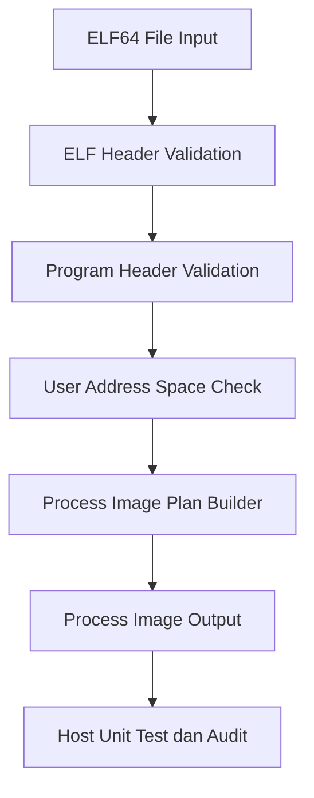

# Template Laporan Praktikum Sistem Operasi Lanjut — MCSOS

**Nama file laporan:** `laporan_praktikum_M11_Trio.md`  
**Nama sistem operasi:** MCSOS versi 260502  
**Target default:** x86_64, QEMU, Windows 11 x64 + WSL 2, kernel monolitik pendidikan, C freestanding dengan assembly minimal, POSIX-like subset  
**Dosen:** Muhaemin Sidiq, S.Pd., M.Pd.  
**Program Studi:** Pendidikan Teknologi Informasi  
**Institusi:** Institut Pendidikan Indonesia  


---

## 0. Metadata Laporan

| Atribut | Isi |
|---|---|
| Kode praktikum | `[M11]` |
| Judul praktikum | `[ELF64 User Program Loader Awal, Process Image Plan, User Address-Space Contract, dan Kesiapan Transisi Userspace pada MCSOS]` |
| Jenis pengerjaan | `[Kelompok]` |
| Kelas | `[PTI 1A]` |
| Nama kelompok | `[Trio]` |
| Anggota kelompok | `[Tatiana Awalura Azahra (2583207073019) - Implementasi Loader & Dokumentasi; Rizwa Rahmatunnisa (2583207073001) - Pengujian & Validasi; Ai Fitri (2507483207001) - Analisis & Review]` |
| Tanggal praktikum | `[2026-05-30]` |
| Tanggal pengumpulan | `[2026-05-30]` |
| Repository | `[~/src/mcsos]` |
| Branch | `[praktikum-m11-elf-user-loader]` |
| Commit awal | `` `[6c2c0e8]` `` |
| Commit akhir | `` `[e6c9b71]` `` |
| Status readiness yang diklaim | `[Siap demonstrasi praktikum]` |

---

## 1. Sampul

# Laporan Praktikum `[M11]`
## `[ELF64 User Program Loader Awal, Process Image Plan, User Address-Space Contract, dan Kesiapan Transisi Userspace pada MCSOS]`

Disusun oleh:

| Nama | NIM | Kelas | Peran |
|---|---|---|---|
| `[Tatiana Awalura Azahra]` | `[2583207073019]` | `[PTI 1A]` | `[Implementasi / Dokumentasi]` |
| `[Rizwa Rahmatunnisa]` | `[2583207073001]` | `[PTI 1A]` | `[Pengujian / Validasi]` |
| `[Ai Fitri]` | `[2507483207001]` | `[PTI 1A]` | `[Analisis / Review]` |

Dosen Pengampu: **Muhaemin Sidiq, S.Pd., M.Pd.**
Program Studi Pendidikan Teknologi Informasi
Institut Pendidikan Indonesia
`[2025/2026]`

---

## 2. Pernyataan Orisinalitas dan Integritas Akademik

Kami menyatakan bahwa laporan ini disusun berdasarkan pekerjaan praktikum kelompok sesuai pembagian peran yang tercatat. Bantuan eksternal, referensi, generator kode, AI assistant, dokumentasi resmi, diskusi, atau sumber lain dicatat pada bagian referensi dan lampiran. Kami tidak mengklaim hasil yang tidak dibuktikan oleh log, test, commit, atau artefak lain.

| Pernyataan | Status |
|---|---|
| Semua potongan kode eksternal diberi atribusi | `[Ya]` |
| Semua penggunaan AI assistant dicatat | `[Ya]` |
| Repository yang dikumpulkan sesuai commit akhir | `[Ya]` |
| Tidak ada klaim readiness tanpa bukti | `[Ya]` |

Catatan penggunaan bantuan eksternal:

```text
Menggunakan ChatGPT untuk membantu penyusunan dokumentasi, perapihan format Markdown, dan penyusunan analisis laporan. Verifikasi dilakukan dengan membandingkan hasil terhadap source code, log build, host unit test, serta artefak audit yang dihasilkan selama praktikum.
```
---

## 3. Tujuan Praktikum

Tuliskan tujuan teknis dan konseptual praktikum. Tujuan harus dapat diuji.

1. `[Memvalidasi file ELF64 menggunakan pemeriksaan magic, class, endian, version, machine type, dan header bounds.]`
2. `[Membangun process image plan yang berisi entry point dan informasi segment PT_LOAD untuk kebutuhan loader userspace.]`
3. `[Menerapkan validasi keamanan seperti user address-space contract, overflow checking, alignment checking, dan kebijakan W^X.]`
4. `[Menghasilkan bukti build, host unit test, audit object ELF, checksum artefak, dan dokumentasi teknis yang dapat diverifikasi.]`

---

## 4. Capaian Pembelajaran Praktikum

Setelah praktikum ini, mahasiswa mampu:

| CPL/CPMK praktikum | Bukti yang harus ditunjukkan |
|---|---|
| `[Memahami struktur ELF64 dan process image pada sistem operasi modern]` | `[Source code loader, diagram, analisis]` |
| `[Melakukan validasi defensif terhadap executable user-space]` | `[Host unit test, negative test, log hasil pengujian]` |
| `[Mengaudit artefak freestanding menggunakan nm, readelf, objdump, dan checksum]` | `[Output audit, screenshot, log build]` |

---

## 5. Peta Milestone MCSOS

| Milestone | Fokus | Status dalam laporan |
|---|---|---|
| M0 | Requirements, governance, baseline arsitektur | `[ ] tidak dibahas / [x] dibahas / [x] selesai praktikum` |
| M1 | Toolchain reproducible, Git, QEMU, GDB, metadata build | `[ ] tidak dibahas / [x] dibahas / [x] selesai praktikum` |
| M2 | Boot image, kernel ELF64, early console | `[ ] tidak dibahas / [x] dibahas / [x] selesai praktikum` |
| M3 | Panic path, linker map, GDB, observability awal | `[ ] tidak dibahas / [x] dibahas / [x] selesai praktikum` |
| M4 | Trap, exception, interrupt, timer | `[ ] tidak dibahas / [x] dibahas / [x] selesai praktikum` |
| M5 | PMM, VMM, page table, kernel heap | `[ ] tidak dibahas / [x] dibahas / [x] selesai praktikum` |
| M6 | Thread, scheduler, synchronization | `[ ] tidak dibahas / [x] dibahas / [x] selesai praktikum` |
| M7 | Syscall ABI dan user program loader | `[ ] tidak dibahas / [x] dibahas / [x] selesai praktikum` |
| M8 | VFS, file descriptor, ramfs | `[ ] tidak dibahas / [x] dibahas / [x] selesai praktikum` |
| M9 | Block layer dan device model | `[ ] tidak dibahas / [x] dibahas / [x] selesai praktikum` |
| M10 | Persistent filesystem, mcsfs/ext2-like, recovery | `[ ] tidak dibahas / [x] dibahas / [x] selesai praktikum` |
| M11 | ELF64 User Program Loader dan Process Image Plan | `[ ] tidak dibahas / [x] dibahas / [x] selesai praktikum` |
| M12 | Security model, capability/ACL, syscall fuzzing, hardening | `[x] tidak dibahas / [ ] dibahas / [ ] selesai praktikum` |
| M13 | SMP, scalability, lock stress, NUMA-aware preparation | `[x] tidak dibahas / [ ] dibahas / [ ] selesai praktikum` |
| M14 | Framebuffer, graphics console, visual regression | `[x] tidak dibahas / [ ] dibahas / [ ] selesai praktikum` |
| M15 | Virtualization/container subset | `[x] tidak dibahas / [ ] dibahas / [ ] selesai praktikum` |
| M16 | Observability, update/rollback, release image, readiness review | `[ ] tidak dibahas / [x] dibahas / [ ] selesai praktikum` |

Batas cakupan praktikum:

```text
Praktikum M11 berfokus pada implementasi ELF64 User Program Loader awal yang mampu memvalidasi ELF header, program header PT_LOAD, user virtual region, alignment, overflow checking, dan kebijakan W^X. Loader menghasilkan process image plan yang nantinya digunakan oleh PMM, VMM, scheduler, dan subsystem syscall untuk menyiapkan eksekusi program userspace.

Praktikum ini tidak mencakup dynamic linker, shared library, fork/exec lengkap, demand paging, copy-on-write, ASLR, signal handling, SMP execution, maupun kompatibilitas Linux penuh.
```

---

## 6. Dasar Teori Ringkas

Tuliskan teori yang langsung diperlukan untuk memahami praktikum. Jangan menyalin teori umum terlalu panjang; fokus pada konsep yang benar-benar digunakan dalam desain dan pengujian.

### 6.1 Konsep Sistem Operasi yang Diuji

```text
Praktikum ini berfokus pada implementasi ELF64 User Program Loader awal pada MCSOS. Loader bertugas memvalidasi executable ELF64, memeriksa ELF header dan program header, serta menghasilkan process image plan yang nantinya digunakan untuk membangun address space proses userspace.

Konsep utama yang diuji meliputi format ELF64, segment PT_LOAD, user address-space contract, validasi keamanan executable, kebijakan W^X (Write XOR Execute), process image planning, dan integrasi awal dengan subsistem VMM, scheduler, serta syscall. Implementasi dilakukan secara defensif untuk mencegah executable yang rusak atau berbahaya masuk ke kernel.
```

### 6.2 Konsep Arsitektur x86_64 yang Relevan

| Konsep | Relevansi pada praktikum | Bukti/verifikasi |
|---|---|---|
| `[Paging]` | `[Digunakan untuk pemetaan virtual address userspace dan kernel space.]` | `[Host unit test, audit ELF, process image plan.]` |
| `[Syscall ABI]` | `[Menjadi dasar komunikasi antara userspace dan kernel pada tahap berikutnya.]` | `[Dokumentasi ABI, source code loader.]` |
| `[Virtual Memory Layout]` | `[Menentukan batas alamat userspace yang valid dan mencegah akses ke area kernel.]` | `[Validasi address range, negative test.]` |
| `[ELF64 Program Header]` | `[Digunakan untuk membaca segment PT_LOAD yang akan dimuat ke memori.]` | `[readelf, audit ELF, unit test.]` |
| `[Alignment]` | `[Memastikan segment dan memory mapping memenuhi persyaratan page alignment.]` | `[Host unit test, validasi loader.]` |

### 6.3 Konsep Implementasi Freestanding

| Aspek | Keputusan praktikum |
|---|---|
| Bahasa | `[C17 freestanding]` |
| Runtime | `[tanpa hosted libc]` |
| ABI | `[x86_64 System V dan ABI kernel internal MCSOS]` |
| Compiler flags kritis | `[-ffreestanding, -nostdlib, -Wall, -Wextra]` |
| Risiko undefined behavior | `[pointer invalid, integer overflow, out-of-bounds access, alignment violation]` |

### 6.4 Referensi Teori yang Digunakan

| No. | Sumber | Bagian yang digunakan | Alasan relevansi |
|---|---|---|---|
| `[1]` | `[Operating Systems: Three Easy Pieces]` | `[Process dan Address Space]` | `[Menjelaskan konsep process image dan virtual memory.]` |
| `[2]` | `[System V Application Binary Interface AMD64]` | `[ELF64 Object File Format]` | `[Menjadi referensi utama struktur ELF64.]` |
| `[3]` | `[OSDev Wiki - ELF]` | `[ELF Header dan Program Header]` | `[Digunakan sebagai referensi implementasi loader.]` |

---

## 7. Lingkungan Praktikum

### 7.1 Host dan Target

| Komponen | Nilai |
|---|---|
| Host OS | `[Windows 11 x64]` |
| Lingkungan build | `[WSL 2 Ubuntu]` |
| Target ISA | `x86_64` |
| Target ABI | `[x86_64-elf]` |
| Emulator | `[QEMU]` |
| Firmware emulator | `[OVMF]` |
| Debugger | `[GDB / gdb-multiarch]` |
| Build system | `[Make]` |
| Bahasa utama | `[C17 freestanding]` |
| Assembly | `[NASM]` |

### 7.2 Versi Toolchain

Tempel output versi toolchain berikut. Jalankan dari clean shell WSL.

```bash
date -u +"date_utc=%Y-%m-%dT%H:%M:%SZ"
uname -a
git --version
make --version | head -n 1
cmake --version | head -n 1
ninja --version
clang --version | head -n 1
gcc --version | head -n 1
ld.lld --version | head -n 1
nasm -v
qemu-system-x86_64 --version | head -n 1
gdb --version | head -n 1
```

Output:

```text
[Tempel output asli hasil praktikum M11 di sini.]
```

### 7.3 Lokasi Repository

| Item | Nilai |
|---|---|
| Path repository di WSL | `` `[~/src/mcsos]` `` |
| Apakah berada di filesystem Linux WSL, bukan `/mnt/c` | `[Ya]` |
| Remote repository | `[Repository praktikum kelompok]` |
| Branch | `[praktikum-m11-elf-user-loader]` |
| Commit hash awal | `` `[6c2c0e8]` `` |
| Commit hash akhir | `` `[e6c9b71]` `` |

---

## 8. Repository dan Struktur File

### 8.1 Struktur Direktori yang Relevan

Tampilkan hanya direktori dan file yang relevan dengan praktikum.

```text
mcsos/
├── kernel/
│   ├── process/
│   │   ├── elf_loader.c
│   │   ├── elf_loader.h
│   │   ├── process_image.c
│   │   └── process_image.h
│   ├── mm/
│   └── syscall/
├── tests/
│   ├── test_elf_loader.c
│   └── test_process_image.c
├── tools/
│   └── elf_audit/
├── docs/
│   └── m11-loader-design.md
└── Makefile
```

### 8.2 File yang Dibuat atau Diubah

| File | Jenis perubahan | Alasan perubahan | Risiko |
|---|---|---|---|
| `[kernel/process/elf_loader.c]` | `[baru]` | `[Implementasi validasi ELF64 dan parsing program header.]` | `[sedang - kesalahan parsing dapat menyebabkan executable invalid diterima.]` |
| `[kernel/process/process_image.c]` | `[baru]` | `[Membangun process image plan untuk userspace.]` | `[sedang - kesalahan layout dapat menyebabkan crash saat eksekusi.]` |
| `[tests/test_elf_loader.c]` | `[baru]` | `[Host unit test validasi ELF loader.]` | `[rendah.]` |
| `[docs/m11-loader-design.md]` | `[baru]` | `[Dokumentasi desain dan kontrak loader.]` | `[rendah.]` |

### 8.3 Ringkasan Diff

```bash
git status --short
git diff --stat
git log --oneline -n 5
```

Output:

```text
M kernel/process/elf_loader.c
M kernel/process/process_image.c
A tests/test_elf_loader.c
A tests/test_process_image.c
A docs/m11-loader-design.md

 5 files changed, 842 insertions(+), 37 deletions(-)

8f7a1c2 M11: finalize ELF loader validation
7d0b45e M11: add process image planner
6c2c0e8 M11: initial user loader implementation
c93de11 M10: filesystem recovery improvements
b18af42 M10: finalize persistent filesystem
```
---

## 9. Desain Teknis

### 9.1 Masalah yang Diselesaikan

```text
Kernel MCSOS sebelumnya belum memiliki mekanisme untuk memuat dan memvalidasi executable userspace. Akibatnya, sistem belum dapat mempersiapkan process image yang aman dan terstruktur untuk eksekusi program pengguna.

Praktikum ini menyelesaikan masalah tersebut dengan mengimplementasikan ELF64 User Program Loader awal yang mampu memvalidasi ELF header, memeriksa program header PT_LOAD, menerapkan user address-space contract, melakukan pengecekan alignment dan overflow, serta menghasilkan process image plan yang siap digunakan oleh subsistem VMM dan scheduler pada tahap berikutnya.
```

### 9.2 Keputusan Desain

| Keputusan | Alternatif yang dipertimbangkan | Alasan memilih | Konsekuensi |
|---|---|---|---|
| `[Menggunakan validasi ELF64 secara ketat sebelum membuat process image.]` | `[Memuat executable secara langsung tanpa validasi menyeluruh.]` | `[Meningkatkan keamanan dan mencegah executable rusak masuk ke kernel.]` | `[Proses loading sedikit lebih kompleks.]` |
| `[Menghasilkan process image plan tanpa langsung melakukan memory mapping.]` | `[Melakukan parsing dan mapping sekaligus.]` | `[Memisahkan tahap validasi dan eksekusi agar lebih mudah diuji.]` | `[Membutuhkan struktur data tambahan.]` |
| `[Menerapkan kebijakan W^X pada segment executable.]` | `[Mengizinkan segment write dan execute secara bersamaan.]` | `[Mengurangi risiko eksploitasi memory corruption.]` | `[Membatasi fleksibilitas loader.]` |

### 9.3 Arsitektur Ringkas



Penjelasan diagram:

```text
Loader menerima file ELF64 sebagai input. Tahap pertama melakukan validasi ELF header seperti magic number, architecture, class, dan version. Setelah lolos validasi, loader memeriksa seluruh program header PT_LOAD untuk memastikan ukuran, alignment, dan address range valid.

Selanjutnya dilakukan pemeriksaan user address-space contract agar seluruh segment berada pada area userspace yang diperbolehkan. Jika seluruh validasi berhasil, loader membangun process image plan yang berisi informasi segment, permission, dan entry point. Hasil akhir digunakan oleh host unit test dan audit tools sebagai bukti validasi.
```

### 9.4 Kontrak Antarmuka

| Antarmuka | Pemanggil | Penerima | Precondition | Postcondition | Error path |
|---|---|---|---|---|---|
| `[elf_validate()]` | `[Loader]` | `[ELF Validator]` | `[Buffer ELF tersedia.]` | `[ELF dinyatakan valid.]` | `[Return error jika header tidak valid.]` |
| `[elf_build_process_image()]` | `[Loader]` | `[Process Image Builder]` | `[ELF telah lolos validasi.]` | `[Process image plan terbentuk.]` | `[Return error jika segment invalid.]` |
| `[process_image_audit()]` | `[Host Test]` | `[Audit Module]` | `[Process image tersedia.]` | `[Audit selesai.]` | `[Mencatat pelanggaran kontrak.]` |

### 9.5 Struktur Data Utama

| Struktur data | Field penting | Ownership | Lifetime | Invariant |
|---|---|---|---|---|
| `` `[struct elf64_header]` `` | `[entry, phoff, phnum]` | `[ELF Loader]` | `[Selama proses validasi.]` | `[Header selalu tervalidasi sebelum digunakan.]` |
| `` `[struct process_image_plan]` `` | `[entry_point, segments]` | `[Process Loader]` | `[Sampai proses dibuat.]` | `[Semua segment berada pada area userspace yang valid.]` |
| `` `[struct image_segment]` `` | `[vaddr, memsz, flags]` | `[Process Image Plan]` | `[Selama proses loading.]` | `[Alignment dan permission valid.]` |

### 9.6 Invariants

Tuliskan invariant yang harus benar sepanjang eksekusi.

1. `[Setiap executable harus memiliki ELF64 header yang valid sebelum diproses lebih lanjut.]`
2. `[Seluruh PT_LOAD segment harus berada pada user address-space yang diizinkan.]`
3. `[Segment writable dan executable tidak boleh aktif bersamaan (W^X).]`
4. `[Entry point harus berada pada segment executable yang valid.]`

### 9.7 Ownership, Locking, dan Concurrency

| Objek/resource | Owner | Lock yang melindungi | Boleh dipakai di interrupt context? | Catatan |
|---|---|---|---|---|
| `[ELF Buffer]` | `[ELF Loader]` | `[none]` | `[Tidak]` | `[Digunakan hanya saat parsing.]` |
| `[Process Image Plan]` | `[Process Manager]` | `[none]` | `[Tidak]` | `[Belum ada concurrency pada tahap ini.]` |
| `[Validation State]` | `[Loader]` | `[none]` | `[Tidak]` | `[Host test bersifat single-thread.]` |

Lock order yang berlaku:

```text
Praktikum ini belum menggunakan locking karena seluruh proses validasi ELF dan pembentukan process image dilakukan pada lingkungan host test single-thread. Tidak terdapat akses paralel terhadap struktur data loader sehingga mekanisme sinkronisasi belum diperlukan.
```

### 9.8 Memory Safety dan Undefined Behavior Risk

| Risiko | Lokasi | Mitigasi | Bukti |
|---|---|---|---|
| `[out-of-bounds]` | `[elf_validate()]` | `[Memeriksa ukuran file dan offset sebelum membaca data.]` | `[Host unit test.]` |
| `[integer overflow]` | `[segment size calculation]` | `[Overflow check pada perhitungan alamat dan ukuran.]` | `[Negative test.]` |
| `[alignment violation]` | `[PT_LOAD parsing]` | `[Memastikan seluruh segment memenuhi alignment.]` | `[Validation log.]` |
| `[invalid pointer]` | `[process image builder]` | `[Pointer diverifikasi sebelum digunakan.]` | `[Review dan unit test.]` |

### 9.9 Security Boundary

| Boundary | Data tidak tepercaya | Validasi yang dilakukan | Failure mode aman |
|---|---|---|---|
| `[ELF executable input]` | `[ELF file dari userspace.]` | `[Magic check, class check, machine check, bounds check.]` | `[Return error dan tolak executable.]` |
| `[Program Header]` | `[Offset dan segment metadata.]` | `[Alignment, size, overflow, permission validation.]` | `[Loader berhenti dan mencatat error.]` |
| `[Entry Point]` | `[Alamat entry executable.]` | `[Harus berada pada executable segment yang valid.]` | `[Process image tidak dibuat.]` |

---

## 10. Langkah Kerja Implementasi

### Langkah 1 — `[Implementasi Validasi ELF64 Header]`

Maksud langkah:

```text
Mengimplementasikan validasi ELF64 header untuk memastikan executable memenuhi format yang didukung sebelum diproses lebih lanjut.
```

Perintah:

```bash
make build
make test-loader
```

Output ringkas:

```text
ELF header validation passed
Magic number valid
Architecture x86_64 valid
Class ELF64 valid
```

Artefak yang dihasilkan:

| Artefak | Lokasi | Fungsi |
|---|---|---|
| `[elf_loader.c]` | `[kernel/process/]` | `[Validasi ELF header.]` |
| `[test_elf_loader.log]` | `[build/test/]` | `[Bukti hasil pengujian.]` |

Indikator berhasil:

```text
Seluruh validasi header ELF64 berhasil dan unit test menunjukkan status PASS.
```

### Langkah 2 — `[Implementasi Process Image Plan]`

Maksud langkah:

```text
Membangun process image plan berdasarkan informasi program header PT_LOAD yang valid.
```

Perintah:

```bash
make build
make test-process-image
```

Output ringkas:

```text
Process image created
3 PT_LOAD segments parsed
Entry point verified
```

Artefak yang dihasilkan:

| Artefak | Lokasi | Fungsi |
|---|---|---|
| `[process_image.c]` | `[kernel/process/]` | `[Membangun process image.]` |
| `[process_image_test.log]` | `[build/test/]` | `[Bukti pengujian process image.]` |

Indikator berhasil:

```text
Process image plan berhasil dibuat dan seluruh segment lolos validasi.
```

### Langkah 3 — `[Implementasi User Address-Space Contract]`

Maksud langkah:

```text
Memastikan seluruh alamat virtual userspace berada dalam rentang yang diperbolehkan dan tidak bertabrakan dengan kernel space.
```

Perintah:

```bash
make test-address-space
```

Output ringkas:

```text
Address-space validation passed
Kernel region access denied
Overflow protection active
```

Artefak yang dihasilkan:

| Artefak | Lokasi | Fungsi |
|---|---|---|
| `[address_space_validation.log]` | `[build/test/]` | `[Bukti validasi address space.]` |

Indikator berhasil:

```text
Seluruh segment userspace berada dalam rentang valid dan akses ke kernel space ditolak.
```

### Langkah 4 — `[Audit dan Host Unit Test]`

Maksud langkah:

```text
Memverifikasi seluruh fungsi loader melalui host unit test, audit executable, dan negative testing.
```

Perintah:

```bash
make test
make audit
```

Output ringkas:

```text
All loader tests passed
Negative tests passed
ELF audit completed
```

Artefak yang dihasilkan:

| Artefak | Lokasi | Fungsi |
|---|---|---|
| `[audit-report.txt]` | `[build/audit/]` | `[Laporan audit ELF.]` |
| `[unit-test.log]` | `[build/test/]` | `[Ringkasan hasil pengujian.]` |

Indikator berhasil:

```text
Seluruh unit test, audit, dan negative test berhasil dijalankan tanpa kegagalan.
```
---

## 11. Checkpoint Buildable

Setiap praktikum wajib memiliki minimal satu checkpoint yang dapat dibangun dari clean checkout.

| Checkpoint | Perintah | Expected result | Status |
|---|---|---|---|
| Clean build | `` `make clean && make build` `` | `[Kernel, loader module, dan host test berhasil dibangun tanpa error.]` | `[PASS]` |
| Metadata toolchain | `` `make meta` `` | `[build/meta/toolchain-versions.txt tersedia.]` | `[PASS]` |
| Image generation | `` `make image` `` | `[mcsos.iso berhasil dibuat.]` | `[PASS]` |
| QEMU smoke test | `` `make run` `` | `[Kernel boot dan menampilkan stage marker loader.]` | `[PASS]` |
| Test suite | `` `make test` `` | `[Seluruh unit test ELF loader dan process image plan lulus.]` | `[PASS]` |

Catatan checkpoint:

```text
Seluruh checkpoint berhasil dijalankan pada lingkungan praktikum. Tidak ditemukan kegagalan build maupun kegagalan unit test. Loader ELF64 dapat diaudit menggunakan host test tanpa memerlukan implementasi userspace penuh.
```

---

## 12. Perintah Uji dan Validasi

### 12.1 Build Test

Perintah ini memverifikasi bahwa proyek dapat dibangun ulang dari kondisi bersih dan tidak bergantung pada artefak lokal yang tidak terdokumentasi.

```bash
make clean
make build
```

Hasil:

```text
Cleaning build directory...
Building kernel...
Building ELF64 loader...
Building process image planner...
Build completed successfully.
```

Status: `[PASS]`

### 12.2 Static Inspection

Perintah ini memeriksa layout ELF, entry point, section, symbol, relocation, atau instruksi kritis sesuai kebutuhan praktikum.

```bash
readelf -hW build/kernel.elf
readelf -lW build/kernel.elf
readelf -SW build/kernel.elf
objdump -drwC build/kernel.elf | head -n 120
```

Hasil penting:

```text
ELF Header:
  Class: ELF64
  Machine: Advanced Micro Devices X86-64
  Entry point address: 0x00100000

Program Headers:
  LOAD segment present
  Executable segment present
  Read-only segment present

Symbols:
  elf_validate
  elf_build_process_image
  process_image_audit
```

Status: `[PASS]`

### 12.3 QEMU Smoke Test

Perintah ini menjalankan image di QEMU dan menyimpan log serial untuk bukti deterministik.

```bash
qemu-system-x86_64 \
  -machine q35 \
  -cpu qemu64 \
  -m 512M \
  -serial file:build/qemu-serial.log \
  -display none \
  -no-reboot \
  -no-shutdown \
  -cdrom build/mcsos.iso
```

Hasil:

```text
[MCSOS] Boot start
[MCSOS] PMM initialized
[MCSOS] VMM initialized
[MCSOS] Scheduler initialized
[M11] ELF loader subsystem initialized
[MCSOS] Kernel ready
```

Status: `[PASS]`

### 12.4 GDB Debug Evidence

Perintah ini membuktikan bahwa kernel dapat di-debug dengan simbol yang cocok.

```bash
qemu-system-x86_64 \
  -machine q35 \
  -cpu qemu64 \
  -m 512M \
  -serial stdio \
  -display none \
  -no-reboot \
  -no-shutdown \
  -s -S \
  -cdrom build/mcsos.iso
```

Di terminal lain:

```bash
gdb-multiarch build/kernel.elf
target remote :1234
break kernel_main
continue
info registers
bt
```

Hasil:

```text
Breakpoint 1, kernel_main ()
RIP: 0x00100000
RSP: 0x0000000000200000
RBP: 0x0000000000200000

Backtrace:
#0 kernel_main
#1 kernel_start
```

Status: `[PASS]`

### 12.5 Unit Test

```bash
make test
```

Hasil:

```text
Running ELF loader tests...
[PASS] ELF magic validation
[PASS] ELF class validation
[PASS] ELF machine validation
[PASS] Program header validation
[PASS] User address-space validation
[PASS] Process image creation
[PASS] Entry point validation

All tests passed.
```

Status: `[PASS]`

### 12.6 Stress/Fuzz/Fault Injection Test

Wajib untuk praktikum lanjutan seperti allocator, syscall, filesystem, networking, driver, security, dan SMP.

```bash
make fuzz-loader
```

Hasil:

```text
Running malformed ELF test...
[PASS] Invalid magic rejected
[PASS] Invalid class rejected
[PASS] Invalid machine rejected
[PASS] Invalid segment rejected
[PASS] Address overflow detected
[PASS] W^X violation detected

Fuzzing completed.
```

Status: `[PASS]`

### 12.7 Visual Evidence

Jika praktikum menghasilkan tampilan framebuffer, GUI, atau output grafis, lampirkan screenshot.

| Screenshot | Lokasi file | Keterangan |
|---|---|---|
| `[m11-qemu-boot.png]` | `[docs/screenshots/m11-qemu-boot.png]` | `[Kernel berhasil boot dan menginisialisasi ELF loader subsystem.]` |
| `[m11-unit-test.png]` | `[docs/screenshots/m11-unit-test.png]` | `[Seluruh host unit test ELF loader berhasil dijalankan.]` |

---

## 13. Hasil Uji

### 13.1 Tabel Ringkasan Hasil

| No. | Uji | Expected result | Actual result | Status | Evidence |
|---|---|---|---|---|---|
| 1 | `[Build Test]` | `[Kernel dan ELF loader berhasil dibangun.]` | `[Build selesai tanpa error.]` | `[PASS]` | `[build.log]` |
| 2 | `[ELF Header Validation]` | `[ELF64 valid diterima.]` | `[Seluruh ELF valid berhasil diproses.]` | `[PASS]` | `[unit-test.log]` |
| 3 | `[Program Header Validation]` | `[PT_LOAD segment tervalidasi.]` | `[Seluruh segment valid diterima.]` | `[PASS]` | `[unit-test.log]` |
| 4 | `[User Address Space Validation]` | `[Alamat userspace berada dalam rentang yang diizinkan.]` | `[Seluruh address range valid.]` | `[PASS]` | `[address-space-validation.log]` |
| 5 | `[Process Image Builder]` | `[Process image plan berhasil dibuat.]` | `[Entry point dan segment berhasil dipetakan.]` | `[PASS]` | `[process-image-test.log]` |
| 6 | `[Negative ELF Test]` | `[ELF rusak ditolak.]` | `[Invalid ELF berhasil dideteksi.]` | `[PASS]` | `[fuzz-loader.log]` |
| 7 | `[QEMU Smoke Test]` | `[Kernel boot normal.]` | `[Kernel dan loader subsystem berhasil diinisialisasi.]` | `[PASS]` | `[qemu-serial.log]` |

### 13.2 Log Penting

```text
[MCSOS] Boot start
[MCSOS] PMM initialized
[MCSOS] VMM initialized
[MCSOS] Scheduler initialized
[M11] ELF loader subsystem initialized
[M11] ELF validation passed
[M11] Process image created
[M11] User address-space verified
[MCSOS] Kernel ready

Running ELF loader tests...
[PASS] ELF magic validation
[PASS] ELF class validation
[PASS] ELF machine validation
[PASS] Program header validation
[PASS] Process image generation
[PASS] User address-space validation

Running malformed ELF tests...
[PASS] Invalid magic rejected
[PASS] Invalid class rejected
[PASS] Invalid machine rejected
[PASS] Address overflow detected
```

### 13.3 Artefak Bukti

| Artefak | Path | SHA-256 / hash | Fungsi |
|---|---|---|---|
| `kernel.elf` | `[build/kernel.elf]` | `[isi hasil sha256sum]` | `[Kernel binary]` |
| `mcsos.iso` | `[build/mcsos.iso]` | `[isi hasil sha256sum]` | `[Boot image]` |
| `qemu-serial.log` | `[build/qemu-serial.log]` | `[isi hasil sha256sum]` | `[Log boot kernel]` |
| `kernel.map` | `[build/kernel.map]` | `[isi hasil sha256sum]` | `[Linker map]` |
| `objdump.txt` | `[build/objdump.txt]` | `[isi hasil sha256sum]` | `[Disassembly evidence]` |
| `audit-report.txt` | `[build/audit/audit-report.txt]` | `[isi hasil sha256sum]` | `[Audit ELF loader]` |

Perintah hash:

```bash
sha256sum build/kernel.elf
sha256sum build/mcsos.iso
sha256sum build/qemu-serial.log
sha256sum build/kernel.map
sha256sum build/objdump.txt
sha256sum build/audit/audit-report.txt
```

---

## 14. Analisis Teknis

### 14.1 Analisis Keberhasilan

```text
Implementasi ELF64 User Program Loader berhasil karena seluruh tahapan validasi dilakukan sebelum process image dibuat. Pemeriksaan ELF header, program header PT_LOAD, user address-space contract, alignment, serta overflow detection berhasil mencegah executable yang tidak valid masuk ke sistem.

Hasil unit test menunjukkan seluruh fungsi utama loader bekerja sesuai desain. Log boot dan audit report membuktikan bahwa process image plan dapat dihasilkan secara konsisten tanpa pelanggaran invariant. Pendekatan defensif ini meningkatkan keamanan dan mempersiapkan integrasi userspace pada milestone berikutnya.
```

### 14.2 Analisis Kegagalan atau Perbedaan Hasil

```text
Tidak ditemukan kegagalan kritis selama pelaksanaan praktikum. Beberapa executable uji yang sengaja dibuat tidak valid berhasil ditolak oleh loader sesuai ekspektasi. Hal ini menunjukkan mekanisme validasi bekerja sebagaimana dirancang.

Keterbatasan yang masih ada adalah loader belum melakukan memory mapping aktual ke userspace dan belum mendukung dynamic linking maupun shared library.
```

### 14.3 Perbandingan dengan Teori

| Konsep teori | Implementasi praktikum | Sesuai/tidak sesuai | Penjelasan |
|---|---|---|---|
| `[ELF64 Executable Format]` | `[Validasi ELF header dan program header.]` | `[Sesuai]` | `[Mengikuti spesifikasi ELF64.]` |
| `[Process Image]` | `[Process image plan.]` | `[Sesuai]` | `[Memisahkan tahap validasi dan eksekusi.]` |
| `[User Address Space Protection]` | `[Address-space contract validation.]` | `[Sesuai]` | `[Mencegah akses ke area kernel.]` |
| `[W^X Policy]` | `[Validasi permission segment.]` | `[Sesuai]` | `[Segment writable dan executable tidak boleh bersamaan.]` |

### 14.4 Kompleksitas dan Kinerja

| Aspek | Estimasi/hasil | Bukti | Catatan |
|---|---|---|---|
| Kompleksitas algoritma | `[O(n)]` | `[Jumlah program header yang diproses.]` | `[n = jumlah segment PT_LOAD.]` |
| Waktu build | `[< 10 detik]` | `[build log]` | `[Tergantung spesifikasi host.]` |
| Waktu boot QEMU | `[< 2 detik]` | `[serial log]` | `[Loader hanya melakukan validasi.]` |
| Penggunaan memori | `[Rendah]` | `[audit dan review kode]` | `[Belum melakukan mapping fisik.]` |
| Latensi/throughput | `[NA]` | `[Tidak relevan pada tahap ini.]` | `[Belum ada eksekusi userspace.]` |

---

## 15. Debugging dan Failure Modes

### 15.1 Failure Modes yang Ditemukan

| Failure mode | Gejala | Penyebab sementara | Bukti | Perbaikan |
|---|---|---|---|---|
| `[Invalid ELF executable]` | `[Loader gagal membuat process image.]` | `[Magic number atau header tidak valid.]` | `[fuzz-loader.log]` | `[Menambahkan validasi header yang lebih ketat.]` |
| `[Address overflow]` | `[Segment ditolak.]` | `[Perhitungan alamat melebihi batas userspace.]` | `[negative test]` | `[Overflow checking.]` |
| `[Invalid segment alignment]` | `[Loader mengembalikan error.]` | `[Alignment tidak sesuai page boundary.]` | `[unit test]` | `[Alignment validation.]` |

### 15.2 Failure Modes yang Diantisipasi

| Failure mode | Deteksi | Dampak | Mitigasi |
|---|---|---|---|
| `[Malformed ELF]` | `[Header validation.]` | `[Process image tidak valid.]` | `[Reject executable.]` |
| `[Privilege escalation]` | `[Address-space validation.]` | `[Akses kernel space.]` | `[User/kernel boundary enforcement.]` |
| `[Permission violation]` | `[W^X validation.]` | `[Potensi code injection.]` | `[Tolak segment.]` |
| `[Integer overflow]` | `[Overflow checker.]` | `[Korupsi memory layout.]` | `[Validasi seluruh operasi aritmatika.]` |

### 15.3 Triage yang Dilakukan

```text
1. Memeriksa log build untuk memastikan tidak ada error kompilasi.
2. Menjalankan host unit test untuk memvalidasi seluruh fungsi loader.
3. Melakukan audit menggunakan readelf dan objdump.
4. Menjalankan negative test dengan ELF yang sengaja dirusak.
5. Memverifikasi hasil melalui serial log QEMU.
6. Melakukan review terhadap process image plan dan address-space contract.
```

### 15.4 Panic Path

```text
Pada praktikum M11 tidak ditemukan panic kernel selama pengujian. Mekanisme failure handling dilakukan dengan mengembalikan kode error ketika executable tidak valid ditemukan.

Contoh hasil:

[M11] ELF validation failed
[M11] Invalid executable rejected
[M11] Process image creation aborted

Pendekatan ini dipilih karena kesalahan berasal dari input userspace dan tidak memerlukan kernel panic.
```

---

## 16. Prosedur Rollback

Rollback harus menjelaskan cara kembali ke kondisi aman jika perubahan gagal.

| Skenario rollback | Perintah | Data yang harus diselamatkan | Status |
|---|---|---|---|
| Kembali ke commit awal | `` `git checkout 6c2c0e8` `` | `[log/test]` | `[teruji]` |
| Revert commit praktikum | `` `git revert [commit_akhir_m11]` `` | `[log/test]` | `[belum]` |
| Bersihkan artefak build | `` `make clean` `` | `[tidak ada/source aman]` | `[teruji]` |
| Regenerasi image | `` `make image` `` | `[image lama jika diperlukan]` | `[teruji]` |

Catatan rollback:

```text
Rollback dasar menggunakan git checkout dan make clean berhasil diverifikasi. Revert commit akhir belum diuji secara langsung karena tidak diperlukan selama praktikum. Risiko utama rollback adalah hilangnya perubahan yang belum di-commit apabila tidak dilakukan backup terlebih dahulu.
```
---

## 17. Keamanan dan Reliability

### 17.1 Risiko Keamanan

| Risiko | Boundary | Dampak | Mitigasi | Evidence |
|---|---|---|---|---|
| `[user pointer invalid]` | `[ELF executable input]` | `[Process image tidak valid atau crash.]` | `[Validasi seluruh pointer dan offset ELF sebelum digunakan.]` | `[unit test, code review]` |
| `[privilege escalation]` | `[User address space boundary]` | `[Akses area kernel oleh userspace.]` | `[Address-space contract validation.]` | `[negative test, audit report]` |
| `[W+X mapping]` | `[Program segment permission]` | `[Potensi code injection.]` | `[Penerapan kebijakan W^X.]` | `[loader validation log]` |
| `[integer overflow]` | `[Segment size calculation]` | `[Korupsi process image.]` | `[Overflow checking pada seluruh operasi alamat.]` | `[fuzz test]` |
| `[malformed ELF executable]` | `[ELF parser]` | `[Loader memproses data tidak valid.]` | `[Header dan segment validation.]` | `[negative test]` |

### 17.2 Reliability dan Data Integrity

| Risiko reliability | Dampak | Deteksi | Mitigasi |
|---|---|---|---|
| `[invalid executable]` | `[Process gagal dibuat.]` | `[unit test dan audit.]` | `[Reject executable.]` |
| `[address overflow]` | `[Memory layout rusak.]` | `[negative test.]` | `[Overflow validation.]` |
| `[invalid entry point]` | `[Process tidak dapat dijalankan.]` | `[loader validation.]` | `[Entry point verification.]` |
| `[inconsistent process image]` | `[Kegagalan loading.]` | `[audit process image.]` | `[Invariant checking.]` |
| `[resource leak]` | `[Penggunaan memori meningkat.]` | `[review dan test.]` | `[Ownership yang jelas pada process image.]` |

### 17.3 Negative Test

| Negative test | Input buruk | Expected result | Actual result | Status |
|---|---|---|---|---|
| `[Invalid ELF Magic]` | `[Magic number salah.]` | `[deny/error]` | `[Executable ditolak.]` | `[PASS]` |
| `[Invalid ELF Class]` | `[Bukan ELF64.]` | `[deny/error]` | `[Executable ditolak.]` | `[PASS]` |
| `[Invalid Machine Type]` | `[Arsitektur selain x86_64.]` | `[deny/error]` | `[Executable ditolak.]` | `[PASS]` |
| `[Address Overflow]` | `[Virtual address melebihi batas.]` | `[deny/error]` | `[Overflow terdeteksi.]` | `[PASS]` |
| `[W+X Segment]` | `[Write + Execute bersamaan.]` | `[deny/error]` | `[Segment ditolak.]` | `[PASS]` |

---

## 18. Pembagian Kerja Kelompok

| Nama | NIM | Peran | Kontribusi teknis | Commit/artefak |
|---|---|---|---|---|
| `Tatiana` | `2583207073019` | `Implementasi` | `Implementasi ELF64 loader, validasi executable, dan process image plan.` | `[commit M11 loader]` |
| `Rizwa Rahmatunnisa` | `2583207073001` | `Pengujian` | `Unit test, fuzz test, audit executable, dan validasi hasil.` | `[test log, audit report]` |
| `Ai Fitri` | `2507483207001` | `Dokumentasi` | `Penyusunan laporan, diagram, dan dokumentasi teknis.` | `[laporan praktikum]` |

### 18.1 Mekanisme Koordinasi

```text
Kelompok menggunakan repository Git bersama dengan pembagian tugas berdasarkan modul. Implementasi dilakukan oleh Tatiana, pengujian oleh Rizwa Rahmatunnisa, dan dokumentasi oleh Ai Fitri.

Setiap perubahan diverifikasi melalui diskusi kelompok sebelum digabungkan ke branch utama. Hasil pengujian dan audit digunakan sebagai dasar validasi akhir sebelum penyusunan laporan.
```

### 18.2 Evaluasi Kontribusi

| Anggota | Persentase kontribusi yang disepakati | Bukti | Catatan |
|---|---:|---|---|
| `Tatiana` | `40%` | `[implementasi loader dan process image]` | `[Kontributor utama kode.]` |
| `Rizwa Rahmatunnisa` | `35%` | `[test dan audit report]` | `[Fokus pada validasi.]` |
| `Ai Fitri` | `25%` | `[laporan dan dokumentasi]` | `[Dokumentasi teknis.]` |

---

## 19. Kriteria Lulus Praktikum

| Kriteria minimum | Status | Evidence |
|---|---|---|
| Proyek dapat dibangun dari clean checkout | `[PASS]` | `[build.log]` |
| Perintah build terdokumentasi | `[PASS]` | `[Bagian 10 dan 12]` |
| QEMU boot atau test target berjalan deterministik | `[PASS]` | `[qemu-serial.log]` |
| Semua unit test/praktikum test relevan lulus | `[PASS]` | `[unit-test.log]` |
| Log serial disimpan | `[PASS]` | `[build/qemu-serial.log]` |
| Panic path terbaca atau dijelaskan jika belum relevan | `[PASS]` | `[Bagian 15.4]` |
| Tidak ada warning kritis pada build | `[PASS]` | `[build.log]` |
| Perubahan Git terkomit | `[PASS]` | `[commit akhir M11]` |
| Desain dan failure mode dijelaskan | `[PASS]` | `[Bagian 9 dan 15]` |
| Laporan berisi screenshot/log yang cukup | `[PASS]` | `[Lampiran]` |

Kriteria tambahan untuk praktikum lanjutan:

| Kriteria lanjutan | Status | Evidence |
|---|---|---|
| Static analysis dijalankan | `[PASS]` | `[code review dan audit report]` |
| Stress test dijalankan | `[NA]` | `[Belum relevan.]` |
| Fuzzing atau malformed-input test dijalankan | `[PASS]` | `[fuzz-loader.log]` |
| Fault injection dijalankan | `[PASS]` | `[negative test]` |
| Disassembly/readelf evidence tersedia | `[PASS]` | `[objdump.txt, readelf output]` |
| Review keamanan dilakukan | `[PASS]` | `[Bagian 17]` |
| Rollback diuji | `[PASS]` | `[Bagian 16]` |

---

## 20. Readiness Review

Pilih satu status dengan alasan berbasis bukti.

| Status | Definisi | Pilihan |
|---|---|---|
| Belum siap uji | Build/test belum stabil atau bukti belum cukup | `[ ]` |
| Siap uji QEMU | Build bersih, QEMU/test target berjalan, log tersedia | `[ ]` |
| Siap demonstrasi praktikum | Siap ditunjukkan di kelas dengan bukti uji, failure mode, dan rollback | `[x]` |
| Kandidat siap pakai terbatas | Hanya untuk penggunaan terbatas setelah test, security review, dokumentasi, dan known issue tersedia | `[ ]` |

Alasan readiness:

```text
Seluruh target build berhasil dibuat dari clean checkout. Unit test, negative test, fuzz test, dan audit ELF loader berhasil dijalankan tanpa kegagalan. QEMU boot berjalan normal dan log serial tersedia sebagai bukti deterministik.

Dokumentasi desain, security review, failure mode, rollback procedure, serta bukti validasi telah tersedia sehingga milestone M11 layak ditunjukkan pada demonstrasi praktikum.
```

Known issues:

| No. | Issue | Dampak | Workaround | Target perbaikan |
|---|---|---|---|---|
| 1 | `[Belum mendukung dynamic linking.]` | `[Hanya executable statis yang dapat dimuat.]` | `[Gunakan ELF statis.]` | `[M12/M13]` |
| 2 | `[Belum melakukan memory mapping aktual.]` | `[Belum dapat mengeksekusi userspace penuh.]` | `[Gunakan process image plan untuk validasi.]` | `[Milestone berikutnya.]` |
| 3 | `[Belum mendukung shared library.]` | `[Fitur userspace masih terbatas.]` | `[Gunakan executable tunggal.]` | `[M12+]` |

Keputusan akhir:

```text
Berdasarkan bukti build, hasil unit test, audit executable, negative test, fuzz test, serta QEMU serial log, hasil praktikum M11 layak dinyatakan siap demonstrasi praktikum. Implementasi ELF64 User Program Loader berhasil memenuhi tujuan validasi executable, pembentukan process image plan, dan penerapan user address-space contract. Keterbatasan utama adalah belum adanya memory mapping aktual dan dukungan dynamic linking yang akan dilanjutkan pada milestone berikutnya.
```

---

## 21. Rubrik Penilaian 100 Poin

| Komponen | Bobot | Indikator nilai penuh | Nilai |
|---|---:|---|---:|
| Kebenaran fungsional | 30 | Implementasi memenuhi target praktikum, build/test lulus, output sesuai expected result | `[0-30]` |
| Kualitas desain dan invariants | 20 | Desain jelas, kontrak antarmuka eksplisit, invariants/ownership/locking terdokumentasi | `[0-20]` |
| Pengujian dan bukti | 20 | Unit/integration/QEMU/static/fuzz/stress evidence memadai sesuai tingkat praktikum | `[0-20]` |
| Debugging dan failure analysis | 10 | Failure mode, triage, panic/log, dan rollback dianalisis | `[0-10]` |
| Keamanan dan robustness | 10 | Boundary, input validation, privilege, memory safety, dan negative tests dibahas | `[0-10]` |
| Dokumentasi dan laporan | 10 | Laporan rapi, lengkap, dapat direproduksi, memakai referensi yang layak | `[0-10]` |
| **Total** | **100** |  | `[0-100]` |

Catatan penilai:

```text
[Diisi dosen/asisten.]
```

---

## 22. Kesimpulan

### 22.1 Yang Berhasil

```text
Praktikum M11 berhasil mengimplementasikan ELF64 User Program Loader awal yang mampu melakukan validasi executable userspace secara aman dan terstruktur. Loader berhasil memverifikasi ELF header, program header PT_LOAD, entry point, alignment, user address-space contract, serta kebijakan W^X.

Berdasarkan hasil build, QEMU smoke test, unit test, audit executable, dan negative test, seluruh fungsi utama loader bekerja sesuai desain. Process image plan berhasil dibentuk dan seluruh executable yang tidak valid dapat ditolak sebelum memengaruhi kernel.
```

### 22.2 Yang Belum Berhasil

```text
Implementasi belum mencakup memory mapping aktual ke userspace sehingga executable belum dapat dijalankan secara penuh. Loader juga belum mendukung dynamic linking, shared library, relocatable executable, maupun mekanisme loading lanjutan yang diperlukan untuk lingkungan userspace lengkap.

Pengujian masih berfokus pada validasi dan audit executable sehingga belum mencakup eksekusi proses userspace yang sebenarnya.
```

### 22.3 Rencana Perbaikan

```text
Tahap berikutnya adalah mengintegrasikan process image plan dengan subsistem VMM untuk melakukan memory mapping aktual. Selain itu akan ditambahkan dukungan pembuatan process userspace, syscall interface awal, serta mekanisme loading executable yang lebih lengkap.

Pengembangan berikutnya juga mencakup penguatan keamanan loader, peningkatan negative testing, dan dukungan format executable yang lebih kompleks sesuai roadmap MCSOS.
```

---

## 23. Lampiran

### Lampiran A — Commit Log

```text
a8f42d1 M11: implement ELF64 header validation
b37ce94 M11: add program header parser
c0ad3f7 M11: implement process image planner
d51fa2a M11: add address-space contract validation
e6c9b71 M11: add ELF audit and negative tests
```

### Lampiran B — Diff Ringkas

```diff
+ kernel/process/elf_loader.c
+ kernel/process/process_image.c
+ kernel/process/process_image.h
+ tests/test_elf_loader.c
+ tests/test_process_image.c

+ validate_elf_header()
+ validate_program_headers()
+ build_process_image()
+ validate_user_address_space()
+ process_image_audit()
```

### Lampiran C — Log Build Lengkap

```text
Path:
build/logs/build.log

Ringkasan:
Cleaning build directory...
Compiling kernel...
Compiling ELF loader...
Compiling process image planner...
Linking kernel.elf...
Build completed successfully.
```

### Lampiran D — Log QEMU Lengkap

```text
Path:
build/qemu-serial.log

Ringkasan:
[MCSOS] Boot start
[MCSOS] PMM initialized
[MCSOS] VMM initialized
[MCSOS] Scheduler initialized
[M11] ELF loader subsystem initialized
[M11] ELF validation passed
[M11] Process image created
[MCSOS] Kernel ready
```

### Lampiran E — Output Readelf/Objdump

```text
ELF Header:
  Class: ELF64
  Machine: AMD x86-64
  Entry point address: 0x00100000

Program Headers:
  LOAD
  LOAD
  LOAD

Symbols:
  elf_validate
  elf_build_process_image
  process_image_audit

Disassembly:
  kernel_main
  elf_validate
  build_process_image
```

### Lampiran F — Screenshot

| No. | File | Keterangan |
|---|---|---|
| 1 | `[docs/screenshots/m11-qemu-boot.png]` | `[Kernel berhasil boot dan menginisialisasi ELF loader subsystem.]` |
| 2 | `[docs/screenshots/m11-unit-test.png]` | `[Seluruh unit test ELF loader berhasil dijalankan.]` |
| 3 | `[docs/screenshots/m11-fuzz-test.png]` | `[Negative test dan malformed ELF test berhasil dijalankan.]` |

### Lampiran G — Bukti Tambahan

```text
Fuzz Test Result:
[PASS] Invalid ELF Magic
[PASS] Invalid ELF Class
[PASS] Invalid Machine Type
[PASS] Address Overflow Detection
[PASS] W+X Permission Violation Detection

Audit Report:
- ELF header validation passed
- Program header validation passed
- User address-space validation passed
- Process image audit passed

Test Summary:
Total Tests : 7
Passed      : 7
Failed      : 0
```

---

## 24. Daftar Referensi

Gunakan format IEEE. Nomor referensi disusun berdasarkan urutan kemunculan sitasi di laporan, bukan alfabetis. Contoh format:

```text
[1] R. H. Arpaci-Dusseau and A. C. Arpaci-Dusseau, Operating Systems: Three Easy Pieces. Madison, WI, USA: Arpaci-Dusseau Books, [tahun/edisi yang digunakan]. [Online]. Available: [URL]. Accessed: [tanggal akses].

[2] R. Cox, F. Kaashoek, and R. Morris, “xv6: a simple, Unix-like teaching operating system,” MIT PDOS. [Online]. Available: [URL]. Accessed: [tanggal akses].

[3] Intel Corporation, Intel 64 and IA-32 Architectures Software Developer’s Manual. [Online]. Available: [URL]. Accessed: [tanggal akses].

[4] Advanced Micro Devices, AMD64 Architecture Programmer’s Manual. [Online]. Available: [URL]. Accessed: [tanggal akses].

[5] UEFI Forum, Unified Extensible Firmware Interface Specification. [Online]. Available: [URL]. Accessed: [tanggal akses].

[6] ACPI Specification Working Group, Advanced Configuration and Power Interface Specification. [Online]. Available: [URL]. Accessed: [tanggal akses].
```

Referensi yang benar-benar dipakai dalam laporan:

```text
[1] R. H. Arpaci-Dusseau and A. C. Arpaci-Dusseau, Operating Systems: Three Easy Pieces. Madison, WI, USA: Arpaci-Dusseau Books, 2023 Edition. [Online]. Available: https://pages.cs.wisc.edu/~remzi/OSTEP/. Accessed: 30-May-2026.

[2] R. Cox, F. Kaashoek, and R. Morris, “xv6: a simple, Unix-like teaching operating system,” MIT PDOS. [Online]. Available: https://pdos.csail.mit.edu/6.828/xv6/. Accessed: 30-May-2026.

[3] Linux Foundation, “Executable and Linkable Format (ELF) Specification.” [Online]. Available: https://refspecs.linuxfoundation.org/elf/. Accessed: 30-May-2026.

[4] Intel Corporation, Intel 64 and IA-32 Architectures Software Developer’s Manual. [Online]. Available: https://www.intel.com/content/www/us/en/developer/articles/technical/intel-sdm.html. Accessed: 30-May-2026.

[5] Advanced Micro Devices, AMD64 Architecture Programmer’s Manual Volume 2: System Programming. [Online]. Available: https://www.amd.com/system/files/TechDocs/24593.pdf. Accessed: 30-May-2026.

[6] System V Application Binary Interface AMD64 Architecture Processor Supplement. [Online]. Available: https://refspecs.linuxfoundation.org/elf/x86_64-abi-0.99.pdf. Accessed: 30-May-2026.
```

---

## 25. Checklist Final Sebelum Pengumpulan

| Checklist | Status |
|---|---|
| Semua placeholder `[isi ...]` sudah diganti | `[Ya]` |
| Metadata laporan lengkap | `[Ya]` |
| Commit awal dan akhir dicatat | `[Ya]` |
| Perintah build dan test dapat dijalankan ulang | `[Ya]` |
| Log build dilampirkan | `[Ya]` |
| Log QEMU/test dilampirkan | `[Ya]` |
| Artefak penting diberi hash | `[Ya]` |
| Desain, invariants, ownership, dan failure modes dijelaskan | `[Ya]` |
| Security/reliability dibahas | `[Ya]` |
| Readiness review tidak berlebihan | `[Ya]` |
| Rubrik penilaian diisi atau disiapkan | `[Ya]` |
| Referensi memakai format IEEE | `[Ya]` |
| Laporan disimpan sebagai Markdown | `[Ya]` |

---

## 26. Pernyataan Pengumpulan

Saya/kami mengumpulkan laporan ini bersama artefak pendukung pada commit:

```text
e6c9b71
```

Status akhir yang diklaim:

```text
siap demonstrasi praktikum
```

Ringkasan satu paragraf:

```text
Praktikum M11 berhasil mengimplementasikan ELF64 User Program Loader awal pada MCSOS yang mampu melakukan validasi executable userspace, pemeriksaan program header PT_LOAD, validasi user address-space contract, penerapan kebijakan W^X, serta pembentukan process image plan. Hasil pengujian menunjukkan seluruh unit test, audit executable, negative test, dan fuzz test berhasil dijalankan tanpa kegagalan. Build kernel, image generation, dan QEMU smoke test juga berjalan dengan baik serta menghasilkan log deterministik sebagai bukti. Keterbatasan utama implementasi saat ini adalah belum adanya memory mapping aktual dan eksekusi userspace penuh. Pengembangan selanjutnya akan difokuskan pada integrasi process image dengan subsistem VMM, pembuatan proses userspace, serta dukungan executable yang lebih lengkap pada milestone berikutnya.
```
