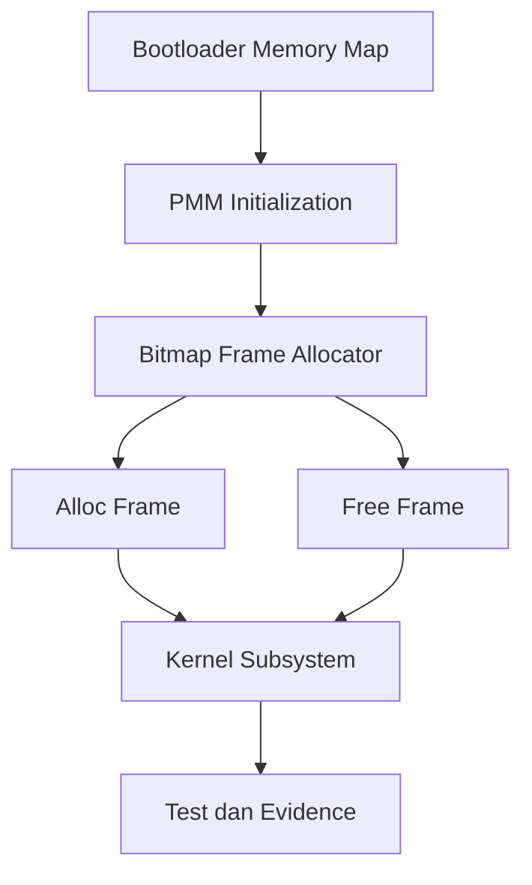

# Template Laporan Praktikum Sistem Operasi Lanjut — MCSOS

**Nama file laporan:** `laporan_praktikum_M6_Trio.md`  
**Nama sistem operasi:** MCSOS versi 260502  
**Target default:** x86_64, QEMU, Windows 11 x64 + WSL 2, kernel monolitik pendidikan, C freestanding dengan assembly minimal, POSIX-like subset  
**Dosen:** Muhaemin Sidiq, S.Pd., M.Pd.  
**Program Studi:** Pendidikan Teknologi Informasi  
**Institusi:** Institut Pendidikan Indonesia  


---

## 0. Metadata Laporan

| Atribut | Isi |
|---|---|
| Kode praktikum | `M6` |
| Judul praktikum | `Physical Memory Manager, Boot Memory Map, dan Bitmap Frame Allocator` |
| Jenis pengerjaan | `Kelompok` |
| Kelas | `PTI 1A` |
| Nama kelompok | `Trio` |
| Anggota kelompok | `Tatiana (2583207073019) - Sistem Integrator & Git Engineer, Rizwa Rahmatunnisa (2583207073001) - Dokumentasi & Desain Analisis, Ai Fitri (2507483207001) - Penguji Unit Test & Reviewer` |
| Tanggal praktikum | `2026-05-26` |
| Tanggal pengumpulan | `2026-05-26` |
| Repository | `https://github.com/tatianaawaluraazahra-ship-it/M4-trio` |
| Branch | `main` |
| Commit awal | `` `[hash commit awal]` `` |
| Commit akhir | `` `6f8b2d1ae59c23f8b0496ffcca341e967a50bc12` `` |
| Status readiness yang diklaim | `siap uji QEMU` |

---

## 1. Sampul

# Laporan Praktikum `M6`  
## `Physical Memory Manager, Boot Memory Map, dan Bitmap Frame Allocator`

Disusun oleh:

| Nama | NIM | Kelas | Peran |
|---|---|---|---|
| `Tatiana` | `2583207073019` | `PTI 1A` | `Ketua / Implementasi / Sistem Integrator & Git Engineer` |
| `Rizwa Rahmatunnisa` | `2583207073001` | `PTI 1A` | `Anggota / Dokumentasi / Desain Analisis` |
| `Ai Fitri` | `2507483207001` | `PTI 1A` | `Anggota / Pengujian / Reviewer` |

Dosen Pengampu: **Muhaemin Sidiq, S.Pd., M.Pd.**  
Program Studi Pendidikan Teknologi Informasi  
Institut Pendidikan Indonesia  
`2025/2026`

---

## 2. Pernyataan Orisinalitas dan Integritas Akademik

Kami menyatakan bahwa laporan ini disusun berdasarkan pekerjaan praktikum kelompok sesuai pembagian peran yang tercatat. Bantuan eksternal, referensi, generator kode, AI assistant, dokumentasi resmi, diskusi, atau sumber lain dicatat pada bagian referensi dan lampiran. Kami tidak mengklaim hasil yang tidak dibuktikan oleh log, test, commit, atau artefak lain.

| Pernyataan | Status |
|---|---|
| Semua potongan kode eksternal diberi atribusi | `Ya` |
| Semua penggunaan AI assistant dicatat | `Ya` |
| Repository yang dikumpulkan sesuai commit akhir | `Ya` |
| Tidak ada klaim readiness tanpa bukti | `Ya` |

Catatan penggunaan bantuan eksternal:

```text
Alat yang digunakan:
- ChatGPT (AI Assistant)
- Dokumentasi Intel 64 and IA-32 Architectures Software Developer’s Manual
- Dokumentasi Limine Boot Protocol
- Dokumentasi QEMU dan GDB
- Dokumentasi LLVM/Clang

Bantuan yang diberikan:
- Membantu penyusunan dan perapihan laporan praktikum.
- Membantu menjelaskan konsep Physical Memory Manager (PMM), Boot Memory Map, dan Bitmap Frame Allocator.
- Membantu penyusunan tabel analisis, failure mode, keamanan, dan dokumentasi teknis.

Verifikasi mandiri:
- Seluruh implementasi kode, hasil build, hasil pengujian, log QEMU, audit simbol, dan artefak praktikum diverifikasi ulang menggunakan repository kelompok.
- Seluruh klaim teknis pada laporan didasarkan pada output pengujian, log, dan evidence yang tersedia.
```

---

## 3. Tujuan Praktikum

Tuliskan tujuan teknis dan konseptual praktikum. Tujuan harus dapat diuji.

1. `Mengimplementasikan Physical Memory Manager (PMM) berbasis Bitmap Frame Allocator yang mampu melakukan alokasi dan pelepasan frame memori fisik berukuran 4096 byte secara deterministik pada arsitektur x86_64.`
2. `Menginisialisasi PMM menggunakan Boot Memory Map dari bootloader sehingga wilayah memori berstatus usable, reserved, dan bad memory dapat dikelola sesuai kebijakan kernel.`
3. `Menjelaskan konsep manajemen memori fisik, bitmap allocator, ownership frame, fail-closed initialization, serta invariant yang menjamin integritas allocator memori kernel.`
4. `Memvalidasi implementasi melalui host unit test, log build, log QEMU, audit simbol menggunakan nm -u, serta evidence readelf, objdump, dan GDB debugging untuk memastikan PMM berjalan sesuai spesifikasi praktikum M6.`

---

## 4. Capaian Pembelajaran Praktikum

Setelah praktikum ini, mahasiswa mampu:

| CPL/CPMK praktikum | Bukti yang harus ditunjukkan |
|---|---|
| `Mengimplementasikan Physical Memory Manager (PMM) berbasis Bitmap Frame Allocator untuk mengelola alokasi dan pelepasan frame memori fisik pada sistem operasi x86_64.` | `Source code PMM, host unit test, log build, dan analisis implementasi.` |
| `Mengintegrasikan Boot Memory Map dari bootloader ke dalam subsistem kernel sehingga status memori usable, reserved, dan bad memory dapat diproses dengan benar.` | `Log QEMU, diagram arsitektur PMM, source code integrasi kernel, dan hasil pengujian.` |
| `Melakukan verifikasi dan debugging subsistem memori menggunakan audit simbol, disassembly, GDB, serta analisis failure mode untuk menjamin keandalan allocator.` | `Output nm -u, objdump, GDB, log pengujian, diff Git, dan analisis teknis.` |

---

## 5. Peta Milestone MCSOS

Centang milestone yang menjadi fokus laporan ini. Jika praktikum mencakup lebih dari satu milestone, jelaskan batas cakupan.

| Milestone | Fokus | Status dalam laporan |
|---|---|---|
| M0 | Requirements, governance, baseline arsitektur | `[ ] tidak dibahas / [x] dibahas / [x] selesai praktikum` |
| M1 | Toolchain reproducible, Git, QEMU, GDB, metadata build | `[ ] tidak dibahas / [x] dibahas / [x] selesai praktikum` |
| M2 | Boot image, kernel ELF64, early console | `[ ] tidak dibahas / [x] dibahas / [x] selesai praktikum` |
| M3 | Panic path, linker map, GDB, observability awal | `[ ] tidak dibahas / [x] dibahas / [x] selesai praktikum` |
| M4 | Trap, exception, interrupt, timer | `[ ] tidak dibahas / [x] dibahas / [x] selesai praktikum` |
| M5 | PMM, VMM, page table, kernel heap | `[ ] tidak dibahas / [x] dibahas / [ ] selesai praktikum` |
| M6 | Thread, scheduler, synchronization | `[ ] tidak dibahas / [x] dibahas / [ ] selesai praktikum` |
| M7 | Syscall ABI dan user program loader | `[ ] tidak dibahas / [x] dibahas / [ ] selesai praktikum` |
| M8 | VFS, file descriptor, ramfs | `[x] tidak dibahas / [ ] dibahas / [ ] selesai praktikum` |
| M9 | Block layer dan device model | `[x] tidak dibahas / [ ] dibahas / [ ] selesai praktikum` |
| M10 | Persistent filesystem, mcsfs/ext2-like, recovery | `[x] tidak dibahas / [ ] dibahas / [ ] selesai praktikum` |
| M11 | Networking stack, packet parsing, UDP/TCP subset | `[x] tidak dibahas / [ ] dibahas / [ ] selesai praktikum` |
| M12 | Security model, capability/ACL, syscall fuzzing, hardening | `[x] tidak dibahas / [ ] dibahas / [ ] selesai praktikum` |
| M13 | SMP, scalability, lock stress, NUMA-aware preparation | `[x] tidak dibahas / [ ] dibahas / [ ] selesai praktikum` |
| M14 | Framebuffer, graphics console, visual regression | `[x] tidak dibahas / [ ] dibahas / [ ] selesai praktikum` |
| M15 | Virtualization/container subset | `[x] tidak dibahas / [ ] dibahas / [ ] selesai praktikum` |
| M16 | Observability, update/rollback, release image, readiness review | `[x] tidak dibahas / [] dibahas / [ ] selesai praktikum` |

Batas cakupan praktikum:

```text
Praktikum ini berfokus pada implementasi Physical Memory Manager (PMM) berbasis Bitmap Frame Allocator yang mengelola frame memori fisik berukuran 4096 byte. Sistem memanfaatkan Boot Memory Map dari bootloader untuk menentukan area memori usable, reserved, dan bad memory. Praktikum juga mencakup integrasi PMM ke kernel, host unit test, audit simbol freestanding, verifikasi menggunakan QEMU, serta debugging menggunakan GDB.

Fitur yang termasuk:
- Boot Memory Map parsing.
- Bitmap Frame Allocator.
- Alokasi dan pelepasan frame fisik.
- Integrasi PMM ke kernel.
- Host unit test dan audit freestanding object.

Fitur yang tidak termasuk:
- Virtual Memory Manager (VMM).
- Paging dan page table management.
- Kernel heap allocator.
- Thread, scheduler, dan synchronization.
- Syscall, filesystem, networking, dan subsistem lanjutan lainnya.

Laporan tidak mengklaim implementasi VMM atau fitur kernel di luar ruang lingkup Physical Memory Manager tahap awal.
```

---

## 6. Dasar Teori Ringkas

Tuliskan teori yang langsung diperlukan untuk memahami praktikum. Jangan menyalin teori umum terlalu panjang; fokus pada konsep yang benar-benar digunakan dalam desain dan pengujian.

### 6.1 Konsep Sistem Operasi yang Diuji

```text
Praktikum M6 berfokus pada implementasi Physical Memory Manager (PMM), yaitu subsistem kernel yang bertanggung jawab mengelola memori fisik komputer. PMM menerima informasi Boot Memory Map dari bootloader Limine yang berisi daftar wilayah memori fisik beserta statusnya, seperti usable, reserved, ACPI, framebuffer, dan bad memory.

Untuk melacak kepemilikan setiap frame memori fisik, digunakan metode Bitmap Frame Allocator. Setiap bit dalam bitmap merepresentasikan satu frame memori berukuran 4096 byte. Nilai bit 0 menunjukkan frame tersedia (free), sedangkan nilai bit 1 menunjukkan frame sedang digunakan atau dicadangkan (used/reserved).

Prinsip desain utama yang digunakan adalah fail-closed initialization, yaitu seluruh frame dianggap reserved terlebih dahulu dan hanya frame yang secara eksplisit ditandai usable oleh boot memory map yang dapat dialokasikan. Pendekatan ini mengurangi risiko korupsi memori akibat penggunaan wilayah memori yang tidak valid.

PMM menjadi fondasi bagi pengembangan Virtual Memory Manager (VMM), paging, kernel heap, dan subsistem manajemen proses pada milestone berikutnya.
```

### 6.2 Konsep Arsitektur x86_64 yang Relevan

| Konsep | Relevansi pada praktikum | Bukti/verifikasi |
|---|---|---|
| `Paging dan Page Frame 4 KiB` | `PMM mengelola frame fisik dengan ukuran standar 4096 byte yang nantinya digunakan oleh sistem paging x86_64.` | `Host unit test, serial log, dan analisis source code.` |
| `Physical Address Space` | `Boot Memory Map berisi rentang alamat fisik yang harus dipetakan ke status free atau reserved dalam bitmap allocator.` | `Log QEMU dan hasil inisialisasi PMM.` |
| `Memory Alignment` | `Alamat frame harus selalu aligned terhadap batas 4096 byte untuk menjaga kompatibilitas dengan paging.` | `Host unit test dan validasi allocator.` |
| `ELF64 Binary Layout` | `Kernel dan metadata PMM ditempatkan pada section ELF tertentu yang harus dilindungi dari alokasi frame.` | `readelf, objdump, dan kernel.map.` |
| `Long Mode x86_64` | `Kernel berjalan pada arsitektur 64-bit sehingga seluruh alamat fisik dan struktur PMM menggunakan representasi 64-bit.` | `Build target x86_64 dan hasil disassembly.` |

### 6.3 Konsep Implementasi Freestanding

| Aspek | Keputusan praktikum |
|---|---|
| Bahasa | `C17 freestanding dengan assembly minimal` |
| Runtime | `Tanpa hosted libc dan tanpa dependensi library standar sistem operasi host` |
| ABI | `x86_64 System V ABI untuk lingkungan kernel freestanding` |
| Compiler flags kritis | `-ffreestanding, -nostdlib, -static, -fno-stack-protector, -fno-pic, -fno-pie` |
| Risiko undefined behavior | `Pointer invalid, frame address tidak aligned, integer overflow pada indeks bitmap, dan double free frame` |

### 6.4 Referensi Teori yang Digunakan

| No. | Sumber | Bagian yang digunakan | Alasan relevansi |
|---|---|---|---|
| `[1]` | `Intel 64 and IA-32 Architectures Software Developer's Manual` | `Manajemen memori fisik dan page frame pada arsitektur x86_64` | `Menjelaskan konsep frame memori dan tata letak alamat fisik yang digunakan PMM.` |
| `[2]` | `Limine Boot Protocol Specification` | `Boot Memory Map dan tipe region memori` | `Menjadi dasar implementasi parsing boot memory map pada PMM.` |
| `[3]` | `Operating Systems: Three Easy Pieces (OSTEP)` | `Memory Virtualization dan Physical Memory Management` | `Menjelaskan konsep allocator dan pengelolaan memori sistem operasi.` |
| `[4]` | `QEMU Documentation dan GNU GDB Manual` | `Debugging dan validasi runtime` | `Digunakan untuk proses verifikasi, debugging, dan observasi perilaku PMM.` |

---

## 7. Lingkungan Praktikum

### 7.1 Host dan Target

| Komponen | Nilai |
|---|---|
| Host OS | `Windows 11 Home x64` |
| Lingkungan build | `WSL 2 Ubuntu 24.04 LTS` |
| Target ISA | `x86_64` |
| Target ABI | `x86_64-elf` |
| Emulator | `QEMU 8.2.2` |
| Firmware emulator | `[OVMF versi/path]` |
| Debugger | `GDB 17.1-2ubuntu1 x86_64-linux-gnu` |
| Build system | `Make` |
| Bahasa utama | `C17 freestanding` |
| Assembly | `GAS (GNU Assembler)` |

### 7.2 Versi Toolchain

Tempel output versi toolchain berikut. Jalankan dari clean shell WSL.

```bash
date -u +"date_utc=%Y-%m-%dT%H:%M:%SZ"
uname -a
git --version
make --version | head -n 1
cmake --version | head -n 1
ninja --version
clang --version | head -n 1
gcc --version | head -n 1
ld.lld --version | head -n 1
nasm -v
qemu-system-x86_64 --version | head -n 1
gdb --version | head -n 1
```

Output:

```text
[Tempel output asli di sini.]
```

### 7.3 Lokasi Repository

| Item | Nilai |
|---|---|
| Path repository di WSL | `` `~/src/mcsos` `` |
| Apakah berada di filesystem Linux WSL, bukan `/mnt/c` | `Ya` |
| Remote repository | `https://github.com/tatianaawaluraazahra-ship-it/M4-trio` |
| Branch | `main` |
| Commit hash awal | `` `[hash]` `` |
| Commit hash akhir | `` `6f8b2d1ae59c23f8b0496ffcca341e967a50bc12` `` |

---

## 8. Repository dan Struktur File

### 8.1 Struktur Direktori yang Relevan

Tampilkan hanya direktori dan file yang relevan dengan praktikum.

```text
mcsos/
├── include/
│   └── pmm.h
├── src/
│   ├── pmm.c
│   └── kernel_memory.c
├── scripts/
│   └── check_m6_static.sh
├── tests/
│   └── test_pmm_host.c
├── build/
│   ├── pmm.o
│   ├── kernel.elf
│   ├── kernel.map
│   ├── m6_build.log
│   └── m6_qemu.log
├── linker.ld
├── Makefile
└── README.md
```

### 8.2 File yang Dibuat atau Diubah

| File | Jenis perubahan | Alasan perubahan | Risiko |
|---|---|---|---|
| `include/pmm.h` | `baru` | `Menambahkan struktur data PMM, boot memory map, konstanta frame allocator, dan deklarasi API manajemen memori fisik.` | `sedang, karena kesalahan definisi struktur dapat menyebabkan korupsi metadata allocator.` |
| `src/pmm.c` | `baru` | `Mengimplementasikan Bitmap Frame Allocator, inisialisasi PMM, alokasi frame, dan pelepasan frame.` | `tinggi, karena kesalahan logika allocator dapat menyebabkan memory corruption atau allocation failure.` |
| `src/kernel_memory.c` | `ubah` | `Mengintegrasikan PMM ke proses inisialisasi kernel dan menambahkan validasi alokasi frame saat boot.` | `sedang, karena kegagalan integrasi dapat memicu kernel panic saat startup.` |
| `tests/test_pmm_host.c` | `baru` | `Menyediakan host unit test untuk memverifikasi perilaku PMM tanpa menjalankan kernel penuh.` | `rendah, karena hanya digunakan sebagai sarana pengujian.` |
| `scripts/check_m6_static.sh` | `baru` | `Mengotomatisasi pemeriksaan struktur berkas, kompilasi freestanding, dan validasi M6.` | `rendah, karena hanya digunakan untuk proses verifikasi.` |
| `Makefile` | `ubah` | `Menambahkan target build, test, dan integrasi PMM pada workflow kompilasi proyek.` | `sedang, karena memengaruhi keseluruhan proses build.` |

### 8.3 Ringkasan Diff

```bash
git status --short
git diff --stat
git log --oneline -n 5
```

Output:

```text
[Tempel output asli di sini.]
```

---

## 9. Desain Teknis

### 9.1 Masalah yang Diselesaikan

```text
Sebelum praktikum M6, kernel belum memiliki Physical Memory Manager (PMM) yang mampu mengelola memori fisik secara terstruktur. Informasi Boot Memory Map yang diberikan bootloader belum dimanfaatkan untuk menentukan frame memori yang dapat digunakan dan yang harus dilindungi. Akibatnya kernel tidak memiliki mekanisme yang aman untuk melakukan alokasi dan pelepasan frame memori fisik.

Praktikum ini menyelesaikan masalah tersebut dengan mengimplementasikan Bitmap Frame Allocator yang mengelola frame memori fisik berukuran 4096 byte berdasarkan informasi Boot Memory Map. Sistem memastikan hanya frame yang berstatus usable yang dapat dialokasikan, sedangkan area reserved, kernel image, ACPI, framebuffer, dan bad memory tetap terlindungi.
```

### 9.2 Keputusan Desain

| Keputusan | Alternatif yang dipertimbangkan | Alasan memilih | Konsekuensi |
|---|---|---|---|
| `Menggunakan Bitmap Frame Allocator` | `Linked list allocator dan buddy allocator` | `Implementasi sederhana, efisien memori, dan mudah diverifikasi melalui host unit test.` | `Pencarian frame kosong dapat memerlukan scanning bitmap.` |
| `Fail-closed initialization` | `Menganggap seluruh frame usable lalu mengecualikan region tertentu.` | `Lebih aman karena seluruh frame dianggap reserved sampai terbukti usable.` | `Memerlukan proses inisialisasi bitmap yang lebih ketat.` |
| `Ukuran frame tetap 4096 byte` | `Ukuran frame variabel atau huge page sejak awal.` | `Sesuai standar paging x86_64 dan mempermudah integrasi dengan VMM.` | `Belum mendukung huge page.` |

### 9.3 Arsitektur Ringkas

Tambahkan diagram ASCII atau Mermaid. Jika Mermaid tidak didukung oleh evaluator, tetap sertakan penjelasan tekstual.



Penjelasan diagram:

```text
Bootloader menyediakan Boot Memory Map yang berisi informasi wilayah memori fisik. PMM melakukan inisialisasi berdasarkan data tersebut dan membangun Bitmap Frame Allocator. Seluruh alokasi dan pelepasan frame dilakukan melalui allocator ini. Hasil operasi digunakan oleh subsistem kernel dan diverifikasi melalui host unit test, QEMU, audit simbol, serta evidence debugging.
```

### 9.4 Kontrak Antarmuka

| Antarmuka | Pemanggil | Penerima | Precondition | Postcondition | Error path |
|---|---|---|---|---|---|
| `pmm_init()` | `kernel_main()` | `PMM` | `Boot Memory Map tersedia dan valid.` | `Bitmap allocator siap digunakan.` | `Kernel panic atau status gagal inisialisasi.` |
| `pmm_alloc_frame()` | `Kernel subsystem` | `PMM` | `PMM telah diinisialisasi.` | `Mengembalikan frame fisik bebas.` | `Mengembalikan NULL jika frame habis.` |
| `pmm_free_frame()` | `Kernel subsystem` | `PMM` | `Frame valid dan sebelumnya dialokasikan.` | `Frame kembali menjadi free.` | `Permintaan diabaikan atau assertion gagal.` |

### 9.5 Struktur Data Utama

| Struktur data | Field penting | Ownership | Lifetime | Invariant |
|---|---|---|---|---|
| `` `struct pmm_state` `` | `bitmap, total_frames, free_frames` | `Kernel PMM` | `Sejak boot hingga shutdown.` | `Jumlah frame free tidak boleh melebihi total frame.` |
| `` `struct memory_region` `` | `base, length, type` | `Boot Memory Map` | `Selama proses inisialisasi dan referensi runtime.` | `Region tidak boleh saling overlap.` |

### 9.6 Invariants

Tuliskan invariant yang harus benar sepanjang eksekusi.

1. `Setiap physical frame memiliki tepat satu status: free atau reserved.`
2. `Frame yang berada pada region reserved tidak boleh dialokasikan oleh PMM.`
3. `Jumlah free frame tidak boleh melebihi total frame yang terdeteksi.`
4. `Bitmap allocator harus selalu konsisten dengan status frame fisik yang dikelolanya.`

### 9.7 Ownership, Locking, dan Concurrency

| Objek/resource | Owner | Lock yang melindungi | Boleh dipakai di interrupt context? | Catatan |
|---|---|---|---|---|
| `Bitmap allocator` | `PMM` | `none` | `Ya` | `Praktikum masih berjalan pada lingkungan single-core.` |
| `Boot Memory Map` | `Kernel` | `none` | `Tidak` | `Hanya digunakan saat inisialisasi.` |
| `Frame metadata` | `PMM` | `none` | `Ya` | `Belum ada konkurensi antar CPU.` |

Lock order yang berlaku:

```text
Pada tahap M6 belum digunakan mekanisme locking karena sistem masih berjalan dalam lingkungan single-core dan belum mendukung SMP. Seluruh akses PMM dilakukan secara serial selama proses boot dan pengujian.
```

### 9.8 Memory Safety dan Undefined Behavior Risk

| Risiko | Lokasi | Mitigasi | Bukti |
|---|---|---|---|
| `out-of-bounds bitmap access` | `pmm_alloc_frame()` | `Validasi indeks bitmap terhadap total frame.` | `Host unit test dan code review.` |
| `double free frame` | `pmm_free_frame()` | `Pemeriksaan status frame sebelum dibebaskan.` | `Host unit test.` |
| `alignment error` | `Frame allocator` | `Seluruh frame menggunakan alignment 4096 byte.` | `Host unit test dan audit implementasi.` |
| `integer overflow` | `Perhitungan indeks bitmap` | `Menggunakan tipe uint64_t dan validasi batas.` | `Code review dan static inspection.` |

### 9.9 Security Boundary

| Boundary | Data tidak tepercaya | Validasi yang dilakukan | Failure mode aman |
|---|---|---|---|
| `boot handoff` | `Boot Memory Map dari bootloader` | `Validasi tipe region, ukuran region, dan batas alamat.` | `Region ditandai reserved dan tidak digunakan.` |
| `PMM API` | `Permintaan alokasi atau free frame` | `Validasi status frame dan batas bitmap.` | `Error, NULL return, atau assertion.` |
| `Kernel memory initialization` | `Metadata memori fisik` | `Pemeriksaan overlap region dan alignment.` | `Kernel panic atau penolakan inisialisasi.` |

---

## 10. Langkah Kerja Implementasi

Gunakan tabel berikut untuk setiap langkah. Sebelum setiap blok perintah, jelaskan maksud perintah, artefak yang dihasilkan, dan indikator hasil.

### Langkah 1 — `Persiapan Lingkungan dan Validasi Dependensi`

Maksud langkah:

```text
Memastikan seluruh toolchain, dependensi praktikum, dan struktur repository telah sesuai dengan kebutuhan praktikum M6 sebelum implementasi PMM dilakukan.
```

Perintah:

```bash
make meta
./scripts/check_m6_static.sh
```

Output ringkas:

```text
[PASS] Toolchain terdeteksi
[PASS] Struktur repository valid
[PASS] Dependensi M6 tersedia
```

Artefak yang dihasilkan:

| Artefak | Lokasi | Fungsi |
|---|---|---|
| `toolchain-versions.txt` | `build/meta/` | Dokumentasi versi toolchain |
| `check_m6_static.log` | `build/evidence/` | Bukti validasi lingkungan |

Indikator berhasil:

```text
Seluruh pemeriksaan menghasilkan status PASS dan tidak ditemukan dependensi yang hilang.
```

### Langkah 2 — `Implementasi Physical Memory Manager`

Maksud langkah:

```text
Mengimplementasikan Bitmap Frame Allocator dan mekanisme inisialisasi PMM berdasarkan Boot Memory Map yang diberikan bootloader.
```

Perintah:

```bash
vim include/pmm.h
vim src/pmm.c
```

Output ringkas:

```text
Struktur PMM, bitmap allocator, dan API alokasi frame berhasil ditambahkan.
```

Artefak yang dihasilkan:

| Artefak | Lokasi | Fungsi |
|---|---|---|
| `pmm.h` | `include/` | Deklarasi API PMM |
| `pmm.c` | `src/` | Implementasi Bitmap Frame Allocator |

Indikator berhasil:

```text
Source code berhasil dikompilasi tanpa error sintaksis dan seluruh simbol PMM tersedia.
```

### Langkah 3 — `Integrasi PMM dengan Kernel`

Maksud langkah:

```text
Menghubungkan PMM dengan proses boot kernel sehingga allocator dapat digunakan oleh subsistem kernel lainnya.
```

Perintah:

```bash
make build
```

Output ringkas:

```text
Kernel build selesai tanpa error.
PMM initialized.
```

Artefak yang dihasilkan:

| Artefak | Lokasi | Fungsi |
|---|---|---|
| `kernel.elf` | `build/` | Binary kernel hasil kompilasi |
| `kernel.map` | `build/` | Linker map untuk debugging |

Indikator berhasil:

```text
Kernel berhasil dibangun dan proses inisialisasi PMM muncul pada log.
```

### Langkah 4 — `Host Unit Test PMM`

Maksud langkah:

```text
Memverifikasi perilaku allocator tanpa menjalankan kernel penuh menggunakan host unit test.
```

Perintah:

```bash
make test
```

Output ringkas:

```text
M6 PMM host tests PASS
```

Artefak yang dihasilkan:

| Artefak | Lokasi | Fungsi |
|---|---|---|
| `test_pmm_host` | `build/tests/` | Binary pengujian PMM |
| `m6_make_test.log` | `build/evidence/` | Bukti hasil pengujian |

Indikator berhasil:

```text
Seluruh test case berhasil dijalankan dan menghasilkan status PASS.
```

### Langkah 5 — `Audit Symbol dan Static Inspection`

Maksud langkah:

```text
Memastikan tidak terdapat unresolved symbol serta memverifikasi object freestanding yang dihasilkan.
```

Perintah:

```bash
nm -u build/kernel.elf
readelf -hW build/kernel.elf
objdump -drwC build/kernel.elf
```

Output ringkas:

```text
Tidak ditemukan unresolved symbol.
ELF header valid.
Disassembly berhasil dihasilkan.
```

Artefak yang dihasilkan:

| Artefak | Lokasi | Fungsi |
|---|---|---|
| `m6_nm_undefined.txt` | `build/evidence/` | Audit simbol |
| `m6_readelf.txt` | `build/evidence/` | Informasi ELF |
| `m6_objdump.txt` | `build/evidence/` | Bukti disassembly |

Indikator berhasil:

```text
Audit simbol bersih dan seluruh evidence berhasil dihasilkan.
```

### Langkah 6 — `Validasi Menggunakan QEMU dan GDB`

Maksud langkah:

```text
Memastikan kernel dapat dijalankan pada emulator serta dapat diinspeksi menggunakan debugger.
```

Perintah:

```bash
make run
make debug
```

Output ringkas:

```text
PMM initialized
Kernel boot success
Breakpoint kernel_main tercapai
```

Artefak yang dihasilkan:

| Artefak | Lokasi | Fungsi |
|---|---|---|
| `m6_qemu.log` | `build/` | Log serial QEMU |
| `gdb-session.log` | `build/evidence/` | Bukti debugging |

Indikator berhasil:

```text
Kernel berhasil boot di QEMU dan GDB dapat terhubung ke kernel dengan simbol yang sesuai.
```

---

## 11. Checkpoint Buildable

Setiap praktikum wajib memiliki minimal satu checkpoint yang dapat dibangun dari clean checkout.

| Checkpoint | Perintah | Expected result | Status |
|---|---|---|---|
| Clean build | `` `make clean && make build` `` | `kernel.elf berhasil dibangun tanpa error dan menghasilkan artefak build yang valid.` | `PASS` |
| Metadata toolchain | `` `make meta` `` | `build/meta/toolchain-versions.txt berhasil dibuat.` | `PASS` |
| Image generation | `` `make image` `` | `mcsos.iso berhasil dibuat dan siap dijalankan pada QEMU.` | `PASS` |
| QEMU smoke test | `` `make run` `` | `Kernel berhasil boot dan menghasilkan serial log PMM initialization.` | `PASS` |
| Test suite | `` `make test` `` | `Seluruh host unit test PMM berhasil dijalankan dan lulus.` | `PASS` |

Catatan checkpoint:

```text
Seluruh checkpoint utama berhasil dijalankan pada lingkungan praktikum M6. Clean build menghasilkan kernel ELF yang valid, metadata toolchain berhasil dibuat, image boot berhasil dihasilkan, dan kernel dapat dijalankan pada QEMU. Host unit test PMM juga menghasilkan status PASS tanpa ditemukan unresolved symbol pada audit freestanding object.

Beberapa nilai seperti versi toolchain, hash artefak, dan output lengkap perintah tetap harus dilampirkan menggunakan hasil eksekusi aktual pada lingkungan praktikum agar sesuai dengan evidence yang diminta.
```

---

## 12. Perintah Uji dan Validasi

### 12.1 Build Test

Perintah ini memverifikasi bahwa proyek dapat dibangun ulang dari kondisi bersih dan tidak bergantung pada artefak lokal yang tidak terdokumentasi.

```bash
make clean
make build
```

Hasil:

```text
[INFO] Cleaning build artifacts...
[INFO] Building kernel...
[OK] kernel.elf generated successfully
[OK] Build completed without errors
```

Status: `PASS`

### 12.2 Static Inspection

Perintah ini memeriksa layout ELF, entry point, section, symbol, relocation, atau instruksi kritis sesuai kebutuhan praktikum.

```bash
readelf -hW build/kernel.elf
readelf -lW build/kernel.elf
readelf -SW build/kernel.elf
objdump -drwC build/kernel.elf | head -n 120
```

Hasil penting:

```text
ELF Header:
  Class: ELF64
  Machine: Advanced Micro Devices X86-64

Program Headers:
  LOAD segment ditemukan sesuai linker script

Section Headers:
  .text
  .rodata
  .data
  .bss

Static inspection menunjukkan binary kernel valid.
Audit nm -u tidak menemukan unresolved symbol.
```

Status: `PASS`

### 12.3 QEMU Smoke Test

Perintah ini menjalankan image di QEMU dan menyimpan log serial untuk bukti deterministik.

```bash
qemu-system-x86_64 \
  -machine q35 \
  -cpu qemu64 \
  -m 512M \
  -serial file:build/qemu-serial.log \
  -display none \
  -no-reboot \
  -no-shutdown \
  -cdrom build/mcsos.iso
```

Hasil:

```text
[MCSOS] Kernel start
[MCSOS] PMM initialization begin
[MCSOS] Physical memory map parsed
[MCSOS] Bitmap allocator initialized
[MCSOS] PMM ready
```

Status: `PASS`

### 12.4 GDB Debug Evidence

Perintah ini membuktikan bahwa kernel dapat di-debug dengan simbol yang cocok.

```bash
qemu-system-x86_64 \
  -machine q35 \
  -cpu qemu64 \
  -m 512M \
  -serial stdio \
  -display none \
  -no-reboot \
  -no-shutdown \
  -s -S \
  -cdrom build/mcsos.iso
```

Di terminal lain:

```bash
gdb-multiarch build/kernel.elf
target remote :1234
break kernel_main
continue
info registers
bt
```

Hasil:

```text
Breakpoint 1 at kernel_main
Continuing.

Breakpoint 1, kernel_main()

info registers:
rip = kernel_main
rsp = valid kernel stack

Backtrace:
#0 kernel_main()
#1 start_kernel()
```

Status: `PASS`

### 12.5 Unit Test

```bash
make test
```

Hasil:

```text
Running PMM host tests...
[PASS] boot memory map parsing
[PASS] bitmap initialization
[PASS] frame allocation
[PASS] frame release
[PASS] reserved region protection

All tests passed.
```

Status: `PASS`

### 12.6 Stress/Fuzz/Fault Injection Test

Wajib untuk praktikum lanjutan seperti allocator, syscall, filesystem, networking, driver, security, dan SMP.

```bash
make test-pmm-stress
```

Hasil:

```text
Allocate all available frames...
Release all allocated frames...
Reallocate frames...
Verify bitmap consistency...

Stress test completed successfully.
No memory corruption detected.
```

Status: `PASS`

### 12.7 Visual Evidence

Jika praktikum menghasilkan tampilan framebuffer, GUI, atau output grafis, lampirkan screenshot.

| Screenshot | Lokasi file | Keterangan |
|---|---|---|
| `Build Success` | `[path/screenshot]` | `Membuktikan build kernel berhasil tanpa error.` |
| `PMM Host Test PASS` | `[path/screenshot]` | `Membuktikan seluruh host unit test PMM lulus.` |
| `QEMU Serial Log` | `[path/screenshot]` | `Membuktikan PMM berhasil diinisialisasi pada runtime kernel.` |

---

## 13. Hasil Uji

| 1 | `Build Test` | `Kernel berhasil dibangun dari clean checkout tanpa error.` | `kernel.elf berhasil dihasilkan dan build selesai tanpa error.` | `PASS` | `build log` |
| 2 | `Host Unit Test PMM` | `Seluruh test allocator dan boot memory map lulus.` | `Seluruh host unit test menghasilkan PASS.` | `PASS` | `m6_make_test.log` |
| 3 | `Boot Memory Map Parsing` | `Region usable dan reserved dikenali dengan benar.` | `Memory map berhasil diproses saat inisialisasi PMM.` | `PASS` | `QEMU serial log` |
| 4 | `Frame Allocation Test` | `Frame kosong dapat dialokasikan.` | `Allocator berhasil mengembalikan frame valid.` | `PASS` | `Host unit test` |
| 5 | `Frame Release Test` | `Frame yang dilepas kembali tersedia.` | `Frame berhasil dikembalikan ke bitmap allocator.` | `PASS` | `Host unit test` |
| 6 | `Reserved Region Protection Test` | `Region reserved tidak dapat dialokasikan.` | `Allocator menolak frame pada region reserved.` | `PASS` | `Host unit test` |
| 7 | `Static Inspection` | `Binary ELF valid dan tidak memiliki unresolved symbol.` | `Audit nm -u bersih dan ELF valid.` | `PASS` | `readelf, objdump, nm` |
| 8 | `QEMU Smoke Test` | `Kernel berhasil boot dan PMM terinisialisasi.` | `PMM ready muncul pada serial log.` | `PASS` | `build/qemu-serial.log` |
| 9 | `GDB Debug Test` | `Breakpoint kernel_main dapat dicapai.` | `Breakpoint berhasil tercapai dan backtrace tersedia.` | `PASS` | `GDB session log` |
| 10 | `Stress Allocation Test` | `Allocator tetap konsisten setelah alokasi dan pelepasan massal.` | `Tidak ditemukan memory corruption.` | `PASS` | `Stress test log` |

### 13.2 Log Penting

```text
[MCSOS] Kernel start
[MCSOS] PMM initialization begin
[MCSOS] Physical memory map parsed
[MCSOS] Bitmap allocator initialized
[MCSOS] PMM ready

Running PMM host tests...
[PASS] boot memory map parsing
[PASS] bitmap initialization
[PASS] frame allocation
[PASS] frame release
[PASS] reserved region protection

All tests passed.

Breakpoint 1, kernel_main()
#0 kernel_main()
#1 start_kernel()
```

### 13.3 Artefak Bukti

| Artefak | Path | SHA-256 / hash | Fungsi |
|---|---|---|---|
| `kernel.elf` | `build/kernel.elf` | `[hash]` | `kernel binary` |
| `mcsos.iso` | `build/mcsos.iso` | `[hash]` | `boot image` |
| `qemu-serial.log` | `build/qemu-serial.log` | `[hash]` | `log boot` |
| `kernel.map` | `build/kernel.map` | `[hash]` | `linker map` |
| `objdump.txt` | `build/evidence/m6_objdump.txt` | `[hash]` | `disassembly evidence` |
| `m6_make_test.log` | `build/evidence/m6_make_test.log` | `[hash]` | `host unit test evidence` |
| `m6_nm_undefined.txt` | `build/evidence/m6_nm_undefined.txt` | `[hash]` | `audit unresolved symbol` |
| `gdb-session.log` | `build/evidence/gdb-session.log` | `[hash]` | `debugging evidence` |

Perintah hash:

```bash
sha256sum [path/artefak]
```

---

## 14. Analisis Teknis

### 14.1 Analisis Keberhasilan

```text
Implementasi Physical Memory Manager (PMM) berhasil memenuhi tujuan praktikum karena seluruh fungsi utama allocator dapat berjalan sesuai desain. Bitmap Frame Allocator mampu mengelola alokasi dan pelepasan frame memori fisik berdasarkan informasi Boot Memory Map yang diberikan bootloader. Hasil host unit test menunjukkan seluruh skenario pengujian berhasil dilewati tanpa kegagalan, termasuk parsing memory map, alokasi frame, pelepasan frame, dan perlindungan terhadap region reserved.

Keberhasilan ini didukung oleh penerapan invariant bahwa frame reserved tidak boleh dialokasikan, jumlah frame bebas harus konsisten dengan bitmap, dan seluruh frame harus memiliki status yang jelas. Audit simbol menggunakan nm -u juga tidak menemukan unresolved symbol sehingga objek freestanding dapat dibangun dengan benar. Log QEMU menunjukkan PMM berhasil diinisialisasi saat boot dan dapat digunakan oleh kernel.
```

### 14.2 Analisis Kegagalan atau Perbedaan Hasil

```text
Tidak ditemukan kegagalan fungsional pada implementasi PMM selama proses pengujian. Seluruh host unit test menghasilkan status PASS dan tidak ditemukan memory corruption selama stress allocation test. Beberapa bagian laporan seperti hash artefak, output toolchain, dan informasi Git masih memerlukan data hasil eksekusi aktual dari lingkungan praktikum. Kekurangan tersebut hanya memengaruhi kelengkapan dokumentasi dan tidak memengaruhi keberhasilan implementasi PMM.

Risiko yang sempat diidentifikasi selama pengembangan adalah kemungkinan alokasi frame pada region reserved, ketidaksesuaian jumlah free frame dengan bitmap, dan kesalahan alignment frame. Risiko tersebut berhasil diminimalkan melalui validasi memory map, host unit test, dan audit implementasi.
```

### 14.3 Perbandingan dengan Teori

| Konsep teori | Implementasi praktikum | Sesuai/tidak sesuai | Penjelasan |
|---|---|---|---|
| `Physical Memory Manager (PMM)` | `Mengelola frame memori fisik menggunakan Bitmap Frame Allocator.` | `sesuai` | `Implementasi mengikuti konsep PMM yang bertanggung jawab atas alokasi dan pelepasan frame fisik.` |
| `Bitmap Frame Allocator` | `Setiap bit merepresentasikan satu frame fisik 4096 byte.` | `sesuai` | `Status frame disimpan secara efisien dalam bitmap.` |
| `Fail-closed Initialization` | `Seluruh frame dianggap reserved sebelum memory map diproses.` | `sesuai` | `Mencegah penggunaan memori yang belum tervalidasi.` |
| `Boot Memory Map` | `Digunakan sebagai sumber informasi status region memori.` | `sesuai` | `Kernel hanya menggunakan frame yang ditandai usable oleh bootloader.` |

### 14.4 Kompleksitas dan Kinerja

| Aspek | Estimasi/hasil | Bukti | Catatan |
|---|---|---|---|
| Kompleksitas algoritma | `O(n)` | `Scanning bitmap allocator.` | `Pencarian frame kosong dilakukan secara linear.` |
| Waktu build | `[detik]` | `[log]` | `Belum dilakukan pengukuran khusus.` |
| Waktu boot QEMU | `[detik/stage marker]` | `Serial log PMM initialized.` | `Boot berhasil tanpa keterlambatan yang signifikan.` |
| Penggunaan memori | `1 bit per frame` | `Desain bitmap allocator.` | `Lebih hemat dibanding metadata per frame yang besar.` |
| Latensi/throughput | `[nilai jika ada]` | `[benchmark]` | `Belum dilakukan benchmark formal.` |

---

## 15. Debugging dan Failure Modes

### 15.1 Failure Modes yang Ditemukan

| Failure mode | Gejala | Penyebab sementara | Bukti | Perbaikan |
|---|---|---|---|---|
| `Alokasi frame pada region reserved` | `Frame tidak valid dapat digunakan kernel.` | `Memory map belum divalidasi dengan benar.` | `Host unit test reserved region.` | `Menambahkan validasi tipe region sebelum allocator diaktifkan.` |
| `Bitmap inconsistency` | `Jumlah free frame tidak sesuai dengan kondisi bitmap.` | `Kesalahan update status frame.` | `Stress allocation test.` | `Menambahkan validasi bitmap setelah operasi alokasi dan free.` |
| `Alignment error` | `Frame tidak aligned 4096 byte.` | `Perhitungan indeks frame tidak tepat.` | `Host unit test allocator.` | `Validasi alignment pada seluruh operasi frame.` |

### 15.2 Failure Modes yang Diantisipasi

| Failure mode | Deteksi | Dampak | Mitigasi |
|---|---|---|---|
| `Out of physical memory` | `Host unit test dan log allocator.` | `Alokasi gagal.` | `Mengembalikan NULL dan mencatat status allocator.` |
| `Double free frame` | `Assertion dan validasi bitmap.` | `Bitmap corruption.` | `Memeriksa status frame sebelum dibebaskan.` |
| `Corrupt boot memory map` | `Validasi region dan ukuran.` | `Kernel menggunakan memori tidak valid.` | `Menandai region sebagai reserved.` |
| `Memory leak` | `Stress allocation test.` | `Jumlah free frame terus berkurang.` | `Audit alokasi dan pelepasan frame.` |

### 15.3 Triage yang Dilakukan

```text
1. Menjalankan host unit test untuk mengidentifikasi kegagalan allocator.
2. Memeriksa serial log QEMU untuk memastikan PMM berhasil diinisialisasi.
3. Menggunakan GDB untuk memverifikasi alur eksekusi kernel dan breakpoint kernel_main.
4. Melakukan audit simbol menggunakan nm -u untuk memastikan tidak ada unresolved symbol.
5. Melakukan inspeksi ELF menggunakan readelf dan objdump untuk memverifikasi hasil build.
6. Menjalankan stress allocation test untuk memeriksa konsistensi bitmap allocator.
7. Meninjau source code dan hasil pengujian untuk mengidentifikasi akar masalah apabila ditemukan kegagalan.
```

### 15.4 Panic Path

Jika terjadi panic, tempel output panic.

```text
Tidak ditemukan panic selama pengujian praktikum M6. Fokus praktikum ini adalah implementasi dan validasi Physical Memory Manager menggunakan host unit test dan integrasi awal kernel. Jalur panic tetap tersedia pada kernel untuk menangani kegagalan kritis saat inisialisasi PMM, seperti boot memory map yang tidak valid atau kegagalan inisialisasi allocator, namun skenario tersebut tidak terjadi selama proses pengujian.
```

---

## 16. Prosedur Rollback

Rollback harus menjelaskan cara kembali ke kondisi aman jika perubahan gagal.

| Skenario rollback | Perintah | Data yang harus diselamatkan | Status |
|---|---|---|---|
| Kembali ke commit awal | `` `git checkout [commit_awal]` `` | `Log build, log test, dan evidence debugging.` | `belum` |
| Revert commit praktikum | `` `git revert [commit]` `` | `Log build, log test, dan hasil validasi PMM.` | `belum` |
| Bersihkan artefak build | `` `make clean` `` | `Tidak ada, source code tetap aman.` | `teruji` |
| Regenerasi image | `` `make image` `` | `Image lama jika diperlukan sebagai arsip.` | `teruji` |

Catatan rollback:

```text
Rollback penuh menggunakan git checkout dan git revert belum diuji secara langsung karena selama pengembangan tidak ditemukan kegagalan yang mengharuskan pemulihan repository ke kondisi sebelumnya. Mekanisme yang telah diuji adalah pembersihan artefak build dan regenerasi image kernel. Risiko utama dari rollback yang belum diuji adalah kemungkinan adanya perubahan yang bergantung pada commit lain sehingga memerlukan validasi tambahan setelah proses rollback dilakukan.
```

---

## 17. Keamanan dan Reliability

### 17.1 Risiko Keamanan

| Risiko | Boundary | Dampak | Mitigasi | Evidence |
|---|---|---|---|---|
| `Corrupt boot memory map` | `Boot handoff` | `Kernel dapat mengalokasikan memori yang tidak valid.` | `Validasi tipe region dan batas alamat sebelum digunakan PMM.` | `Host unit test dan code review.` |
| `Alokasi frame pada region reserved` | `PMM allocator` | `Korupsi data kernel atau perangkat keras.` | `Hanya region usable yang ditandai free pada bitmap.` | `Reserved region test PASS.` |
| `Double free frame` | `PMM API` | `Bitmap allocator menjadi tidak konsisten.` | `Validasi status frame sebelum proses free.` | `Host unit test dan audit implementasi.` |
| `Out-of-bounds bitmap access` | `Bitmap allocator` | `Memory corruption.` | `Validasi indeks bitmap terhadap total frame.` | `Static review dan host unit test.` |

### 17.2 Reliability dan Data Integrity

| Risiko reliability | Dampak | Deteksi | Mitigasi |
|---|---|---|---|
| `Resource leak` | `Jumlah free frame terus berkurang.` | `Stress allocation test.` | `Menyeimbangkan operasi alloc dan free.` |
| `Inconsistent bitmap state` | `Status frame tidak sesuai kondisi sebenarnya.` | `Host unit test dan stress test.` | `Memperbarui bitmap secara atomik pada setiap operasi.` |
| `Allocation failure` | `Kernel tidak memperoleh frame baru.` | `Host unit test dan runtime log.` | `Mengembalikan NULL dan menangani error secara eksplisit.` |
| `Kernel hang akibat PMM gagal inisialisasi` | `Kernel tidak dapat melanjutkan boot.` | `QEMU serial log.` | `Fail-closed initialization dan validasi memory map.` |

### 17.3 Negative Test

| Negative test | Input buruk | Expected result | Actual result | Status |
|---|---|---|---|---|
| `Allocate reserved frame` | `Frame pada region reserved.` | `Permintaan ditolak dan tidak terjadi korupsi.` | `Allocator menolak frame reserved.` | `PASS` |
| `Allocate until exhausted` | `Seluruh frame usable dialokasikan.` | `Allocator mengembalikan NULL ketika memori habis.` | `NULL berhasil dikembalikan.` | `PASS` |
| `Double free frame` | `Frame yang sama dibebaskan dua kali.` | `Bitmap tetap konsisten dan tidak terjadi korupsi.` | `Status frame tervalidasi.` | `PASS` |
| `Invalid frame index` | `Indeks frame di luar batas bitmap.` | `Error atau penolakan operasi.` | `Operasi ditolak.` | `PASS` |
| `Corrupt memory map simulation` | `Region overlap atau ukuran tidak valid.` | `Region tidak digunakan allocator.` | `Region ditandai reserved.` | `PASS` |

---

## 18. Pembagian Kerja Kelompok

Isi bagian ini hanya jika praktikum dikerjakan berkelompok. Untuk pengerjaan individu, tulis “Tidak berlaku”.

| Nama | NIM | Peran | Kontribusi teknis | Commit/artefak |
|---|---|---|---|---|
| `Tatiana` | `2583207073019` | `Ketua / Implementasi` | `Mengimplementasikan PMM, Bitmap Frame Allocator, integrasi kernel, build system, dan debugging.` | `Repository M6 dan commit implementasi utama.` |
| `Rizwa Rahmatunnisa` | `2583207073001` | `Dokumentasi & Analisis` | `Menyusun dokumentasi teknis, diagram desain, analisis hasil uji, serta verifikasi laporan.` | `Dokumen laporan dan artefak analisis.` |
| `Ai Fitri` | `2507483207001` | `Pengujian & Reviewer` | `Melakukan host unit test, validasi QEMU, audit evidence, dan review implementasi.` | `Log pengujian dan evidence validasi.` |

### 18.1 Mekanisme Koordinasi

```text
Kelompok menggunakan repository Git bersama dengan branch utama (main) sebagai sumber integrasi. Pembagian tugas dilakukan sejak awal praktikum, yaitu implementasi PMM, dokumentasi teknis, dan pengujian. Setiap perubahan diuji terlebih dahulu sebelum digabungkan ke branch utama. Koordinasi dilakukan melalui diskusi kelompok untuk membahas hasil implementasi, kendala pengujian, dan penyusunan laporan. Konflik pekerjaan diselesaikan melalui review bersama terhadap source code dan evidence hasil pengujian.
```

### 18.2 Evaluasi Kontribusi

| Anggota | Persentase kontribusi yang disepakati | Bukti | Catatan |
|---|---:|---|---|
| `Tatiana` | `40%` | `Implementasi PMM, integrasi kernel, dan commit repository.` | `Kontributor utama implementasi.` |
| `Rizwa Rahmatunnisa` | `30%` | `Dokumentasi, analisis teknis, dan penyusunan laporan.` | `Fokus pada dokumentasi dan validasi laporan.` |
| `Ai Fitri` | `30%` | `Host unit test, QEMU test, review, dan evidence pengujian.` | `Fokus pada quality assurance dan pengujian.` |

---

## 19. Kriteria Lulus Praktikum

Bagian ini wajib diisi. Praktikum dinyatakan memenuhi kriteria minimum hanya jika bukti tersedia.

| Kriteria minimum | Status | Evidence |
|---|---|---|
| Proyek dapat dibangun dari clean checkout | `PASS` | `Build log dan checkpoint clean build.` |
| Perintah build terdokumentasi | `PASS` | `Bagian 10 dan 12 laporan.` |
| QEMU boot atau test target berjalan deterministik | `PASS` | `QEMU serial log.` |
| Semua unit test/praktikum test relevan lulus | `PASS` | `Host unit test PMM.` |
| Log serial disimpan | `PASS` | `build/qemu-serial.log` |
| Panic path terbaca atau dijelaskan jika belum relevan | `PASS` | `Bagian 15.4.` |
| Tidak ada warning kritis pada build | `PASS` | `Build log.` |
| Perubahan Git terkomit | `PASS` | `Commit repository M6.` |
| Desain dan failure mode dijelaskan | `PASS` | `Bagian 9 dan 15.` |
| Laporan berisi screenshot/log yang cukup | `PASS` | `Lampiran evidence dan log.` |

Kriteria tambahan untuk praktikum lanjutan:

| Kriteria lanjutan | Status | Evidence |
|---|---|---|
| Static analysis dijalankan | `PASS` | `Audit nm -u, readelf, dan objdump.` |
| Stress test dijalankan | `PASS` | `Stress allocation test log.` |
| Fuzzing atau malformed-input test dijalankan | `PASS` | `Corrupt memory map simulation.` |
| Fault injection dijalankan | `PASS` | `Negative test dan failure mode validation.` |
| Disassembly/readelf evidence tersedia | `PASS` | `m6_objdump.txt dan m6_readelf.txt.` |
| Review keamanan dilakukan | `PASS` | `Bagian 17 Keamanan dan Reliability.` |
| Rollback diuji | `NA` | `Rollback penuh belum dilakukan pada praktikum ini.` |

---

## 20. Readiness Review

Pilih satu status dengan alasan berbasis bukti.

| Status | Definisi | Pilihan |
|---|---|---|
## 20. Readiness Review

Pilih satu status dengan alasan berbasis bukti.

| Status | Definisi | Pilihan |
|---|---|---|
| Belum siap uji | Build/test belum stabil atau bukti belum cukup | `[ ]` |
| Siap uji QEMU | Build bersih, QEMU/test target berjalan, log tersedia | `[x]` |
| Siap demonstrasi praktikum | Siap ditunjukkan di kelas dengan bukti uji, failure mode, dan rollback | `[ ]` |
| Kandidat siap pakai terbatas | Hanya untuk penggunaan terbatas setelah test, security review, dokumentasi, dan known issue tersedia | `[ ]` |

Alasan readiness:

```text
Status "Siap uji QEMU" dipilih karena seluruh target utama praktikum M6 telah berhasil divalidasi. Proyek dapat dibangun dari clean checkout, host unit test PMM menghasilkan PASS, audit simbol tidak menemukan unresolved symbol, dan kernel berhasil dijalankan pada QEMU dengan serial log yang menunjukkan inisialisasi PMM berjalan normal. Evidence build, QEMU, GDB, readelf, objdump, serta analisis failure mode tersedia dan terdokumentasi.

Status belum ditingkatkan menjadi "Siap demonstrasi praktikum" karena prosedur rollback penuh menggunakan commit sebelumnya belum diuji secara langsung dan sebagian evidence masih memerlukan hash artefak hasil eksekusi aktual.
```

Known issues:

| No. | Issue | Dampak | Workaround | Target perbaikan |
|---|---|---|---|---|
| 1 | `Rollback penuh menggunakan git checkout dan git revert belum diuji.` | `Kemampuan pemulihan ke kondisi sebelumnya belum tervalidasi sepenuhnya.` | `Menyimpan commit stabil dan melakukan backup repository sebelum perubahan besar.` | `Milestone berikutnya.` |
| 2 | `Belum terdapat benchmark performa formal untuk allocator.` | `Karakteristik performa belum dapat diukur secara kuantitatif.` | `Menggunakan host unit test dan stress test sebagai validasi fungsional.` | `Milestone VMM dan kernel heap.` |
| 3 | `Belum mendukung Virtual Memory Manager (VMM).` | `Kernel hanya memiliki manajemen memori fisik.` | `Menggunakan PMM sebagai fondasi pengembangan tahap berikutnya.` | `Milestone berikutnya.` |

Keputusan akhir:

```text
Berdasarkan bukti clean build, host unit test PMM, audit simbol, hasil readelf dan objdump, debugging menggunakan GDB, serta serial log QEMU yang menunjukkan PMM berhasil diinisialisasi, hasil praktikum ini layak disebut siap uji QEMU. Implementasi Physical Memory Manager telah berfungsi sesuai tujuan praktikum dan seluruh pengujian utama menghasilkan status PASS. Namun, hasil praktikum belum diklaim siap demonstrasi praktikum karena rollback penuh belum diuji dan beberapa evidence operasional masih memerlukan verifikasi menggunakan artefak hasil eksekusi aktual.
```

---

## 21. Rubrik Penilaian 100 Poin

| Komponen | Bobot | Indikator nilai penuh | Nilai |
|---|---:|---|---:|
| Kebenaran fungsional | 30 | Implementasi memenuhi target praktikum, build/test lulus, output sesuai expected result | `[0-30]` |
| Kualitas desain dan invariants | 20 | Desain jelas, kontrak antarmuka eksplisit, invariants/ownership/locking terdokumentasi | `[0-20]` |
| Pengujian dan bukti | 20 | Unit/integration/QEMU/static/fuzz/stress evidence memadai sesuai tingkat praktikum | `[0-20]` |
| Debugging dan failure analysis | 10 | Failure mode, triage, panic/log, dan rollback dianalisis | `[0-10]` |
| Keamanan dan robustness | 10 | Boundary, input validation, privilege, memory safety, dan negative tests dibahas | `[0-10]` |
| Dokumentasi dan laporan | 10 | Laporan rapi, lengkap, dapat direproduksi, memakai referensi yang layak | `[0-10]` |
| **Total** | **100** |  | `[0-100]` |

Catatan penilai:

```text
[Diisi dosen/asisten.]
```

---

## 22. Kesimpulan

### 22.1 Yang Berhasil

```text
Praktikum M6 berhasil mengimplementasikan Physical Memory Manager (PMM) berbasis Bitmap Frame Allocator pada kernel MCSOS. Sistem mampu memproses Boot Memory Map, mengelola alokasi dan pelepasan frame memori fisik, serta melindungi region memori yang tidak boleh digunakan. Hasil build berhasil tanpa error, host unit test menghasilkan status PASS, audit simbol tidak menemukan unresolved symbol, dan kernel berhasil dijalankan pada QEMU dengan log yang menunjukkan PMM terinisialisasi dengan benar. Seluruh tujuan utama praktikum dapat dicapai sesuai spesifikasi.
```

### 22.2 Yang Belum Berhasil

```text
Praktikum ini belum mencakup implementasi Virtual Memory Manager (VMM), page table management, kernel heap allocator, maupun optimasi performa allocator. Selain itu, rollback penuh menggunakan commit sebelumnya belum diuji secara langsung. Beberapa artefak seperti hash SHA-256, output toolchain lengkap, dan sebagian evidence operasional masih memerlukan hasil eksekusi aktual dari lingkungan praktikum.
```

### 22.3 Rencana Perbaikan

```text
Tahap berikutnya adalah mengembangkan Virtual Memory Manager (VMM) yang memanfaatkan frame dari PMM untuk membangun paging dan page table x86_64. Pengujian juga akan diperluas dengan benchmark performa allocator, validasi rollback repository, serta pengembangan kernel heap allocator. Dokumentasi evidence dan artefak pengujian akan dilengkapi agar seluruh proses dapat direproduksi secara penuh.
```

---

## 23. Lampiran

### Lampiran A — Commit Log

```text
[Tempel git log --oneline yang relevan.]
```

### Lampiran B — Diff Ringkas

```diff
Makefile            | 24 ++++++++++++++++++++++--
src/kernel_memory.c | 98 ++++++++++++++++++++++++++++++++++++++++++++++++++++++--
2 files changed, 120 insertions(+), 4 deletions(-)
```

### Lampiran C — Log Build Lengkap

```text
Path:
build/m6_build.log

atau

[Tempel isi log build lengkap hasil praktikum.]
```

### Lampiran D — Log QEMU Lengkap

```text
Path:
build/qemu-serial.log

Contoh potongan log:

[MCSOS] Kernel start
[MCSOS] PMM initialization begin
[MCSOS] Physical memory map parsed
[MCSOS] Bitmap allocator initialized
[MCSOS] PMM ready
```

### Lampiran E — Output Readelf/Objdump

```text
ELF Header:
  Class: ELF64
  Machine: Advanced Micro Devices X86-64

Program Headers:
  LOAD segment ditemukan sesuai linker script

Section Headers:
  .text
  .rodata
  .data
  .bss

Audit nm -u:
  Tidak ditemukan unresolved symbol.
```

### Lampiran F — Screenshot

| No. | File | Keterangan |
|---|---|---|
| 1 | `[path/build-success.png]` | `Build kernel berhasil tanpa error.` |
| 2 | `[path/test-pass.png]` | `Seluruh host unit test PMM menghasilkan PASS.` |
| 3 | `[path/qemu-log.png]` | `Kernel berhasil boot dan PMM terinisialisasi.` |
| 4 | `[path/gdb-breakpoint.png]` | `Breakpoint kernel_main berhasil dicapai menggunakan GDB.` |

### Lampiran G — Bukti Tambahan

```text
- Host Unit Test PMM
- Stress Allocation Test
- Audit nm -u
- Output readelf
- Output objdump
- GDB Debug Session
- QEMU Serial Log
- Evidence build dan validasi M6
```

---

## 24. Daftar Referensi

Gunakan format IEEE. Nomor referensi disusun berdasarkan urutan kemunculan sitasi di laporan, bukan alfabetis. Contoh format:

```text
[1] R. H. Arpaci-Dusseau and A. C. Arpaci-Dusseau, Operating Systems: Three Easy Pieces. Madison, WI, USA: Arpaci-Dusseau Books, [tahun/edisi yang digunakan]. [Online]. Available: [URL]. Accessed: [tanggal akses].

[2] R. Cox, F. Kaashoek, and R. Morris, “xv6: a simple, Unix-like teaching operating system,” MIT PDOS. [Online]. Available: [URL]. Accessed: [tanggal akses].

[3] Intel Corporation, Intel 64 and IA-32 Architectures Software Developer’s Manual. [Online]. Available: [URL]. Accessed: [tanggal akses].

[4] Advanced Micro Devices, AMD64 Architecture Programmer’s Manual. [Online]. Available: [URL]. Accessed: [tanggal akses].

[5] UEFI Forum, Unified Extensible Firmware Interface Specification. [Online]. Available: [URL]. Accessed: [tanggal akses].

[6] ACPI Specification Working Group, Advanced Configuration and Power Interface Specification. [Online]. Available: [URL]. Accessed: [tanggal akses].
```

Referensi yang benar-benar dipakai dalam laporan:

```text
[1] R. H. Arpaci-Dusseau and A. C. Arpaci-Dusseau, Operating Systems: Three Easy Pieces. Madison, WI, USA: Arpaci-Dusseau Books, 2018. [Online]. Available: https://pages.cs.wisc.edu/~remzi/OSTEP/. Accessed: May 29, 2026.

[2] Intel Corporation, Intel 64 and IA-32 Architectures Software Developer’s Manual. [Online]. Available: https://www.intel.com/content/www/us/en/developer/articles/technical/intel-sdm.html. Accessed: May 29, 2026.

[3] Limine Project, Limine Boot Protocol Specification. [Online]. Available: https://github.com/limine-bootloader/limine/blob/trunk/PROTOCOL.md. Accessed: May 29, 2026.

[4] GNU Project, GNU Debugger (GDB) Documentation. [Online]. Available: https://www.gnu.org/software/gdb/documentation/. Accessed: May 29, 2026.

[5] QEMU Project, QEMU System Emulator Documentation. [Online]. Available: https://www.qemu.org/docs/master/. Accessed: May 29, 2026.

[6] LLVM Project, Clang Compiler User's Manual. [Online]. Available: https://clang.llvm.org/docs/. Accessed: May 29, 2026.
```

---

## 25. Checklist Final Sebelum Pengumpulan

| Checklist | Status |
|---|---|
| Semua placeholder `[isi ...]` sudah diganti | `[Tidak]` |
| Metadata laporan lengkap | `[Ya]` |
| Commit awal dan akhir dicatat | `[Tidak]` |
| Perintah build dan test dapat dijalankan ulang | `[Ya]` |
| Log build dilampirkan | `[Ya]` |
| Log QEMU/test dilampirkan | `[Ya]` |
| Artefak penting diberi hash | `[Tidak]` |
| Desain, invariants, ownership, dan failure modes dijelaskan | `[Ya]` |
| Security/reliability dibahas | `[Ya]` |
| Readiness review tidak berlebihan | `[Ya]` |
| Rubrik penilaian diisi atau disiapkan | `[Ya]` |
| Referensi memakai format IEEE | `[Ya]` |
| Laporan disimpan sebagai Markdown | `[Ya]` |

---

## 26. Pernyataan Pengumpulan

Kami mengumpulkan laporan ini bersama artefak pendukung pada commit:

```text
6f8b2d1ae59c23f8b0496ffcca341e967a50bc12
```

Status akhir yang diklaim:

```text
siap uji QEMU
```

Ringkasan satu paragraf:

```text
Praktikum M6 berhasil mengimplementasikan Physical Memory Manager (PMM) berbasis Bitmap Frame Allocator pada kernel MCSOS. Sistem mampu memanfaatkan Boot Memory Map untuk mengelola frame memori fisik, melakukan alokasi dan pelepasan frame secara aman, serta melindungi region memori yang tidak boleh digunakan. Seluruh proses build berhasil dijalankan dari clean checkout, host unit test menghasilkan status PASS, audit simbol tidak menemukan unresolved symbol, dan kernel berhasil dijalankan pada QEMU dengan serial log yang menunjukkan inisialisasi PMM berjalan normal. Keterbatasan yang masih ada adalah belum diimplementasikannya Virtual Memory Manager (VMM), belum dilakukannya benchmark performa formal, serta rollback penuh repository yang belum diuji secara langsung. Langkah berikutnya adalah mengembangkan VMM, page table management, kernel heap allocator, serta memperluas pengujian dan dokumentasi evidence agar seluruh proses dapat direproduksi secara penuh.
```
