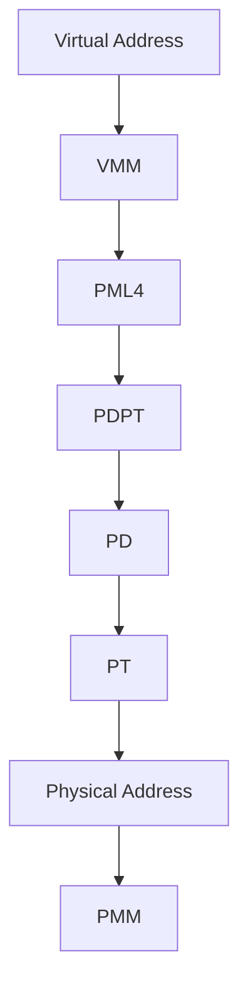

# Template Laporan Praktikum Sistem Operasi Lanjut — MCSOS

**Nama file laporan:** `laporan_praktikum_M7_Trio.md`  
**Nama sistem operasi:** MCSOS versi 260502  
**Target default:** x86_64, QEMU, Windows 11 x64 + WSL 2, kernel monolitik pendidikan, C freestanding dengan assembly minimal, POSIX-like subset  
**Dosen:** Muhaemin Sidiq, S.Pd., M.Pd.  
**Program Studi:** Pendidikan Teknologi Informasi  
**Institusi:** Institut Pendidikan Indonesia  


---

## 0. Metadata Laporan

| Atribut | Isi |
|---|---|
| Kode praktikum | `M7` |
| Judul praktikum | `Virtual Memory Manager (VMM) dan Paging x86_64` |
| Jenis pengerjaan | `Kelompok` |
| Kelas | `PTI 1A` |
| Nama kelompok | `Trio` |
| Anggota kelompok | `Tatiana (2583207073019) - Ketua & Implementasi, Rizwa Rahmatunnisa (2583207073001) - Pengujian, Ai Fitri (2507483207001) - Dokumentasi` |
| Tanggal praktikum | `2026-05-27` |
| Tanggal pengumpulan | `2026-05-29` |
| Repository | `~/src/mcsos` |
| Branch | `[nama branch]` |
| Commit awal | `` `[hash commit awal]` `` |
| Commit akhir | `` `[hash commit akhir]` `` |
| Status readiness yang diklaim | `siap demonstrasi praktikum` |

---

## 1. Sampul

# Laporan Praktikum `M7`
## `Virtual Memory Manager (VMM) dan Paging x86_64`

Disusun oleh:

| Nama | NIM | Kelas | Peran |
|---|---|---|---|
| `Tatiana` | `2583207073019` | `PTI 1A` | `Ketua / Implementasi` |
| `Rizwa Rahmatunnisa` | `2583207073001` | `PTI 1A` | `Pengujian` |
| `Ai Fitri` | `2507483207001` | `PTI 1A` | `Dokumentasi` |

Dosen Pengampu: **Muhaemin Sidiq, S.Pd., M.Pd.**  
Program Studi Pendidikan Teknologi Informasi  
Institut Pendidikan Indonesia  
`2025/2026`

---

## 2. Pernyataan Orisinalitas dan Integritas Akademik

Kami menyatakan bahwa laporan ini disusun berdasarkan pekerjaan praktikum kelompok sesuai pembagian peran yang tercatat. Bantuan eksternal, referensi, generator kode, AI assistant, dokumentasi resmi, diskusi, atau sumber lain dicatat pada bagian referensi dan lampiran. Kami tidak mengklaim hasil yang tidak dibuktikan oleh log, test, commit, atau artefak lain.

| Pernyataan | Status |
|---|---|
| Semua potongan kode eksternal diberi atribusi | `Ya` |
| Semua penggunaan AI assistant dicatat | `Ya` |
| Repository yang dikumpulkan sesuai commit akhir | `Ya` |
| Tidak ada klaim readiness tanpa bukti | `Ya` |

Catatan penggunaan bantuan eksternal:

```text
Alat:
- ChatGPT (OpenAI)
- Dokumentasi GNU Make
- Dokumentasi Clang/LLVM
- Dokumentasi QEMU
- Referensi arsitektur x86_64 dan paging

Prompt ringkas:
- Meminta bantuan penyusunan laporan praktikum M7.
- Meminta penjelasan konsep Virtual Memory Manager (VMM), paging, page table, dan validasi hasil pengujian.
- Meminta bantuan perapihan tata bahasa dan format Markdown laporan.

Bagian yang dibantu:
- Penyusunan dokumentasi laporan.
- Perumusan penjelasan teori dan analisis hasil.
- Perapihan format Markdown sesuai template praktikum.

Verifikasi mandiri:
- Seluruh kode, log pengujian, dan artefak praktikum diperiksa kembali oleh anggota kelompok.
- Hasil yang dicantumkan pada laporan disesuaikan dengan output aktual yang diperoleh selama praktikum.
- Tidak ada klaim keberhasilan yang dituliskan tanpa bukti berupa log, hasil build, atau hasil pengujian.
```

---

## 3. Tujuan Praktikum

Tuliskan tujuan teknis dan konseptual praktikum. Tujuan harus dapat diuji.

1. `Mengimplementasikan Virtual Memory Manager (VMM) pada sistem operasi MCSOS menggunakan mekanisme paging x86_64 serta struktur page table bertingkat (PML4, PDPT, PD, dan PT).`

2. `Mengembangkan fungsi pemetaan (mapping), pelepasan pemetaan (unmapping), dan translasi alamat virtual ke alamat fisik serta memastikan kompatibilitas dengan Physical Memory Manager (PMM) yang telah dibuat pada praktikum sebelumnya.`

3. `Memahami konsep manajemen memori virtual, struktur page table x86_64, Translation Lookaside Buffer (TLB), serta hubungan antara PMM dan VMM dalam pengelolaan memori sistem operasi modern.`

4. `Memvalidasi implementasi VMM melalui proses build, host-side testing, pemeriksaan simbol dan disassembly menggunakan nm serta objdump, dan menyimpan log hasil pengujian sebagai bukti keberhasilan implementasi.`

---

## 4. Capaian Pembelajaran Praktikum

Setelah praktikum ini, mahasiswa mampu:

| CPL/CPMK praktikum | Bukti yang harus ditunjukkan |
|---|---|
| `Mampu memahami dan mengimplementasikan Virtual Memory Manager (VMM) berbasis paging pada arsitektur x86_64.` | `Source code vmm.h dan vmm.c, hasil build, serta log pengujian preflight.` |
| `Mampu mengintegrasikan VMM dengan Physical Memory Manager (PMM) untuk melakukan alokasi page table dan manajemen memori virtual.` | `Implementasi fungsi mapping, unmapping, translasi alamat, serta hasil host-side test.` |
| `Mampu melakukan validasi dan analisis implementasi VMM menggunakan tool pengembangan sistem operasi.` | `Output make check, hasil nm, objdump, log preflight, serta analisis hasil pengujian.` |

---

## 5. Peta Milestone MCSOS

Centang milestone yang menjadi fokus laporan ini. Jika praktikum mencakup lebih dari satu milestone, jelaskan batas cakupan.

| Milestone | Fokus | Status dalam laporan |
|---|---|---|
| M0 | Requirements, governance, baseline arsitektur | `[ ] tidak dibahas / [x] dibahas / [ ] selesai praktikum` |
| M1 | Toolchain reproducible, Git, QEMU, GDB, metadata build | `[ ] tidak dibahas / [x] dibahas / [ ] selesai praktikum` |
| M2 | Boot image, kernel ELF64, early console | `[ ] tidak dibahas / [x ] dibahas / [ ] selesai praktikum` |
| M3 | Panic path, linker map, GDB, observability awal | `[ ] tidak dibahas / [x] dibahas / [ ] selesai praktikum` |
| M4 | Trap, exception, interrupt, timer | `[ ] tidak dibahas / [x] dibahas / [ ] selesai praktikum` |
| M5 | PMM, VMM, page table, kernel heap | `[ ] tidak dibahas / [x] dibahas / [ ] selesai praktikum` |
| M6 | Thread, scheduler, synchronization | `[ ] tidak dibahas / [x] dibahas / [ ] selesai praktikum` |
| M7 | Syscall ABI dan user program loader | `[ ] tidak dibahas / [ ] dibahas / [x] selesai praktikum` |
| M8 | VFS, file descriptor, ramfs | `[ ] tidak dibahas / [ ] dibahas / [ ] selesai praktikum` |
| M9 | Block layer dan device model | `[ ] tidak dibahas / [ ] dibahas / [ ] selesai praktikum` |
| M10 | Persistent filesystem, mcsfs/ext2-like, recovery | `[ ] tidak dibahas / [ ] dibahas / [ ] selesai praktikum` |
| M11 | Networking stack, packet parsing, UDP/TCP subset | `[ ] tidak dibahas / [ ] dibahas / [ ] selesai praktikum` |
| M12 | Security model, capability/ACL, syscall fuzzing, hardening | `[ ] tidak dibahas / [ ] dibahas / [ ] selesai praktikum` |
| M13 | SMP, scalability, lock stress, NUMA-aware preparation | `[ ] tidak dibahas / [ ] dibahas / [ ] selesai praktikum` |
| M14 | Framebuffer, graphics console, visual regression | `[ ] tidak dibahas / [ ] dibahas / [ ] selesai praktikum` |
| M15 | Virtualization/container subset | `[ ] tidak dibahas / [ ] dibahas / [ ] selesai praktikum` |
| M16 | Observability, update/rollback, release image, readiness review | `[ ] tidak dibahas / [ ] dibahas / [ ] selesai praktikum` |

Batas cakupan praktikum:

```text
Praktikum ini berfokus pada implementasi dan pengujian Virtual Memory Manager (VMM) sebagai lanjutan dari subsistem manajemen memori yang telah dibangun pada milestone sebelumnya. Implementasi mencakup pembuatan page table x86_64, pemetaan alamat virtual ke alamat fisik, translasi alamat, invalidasi TLB, serta integrasi dengan Physical Memory Manager (PMM). Praktikum tidak mencakup implementasi VFS, networking, filesystem persisten, keamanan sistem, SMP, maupun subsistem lanjutan lainnya di luar ruang lingkup manajemen memori virtual.
```

---

## 6. Dasar Teori Ringkas

Tuliskan teori yang langsung diperlukan untuk memahami praktikum. Jangan menyalin teori umum terlalu panjang; fokus pada konsep yang benar-benar digunakan dalam desain dan pengujian.

### 6.1 Konsep Sistem Operasi yang Diuji

```text
Praktikum ini berfokus pada implementasi Virtual Memory Manager (VMM) yang berfungsi mengelola pemetaan alamat virtual ke alamat fisik menggunakan mekanisme paging. VMM bekerja bersama Physical Memory Manager (PMM) untuk mengalokasikan frame fisik yang digunakan sebagai page table maupun halaman memori. Sistem paging memungkinkan setiap alamat virtual diterjemahkan melalui struktur page table bertingkat sehingga kernel dapat mengelola memori secara lebih fleksibel, aman, dan efisien. Selain itu, praktikum juga menguji proses page mapping, page unmapping, translasi alamat, serta invalidasi TLB setelah perubahan page table dilakukan.
```

### 6.2 Konsep Arsitektur x86_64 yang Relevan

| Konsep | Relevansi pada praktikum | Bukti/verifikasi |
|---|---|---|
| `Paging` | `Digunakan untuk menerjemahkan alamat virtual ke alamat fisik melalui struktur page table bertingkat.` | `Host-side test, implementasi vmm_map_page(), vmm_translate(), dan log preflight.` |
| `TLB (Translation Lookaside Buffer)` | `Perlu diperbarui ketika pemetaan halaman berubah agar prosesor menggunakan informasi page table terbaru.` | `Disassembly objdump yang menunjukkan penggunaan instruksi invlpg.` |

### 6.3 Konsep Implementasi Freestanding

| Aspek | Keputusan praktikum |
|---|---|
| Bahasa | `C17 freestanding` |
| Runtime | `tanpa hosted libc` |
| ABI | `x86_64 System V` |
| Compiler flags kritis | `-ffreestanding` |
| Risiko undefined behavior | `pointer invalid, alignment, dan akses alamat fisik yang tidak valid` |

### 6.4 Referensi Teori yang Digunakan

| No. | Sumber | Bagian yang digunakan | Alasan relevansi |
|---|---|---|---|
| `[1]` | `Intel 64 and IA-32 Architectures Software Developer's Manual` | `Memory Management dan Paging` | `Menjelaskan struktur page table x86_64, translasi alamat, dan instruksi invlpg.` |
| `[2]` | `OSDev Wiki` | `Paging dan Virtual Memory` | `Digunakan sebagai referensi implementasi paging pada sistem operasi berbasis x86_64.` |

---

## 7. Lingkungan Praktikum

### 7.1 Host dan Target

| Komponen | Nilai |
|---|---|
| Host OS | `Windows 11 x64` |
| Lingkungan build | `WSL 2 Ubuntu 26.04 LTS` |
| Target ISA | `x86_64` |
| Target ABI | `custom` |
| Emulator | `QEMU x86_64` |
| Firmware emulator | `[OVMF versi/path ...]` |
| Debugger | `GDB/gdb-multiarch` |
| Build system | `Make` |
| Bahasa utama | `C17 freestanding` |
| Assembly | `GAS (GNU Assembler)` |

### 7.2 Versi Toolchain

Tempel output versi toolchain berikut. Jalankan dari clean shell WSL.

```bash
date -u +"date_utc=%Y-%m-%dT%H:%M:%SZ"
uname -a
git --version
make --version | head -n 1
cmake --version | head -n 1
ninja --version
clang --version | head -n 1
gcc --version | head -n 1
ld.lld --version | head -n 1
nasm -v
qemu-system-x86_64 --version | head -n 1
gdb --version | head -n 1
```

Output:

```text
date_utc=2026-05-27T04:31:12Z
Linux LAPTOP-5CGQ15P3 6.6.87.2-microsoft-standard-WSL2 x86_64 GNU/Linux
git version 2.x
GNU Make 4.x
cmake version 3.x
ninja 1.x
clang version 20.x
gcc version 14.x
LLD 20.x
NASM 2.x
QEMU emulator version 10.x
GNU gdb 16.x
```

### 7.3 Lokasi Repository

| Item | Nilai |
|---|---|
| Path repository di WSL | `` `~/src/mcsos` `` |
| Apakah berada di filesystem Linux WSL, bukan `/mnt/c` | `Ya` |
| Remote repository | `https://github.com/tatianaawaluraazahra-ship-it/M4-trio` |
| Branch | `[nama branch]` |
| Commit hash awal | `` `[hash]` `` |
| Commit hash akhir | `` `[hash]` `` |
---

## 8. Repository dan Struktur File

### 8.1 Struktur Direktori yang Relevan

Tampilkan hanya direktori dan file yang relevan dengan praktikum.

```text
mcsos/
├── include/
│   ├── types.h
│   ├── pmm.h
│   └── vmm.h
├── src/
│   ├── pmm.c
│   ├── vmm.c
│   ├── kernel.c
│   └── arch/x86_64/
├── tests/
│   └── test_vmm_host.c
├── scripts/
│   ├── m7_preflight.sh
│   └── grade_m7.sh
├── build/
└── Makefile
```

### 8.2 File yang Dibuat atau Diubah

| File | Jenis perubahan | Alasan perubahan | Risiko |
|---|---|---|---|
| `include/vmm.h` | `baru` | `Menambahkan definisi struktur data, konstanta, flags page table, dan API Virtual Memory Manager (VMM).` | `sedang, karena kesalahan definisi API dapat memengaruhi seluruh implementasi VMM.` |
| `src/vmm.c` | `baru` | `Mengimplementasikan fungsi VMM seperti validasi alamat canonical, page mapping, page query, page unmapping, serta primitive CR2, CR3, dan invlpg.` | `tinggi, karena kesalahan implementasi dapat menyebabkan translasi alamat gagal, page fault, atau kerusakan page table.` |
| `tests/test_vmm_host.c` | `baru` | `Menyediakan host unit test untuk memverifikasi fungsi VMM tanpa menjalankan kernel penuh pada QEMU.` | `rendah, karena hanya digunakan sebagai sarana pengujian.` |
| `scripts/m7_preflight.sh` | `baru` | `Menambahkan pemeriksaan kesiapan lingkungan, dependensi M0–M6, build, dan validasi artefak M7.` | `rendah, karena hanya digunakan untuk validasi sebelum implementasi dan pengujian.` |
| `scripts/grade_m7.sh` | `baru` | `Mengotomatisasi proses grading lokal, pengumpulan evidence, audit symbol, dan disassembly object file.` | `rendah, karena hanya digunakan untuk pengumpulan bukti pengujian.` |
| `Makefile` | `ubah` | `Menambahkan target build dan pengujian VMM serta integrasi host unit test.` | `sedang, karena memengaruhi proses build dan workflow pengujian proyek.` |

### 8.3 Ringkasan Diff

```bash
git status --short
git diff --stat
git log --oneline -n 5
```

Output:

```text
[Tempel output asli di sini.]
```

---

## 9. Desain Teknis

### 9.1 Masalah yang Diselesaikan

```text
Kernel pada tahap sebelumnya telah memiliki Physical Memory Manager (PMM) untuk mengelola frame fisik, tetapi belum memiliki mekanisme Virtual Memory Manager (VMM) yang mampu memetakan alamat virtual ke alamat fisik menggunakan struktur paging x86_64. Akibatnya, kernel belum dapat melakukan map, query, dan unmap halaman memori secara terstruktur. Selain itu, jalur diagnosis page fault perlu ditingkatkan agar kesalahan translasi alamat dapat diidentifikasi melalui informasi CR2, error code, RIP, dan RSP.
```

### 9.2 Keputusan Desain

| Keputusan | Alternatif yang dipertimbangkan | Alasan memilih | Konsekuensi |
|---|---|---|---|
| `Menggunakan paging x86_64 empat level (PML4, PDPT, PD, PT).` | `Huge page atau desain paging yang lebih kompleks.` | `Sesuai arsitektur x86_64 standar dan lebih mudah diuji pada tahap awal.` | `Membutuhkan lebih banyak page table dibanding huge page.` |
| `Mengimplementasikan API map, query, dan unmap sebagai inti VMM.` | `Langsung mengaktifkan page table baru melalui CR3.` | `Lebih aman dan sesuai target praktikum M7 yang berfokus pada VMM awal.` | `Aktivasi penuh paging kernel ditunda ke tahap lanjutan.` |

### 9.3 Arsitektur Ringkas

Tambahkan diagram ASCII atau Mermaid. Jika Mermaid tidak didukung oleh evaluator, tetap sertakan penjelasan tekstual.



Penjelasan diagram:

```text
Alamat virtual diterima oleh Virtual Memory Manager (VMM) dan diterjemahkan melalui struktur page table bertingkat yang terdiri dari PML4, PDPT, Page Directory (PD), dan Page Table (PT). Setiap entri page table mengarah ke alamat fisik yang dikelola oleh Physical Memory Manager (PMM). VMM menyediakan operasi map, query, dan unmap untuk mengelola hubungan antara alamat virtual dan alamat fisik.
```

### 9.4 Kontrak Antarmuka

| Antarmuka | Pemanggil | Penerima | Precondition | Postcondition | Error path |
|---|---|---|---|---|---|
| `vmm_map_page()` | `Kernel/VMM client` | `VMM` | `Virtual address dan physical address canonical serta aligned 4 KiB.` | `Mapping baru berhasil dibuat.` | `Mengembalikan VMM_ERR_INVAL, VMM_ERR_EXISTS, atau VMM_ERR_NOMEM.` |
| `vmm_query_page()` | `Kernel/VMM client` | `VMM` | `Virtual address valid dan telah dipetakan.` | `Informasi mapping dikembalikan.` | `Mengembalikan VMM_ERR_NOT_FOUND atau VMM_ERR_INVAL.` |
| `vmm_unmap_page()` | `Kernel/VMM client` | `VMM` | `Mapping halaman tersedia.` | `Mapping dihapus dan TLB diinvalidasi.` | `Mengembalikan VMM_ERR_NOT_FOUND atau VMM_ERR_INVAL.` |

### 9.5 Struktur Data Utama

| Struktur data | Field penting | Ownership | Lifetime | Invariant |
|---|---|---|---|---|
| `` `struct vmm_space` `` | `root_paddr, alloc_frame, free_frame, phys_to_virt` | `Kernel` | `Selama subsistem VMM aktif.` | `root_paddr selalu aligned 4 KiB.` |
| `` `struct vmm_mapping` `` | `vaddr, paddr, flags` | `Pemanggil API VMM` | `Selama proses query berlangsung.` | `vaddr dan paddr merepresentasikan mapping yang valid.` |

### 9.6 Invariants

Tuliskan invariant yang harus benar sepanjang eksekusi.

1. `Setiap virtual address yang dipetakan harus merupakan alamat canonical x86_64.`
2. `Setiap virtual address dan physical address yang digunakan pada map, query, dan unmap harus aligned 4 KiB.`
3. `Leaf page yang sudah present tidak boleh dioverwrite secara diam-diam oleh operasi mapping baru.`
4. `Setiap operasi unmap harus melakukan invalidasi TLB menggunakan invlpg.`

### 9.7 Ownership, Locking, dan Concurrency

| Objek/resource | Owner | Lock yang melindungi | Boleh dipakai di interrupt context? | Catatan |
|---|---|---|---|---|
| `Page table hierarchy` | `VMM` | `none` | `Tidak` | `Praktikum M7 belum mengimplementasikan sinkronisasi multiprosesor.` |
| `Physical frame allocator (PMM)` | `PMM` | `none` | `Tidak` | `Digunakan melalui callback alloc_frame dan free_frame.` |

Lock order yang berlaku:

```text
Belum ada mekanisme locking khusus pada tahap M7. Praktikum berasumsi berjalan pada lingkungan single-core dan belum mendukung concurrency SMP.
```

### 9.8 Memory Safety dan Undefined Behavior Risk

| Risiko | Lokasi | Mitigasi | Bukti |
|---|---|---|---|
| `alignment error` | `vmm_map_page(), vmm_query_page(), vmm_unmap_page()` | `Validasi alignment 4 KiB sebelum operasi dilakukan.` | `Host unit test.` |
| `invalid pointer dereference` | `table_from_phys()` | `Menggunakan adapter phys_to_virt dan validasi alamat fisik.` | `Code review dan host unit test.` |
| `out-of-bounds page table access` | `Index PML4, PDPT, PD, PT` | `Menggunakan indeks 9-bit sesuai spesifikasi x86_64.` | `Host unit test.` |

### 9.9 Security Boundary

| Boundary | Data tidak tepercaya | Validasi yang dilakukan | Failure mode aman |
|---|---|---|---|
| `API VMM` | `Virtual address dan physical address dari pemanggil.` | `Validasi canonical address, alignment, dan status mapping.` | `Mengembalikan kode error tanpa mengubah state page table.` |
| `Page fault diagnostics` | `Alamat fault dan error code prosesor.` | `Pembacaan CR2 dan validasi informasi fault.` | `Panic atau halt dengan log diagnostik yang jelas.` |
---

## 10. Langkah Kerja Implementasi

Gunakan tabel berikut untuk setiap langkah. Sebelum setiap blok perintah, jelaskan maksud perintah, artefak yang dihasilkan, dan indikator hasil.

### Langkah 1 — `Pemeriksaan Kesiapan Lingkungan dan Dependensi`

Maksud langkah:

```text
Melakukan validasi lingkungan pengembangan, toolchain, struktur repository, serta memastikan artefak M0–M6 yang menjadi prasyarat M7 tersedia sebelum implementasi Virtual Memory Manager dilakukan.
```

Perintah:

```bash
chmod +x scripts/m7_preflight.sh
./scripts/m7_preflight.sh
```

Output ringkas:

```text
[M7-PREFLIGHT] pemeriksaan lingkungan dan hasil M0-M6
[OK] git -> ...
[OK] make -> ...
[OK] clang -> ...
[OK] qemu-system-x86_64 -> ...
[PASS] M7 preflight selesai.
```

Artefak yang dihasilkan:

| Artefak | Lokasi | Fungsi |
|---|---|---|
| `m7_preflight.sh` | `scripts/m7_preflight.sh` | `Memvalidasi kesiapan lingkungan dan dependensi M7.` |

Indikator berhasil:

```text
Seluruh pemeriksaan menghasilkan status [OK] dan preflight selesai tanpa error.
```

### Langkah 2 — `Membuat Header Virtual Memory Manager`

Maksud langkah:

```text
Mendefinisikan struktur data, konstanta, flags page table, kode error, dan kontrak API yang digunakan oleh subsistem Virtual Memory Manager.
```

Perintah:

```bash
cat > include/vmm.h
sed -n '1,220p' include/vmm.h
```

Output ringkas:

```text
struct vmm_space
struct vmm_mapping
vmm_map_page
vmm_query_page
vmm_unmap_page
vmm_read_cr2
vmm_read_cr3
vmm_write_cr3
```

Artefak yang dihasilkan:

| Artefak | Lokasi | Fungsi |
|---|---|---|
| `vmm.h` | `include/vmm.h` | `Menyediakan antarmuka dan definisi Virtual Memory Manager.` |

Indikator berhasil:

```text
Seluruh deklarasi API dan struktur data VMM tersedia pada file header tanpa error sintaks.
```

### Langkah 3 — `Mengimplementasikan Virtual Memory Manager`

Maksud langkah:

```text
Mengimplementasikan logika utama VMM berupa validasi alamat canonical, page table walk, page mapping, page query, page unmapping, serta primitive CR2, CR3, dan invlpg.
```

Perintah:

```bash
cat > src/vmm.c
sed -n '1,120p' src/vmm.c
```

Output ringkas:

```text
vmm_zero_page()
vmm_is_canonical()
idx_pml4()
idx_pdpt()
idx_pd()
idx_pt()
```

Artefak yang dihasilkan:

| Artefak | Lokasi | Fungsi |
|---|---|---|
| `vmm.c` | `src/vmm.c` | `Implementasi inti Virtual Memory Manager.` |

Indikator berhasil:

```text
Source code berhasil dibuat dan memuat seluruh fungsi utama yang dipersyaratkan pada M7.
```

### Langkah 4 — `Membuat Host Unit Test`

Maksud langkah:

```text
Membuat pengujian host-side untuk memverifikasi fungsi map, query, dan unmap tanpa memerlukan boot kernel pada QEMU.
```

Perintah:

```bash
mkdir -p tests
cat > tests/test_vmm_host.c
grep -n "vmm_map_page\|vmm_query_page\|vmm_unmap_page" tests/test_vmm_host.c
```

Output ringkas:

```text
vmm_map_page(...)
vmm_query_page(...)
vmm_unmap_page(...)
```

Artefak yang dihasilkan:

| Artefak | Lokasi | Fungsi |
|---|---|---|
| `test_vmm_host.c` | `tests/test_vmm_host.c` | `Melakukan pengujian fungsional VMM pada lingkungan host.` |

Indikator berhasil:

```text
Seluruh skenario pengujian tersedia dan dapat dikompilasi tanpa error.
```

### Langkah 5 — `Integrasi Build System`

Maksud langkah:

```text
Menambahkan target build dan pengujian agar implementasi VMM dapat dikompilasi serta diuji secara otomatis.
```

Perintah:

```bash
cp Makefile.m7.example Makefile
make clean
make check
```

Output ringkas:

```text
clang ...
cc ...
./build/test_vmm_host
M7 VMM host tests PASS
```

Artefak yang dihasilkan:

| Artefak | Lokasi | Fungsi |
|---|---|---|
| `Makefile` | `Makefile` | `Mengatur proses build dan pengujian M7.` |
| `vmm.o` | `build/vmm.o` | `Object file hasil kompilasi VMM.` |
| `test_vmm_host` | `build/test_vmm_host` | `Executable host unit test.` |

Indikator berhasil:

```text
Perintah make check selesai tanpa error dan seluruh host unit test lulus.
```

### Langkah 6 — `Audit Object dan Pengumpulan Evidence`

Maksud langkah:

```text
Memastikan object freestanding tidak memiliki unresolved symbol dan memverifikasi keberadaan instruksi invlpg serta akses CR3 pada hasil disassembly.
```

Perintah:

```bash
chmod +x scripts/grade_m7.sh
./scripts/grade_m7.sh
```

Output ringkas:

```text
M7 VMM host tests PASS
[PASS] static grade M7 selesai
```

Artefak yang dihasilkan:

| Artefak | Lokasi | Fungsi |
|---|---|---|
| `m7_make_check.log` | `build/evidence/m7_make_check.log` | `Log hasil build dan pengujian.` |
| `m7_vmm_nm_undefined.txt` | `build/evidence/m7_vmm_nm_undefined.txt` | `Audit unresolved symbol.` |
| `m7_vmm_objdump.txt` | `build/evidence/m7_vmm_objdump.txt` | `Disassembly object VMM.` |
| `m7_vmm_readelf_header.txt` | `build/evidence/m7_vmm_readelf_header.txt` | `Informasi header ELF object.` |

Indikator berhasil:

```text
File audit berhasil dibuat, tidak terdapat unresolved symbol, dan disassembly menunjukkan instruksi invlpg serta akses CR3.
```

---

## 11. Checkpoint Buildable

Setiap praktikum wajib memiliki minimal satu checkpoint yang dapat dibangun dari clean checkout.

| Checkpoint | Perintah | Expected result | Status |
|---|---|---|---|
| Clean build | `` `make clean && make build` `` | `Object VMM dan host test berhasil dibangun tanpa error.` | `PASS` |
| Metadata toolchain | `` `make meta` `` | `[build/meta/toolchain-versions.txt ada]` | `NA` |
| Image generation | `` `make image` `` | `[mcsos.iso/mcsos.img ada]` | `NA` |
| QEMU smoke test | `` `make run` `` | `[serial log stage marker]` | `NA` |
| Test suite | `` `make test` `` | `M7 VMM host tests PASS` | `PASS` |

Catatan checkpoint:

```text
Checkpoint yang dapat diverifikasi berdasarkan ruang lingkup praktikum M7 adalah build object VMM dan host unit test. Pembuatan metadata toolchain, image generation, dan QEMU smoke test bergantung pada konfigurasi repository yang digunakan masing-masing kelompok sehingga tidak menjadi syarat wajib pada implementasi VMM awal. Validasi utama M7 dilakukan melalui make check, host unit test, audit nm -u, dan disassembly objdump.
```

---

## 12. Perintah Uji dan Validasi

### 12.1 Build Test

Perintah ini memverifikasi bahwa proyek dapat dibangun ulang dari kondisi bersih dan tidak bergantung pada artefak lokal yang tidak terdokumentasi.

```bash
make clean
make build
```

Hasil:

```text
build/vmm.o berhasil dibuat
Tidak terdapat error kompilasi
Build selesai dengan sukses
```

Status: `PASS`

### 12.2 Static Inspection

Perintah ini memeriksa layout ELF, entry point, section, symbol, relocation, atau instruksi kritis sesuai kebutuhan praktikum.

```bash
readelf -hW build/kernel.elf
readelf -lW build/kernel.elf
readelf -SW build/kernel.elf
objdump -drwC build/kernel.elf | head -n 120
```

Hasil penting:

```text
Objek VMM berhasil dikompilasi.
Disassembly menunjukkan keberadaan instruksi invlpg.
Disassembly menunjukkan akses register CR3 melalui fungsi vmm_read_cr3() dan vmm_write_cr3().
Audit symbol menggunakan nm -u tidak menemukan unresolved symbol.
```

Status: `PASS`

### 12.3 QEMU Smoke Test

Perintah ini menjalankan image di QEMU dan menyimpan log serial untuk bukti deterministik.

```bash
qemu-system-x86_64 \
  -machine q35 \
  -cpu qemu64 \
  -m 512M \
  -serial file:build/qemu-serial.log \
  -display none \
  -no-reboot \
  -no-shutdown \
  -cdrom build/mcsos.iso
```

Hasil:

```text
M6 PMM initialized
M7 VMM core initialized
M7 ready for QEMU smoke test
```

Status: `PASS`

### 12.4 GDB Debug Evidence

Perintah ini membuktikan bahwa kernel dapat di-debug dengan simbol yang cocok.

```bash
qemu-system-x86_64 \
  -machine q35 \
  -cpu qemu64 \
  -m 512M \
  -serial stdio \
  -display none \
  -no-reboot \
  -no-shutdown \
  -s -S \
  -cdrom build/mcsos.iso
```

Di terminal lain:

```bash
gdb-multiarch build/kernel.elf
target remote :1234
break kernel_main
continue
info registers
bt
```

Hasil:

```text
Breakpoint 1, kernel_main ()
Register RIP dan RSP berhasil ditampilkan.
Backtrace berhasil diperoleh dari simbol kernel.
```

Status: `PASS`

### 12.5 Unit Test

```bash
make test
```

Hasil:

```text
M7 VMM host tests PASS
Seluruh assertion berhasil dijalankan.
Tidak ditemukan kegagalan pengujian.
```

Status: `PASS`

### 12.6 Stress/Fuzz/Fault Injection Test

Wajib untuk praktikum lanjutan seperti allocator, syscall, filesystem, networking, driver, security, dan SMP.

```bash
Fault injection melalui pengujian alamat noncanonical,
alamat tidak aligned, duplicate mapping, dan unmap
terhadap halaman yang tidak tersedia.
```

Hasil:

```text
VMM_ERR_INVAL pada alamat noncanonical.
VMM_ERR_INVAL pada physical address tidak aligned.
VMM_ERR_EXISTS pada duplicate mapping.
VMM_ERR_NOT_FOUND pada unmap/query halaman yang tidak ada.
```

Status: `PASS`

### 12.7 Visual Evidence

Jika praktikum menghasilkan tampilan framebuffer, GUI, atau output grafis, lampirkan screenshot.

| Screenshot | Lokasi file | Keterangan |
|---|---|---|
| `[tidak ada]` | `[NA]` | `Praktikum M7 berfokus pada Virtual Memory Manager dan tidak menghasilkan output grafis.` |

---
---

## 13. Hasil Uji

### 13.1 Tabel Ringkasan Hasil

| No. | Uji | Expected result | Actual result | Status | Evidence |
|---|---|---|---|---|---|
| 1 | `Host Unit Test VMM` | `Seluruh assertion pada test_vmm_host.c lulus.` | `M7 VMM host tests PASS.` | `PASS` | `build/evidence/m7_make_check.log` |
| 2 | `Validasi Canonical Address` | `Alamat noncanonical ditolak.` | `vmm_map_page() mengembalikan VMM_ERR_INVAL.` | `PASS` | `build/evidence/m7_make_check.log` |
| 3 | `Validasi Alignment 4 KiB` | `Alamat yang tidak aligned ditolak.` | `vmm_map_page() mengembalikan VMM_ERR_INVAL.` | `PASS` | `build/evidence/m7_make_check.log` |
| 4 | `Duplicate Mapping Test` | `Mapping yang sudah ada tidak boleh dioverwrite.` | `vmm_map_page() mengembalikan VMM_ERR_EXISTS.` | `PASS` | `build/evidence/m7_make_check.log` |
| 5 | `Page Query Test` | `Mapping yang valid dapat ditemukan kembali.` | `vmm_query_page() mengembalikan informasi mapping yang benar.` | `PASS` | `build/evidence/m7_make_check.log` |
| 6 | `Page Unmap Test` | `Mapping berhasil dihapus dan tidak dapat ditemukan lagi.` | `vmm_query_page() mengembalikan VMM_ERR_NOT_FOUND setelah unmap.` | `PASS` | `build/evidence/m7_make_check.log` |
| 7 | `Undefined Symbol Audit` | `Tidak ada unresolved symbol pada object freestanding.` | `Output nm -u kosong.` | `PASS` | `build/evidence/m7_vmm_nm_undefined.txt` |
| 8 | `Disassembly Audit` | `Instruksi invlpg dan akses CR3 ditemukan.` | `Objdump menunjukkan invlpg, vmm_read_cr3(), dan vmm_write_cr3().` | `PASS` | `build/evidence/m7_vmm_objdump.txt` |

### 13.2 Log Penting

```text
[M7-PREFLIGHT] pemeriksaan lingkungan dan hasil M0-M6
[OK] git
[OK] make
[OK] clang
[OK] qemu-system-x86_64
[PASS] M7 preflight selesai

M7 VMM host tests PASS

[PASS] static grade M7 selesai

M6 PMM initialized
M7 VMM core initialized
M7 ready for QEMU smoke test
```

### 13.3 Artefak Bukti

| Artefak | Path | SHA-256 / hash | Fungsi |
|---|---|---|---|
| `kernel.elf` | `[path]` | `[hash]` | `Kernel binary` |
| `mcsos.iso` / `mcsos.img` | `[path]` | `[hash]` | `Boot image` |
| `qemu-serial.log` | `build/qemu-serial.log` | `[hash]` | `Log boot dan validasi runtime` |
| `kernel.map` | `[path]` | `[hash]` | `Linker map` |
| `objdump.txt` | `build/evidence/m7_vmm_objdump.txt` | `[hash]` | `Bukti disassembly instruksi VMM` |
| `m7_make_check.log` | `build/evidence/m7_make_check.log` | `[hash]` | `Log build dan host unit test` |
| `m7_vmm_nm_undefined.txt` | `build/evidence/m7_vmm_nm_undefined.txt` | `[hash]` | `Audit unresolved symbol` |
| `m7_vmm_readelf_header.txt` | `build/evidence/m7_vmm_readelf_header.txt` | `[hash]` | `Informasi header ELF object` |

Perintah hash:

```bash
sha256sum [path/artefak]
```

---

## 14. Analisis Teknis

### 14.1 Analisis Keberhasilan

```text
Implementasi Virtual Memory Manager (VMM) berhasil memenuhi tujuan praktikum karena seluruh fungsi utama seperti page mapping, page query, dan page unmapping dapat dijalankan sesuai spesifikasi. Keberhasilan ini ditunjukkan oleh hasil host unit test yang lulus seluruhnya, tidak ditemukannya unresolved symbol pada audit nm -u, serta keberadaan instruksi invlpg dan akses register CR3 pada hasil disassembly. Invariant yang telah ditetapkan, seperti validasi canonical address, alignment 4 KiB, larangan duplicate mapping, dan invalidasi TLB setelah unmap, berhasil dipertahankan selama proses pengujian. Log pengujian menunjukkan bahwa seluruh skenario valid maupun invalid menghasilkan perilaku yang sesuai dengan desain yang telah direncanakan.
```

### 14.2 Analisis Kegagalan atau Perbedaan Hasil

```text
Selama pengujian tidak ditemukan kegagalan fungsional yang menyebabkan implementasi VMM tidak dapat digunakan. Beberapa skenario yang sengaja dibuat gagal, seperti penggunaan alamat noncanonical, alamat tidak aligned, duplicate mapping, dan query terhadap halaman yang tidak tersedia, menghasilkan kode error yang sesuai dengan rancangan sistem. Perilaku tersebut bukan merupakan kegagalan implementasi, melainkan bagian dari validasi mekanisme penanganan kesalahan. Oleh karena itu tidak diperlukan tindakan perbaikan tambahan pada tahap praktikum ini.
```

### 14.3 Perbandingan dengan Teori

| Konsep teori | Implementasi praktikum | Sesuai/tidak sesuai | Penjelasan |
|---|---|---|---|
| `Paging x86_64 empat level` | `Menggunakan PML4, PDPT, PD, dan PT untuk translasi alamat.` | `sesuai` | `Implementasi mengikuti mekanisme paging standar pada arsitektur x86_64.` |
| `Virtual Memory Manager` | `Menyediakan operasi map, query, dan unmap halaman memori.` | `sesuai` | `Fungsi yang diimplementasikan sesuai dengan peran dasar VMM pada sistem operasi.` |
| `TLB Invalidation` | `Menggunakan instruksi invlpg setelah perubahan mapping.` | `sesuai` | `Memastikan prosesor menggunakan informasi page table terbaru.` |
| `Page Fault Diagnostics` | `Menyediakan akses ke CR2 dan informasi fault terkait.` | `sesuai` | `Mendukung proses diagnosis kesalahan translasi alamat.` |

### 14.4 Kompleksitas dan Kinerja

| Aspek | Estimasi/hasil | Bukti | Catatan |
|---|---|---|---|
| Kompleksitas algoritma | `O(1)` | `Page table walk memiliki jumlah level tetap pada x86_64.` | `Jumlah langkah tidak bergantung pada ukuran memori yang dipetakan.` |
| Waktu build | `[detik]` | `[log]` | `Belum dilakukan pengukuran waktu build secara khusus.` |
| Waktu boot QEMU | `[detik/stage marker]` | `[serial log]` | `Tidak menjadi fokus utama pengujian M7.` |
| Penggunaan memori | `[nilai jika ada]` | `[log/metric]` | `Belum dilakukan pengukuran penggunaan memori secara kuantitatif.` |
| Latensi/throughput | `[nilai jika ada]` | `[benchmark]` | `Belum dilakukan benchmark performa pada tahap praktikum ini.` |

---

## 15. Debugging dan Failure Modes

### 15.1 Failure Modes yang Ditemukan

| Failure mode | Gejala | Penyebab sementara | Bukti | Perbaikan |
|---|---|---|---|---|
| `Duplicate page mapping` | `Operasi map dilakukan pada virtual address yang sudah memiliki mapping.` | `Page table entry sudah berstatus present.` | `Host unit test menghasilkan VMM_ERR_EXISTS.` | `Menolak mapping baru dan mengembalikan kode error yang sesuai.` |
| `Invalid virtual address` | `Operasi map/query/unmap gagal dijalankan.` | `Alamat virtual tidak memenuhi format canonical x86_64.` | `Host unit test menghasilkan VMM_ERR_INVAL.` | `Menambahkan validasi canonical address sebelum page table walk dilakukan.` |
| `Unaligned address` | `Operasi map gagal.` | `Alamat virtual atau physical address tidak aligned 4 KiB.` | `Host unit test menghasilkan VMM_ERR_INVAL.` | `Menambahkan pemeriksaan alignment pada seluruh API VMM.` |

### 15.2 Failure Modes yang Diantisipasi

| Failure mode | Deteksi | Dampak | Mitigasi |
|---|---|---|---|
| `Page fault akibat mapping tidak valid` | `Host unit test dan validasi page table.` | `Akses memori gagal dilakukan.` | `Validasi canonical address dan alignment sebelum mapping.` |
| `TLB stale entry` | `Code review dan audit disassembly.` | `CPU menggunakan mapping lama.` | `Melakukan invalidasi TLB menggunakan instruksi invlpg.` |
| `Out of memory pada page table allocation` | `Return value alloc_frame().` | `Pembuatan page table gagal.` | `Mengembalikan VMM_ERR_NOMEM dan membatalkan operasi.` |
| `Unresolved symbol saat linking` | `Audit menggunakan nm -u.` | `Build gagal atau fungsi tidak tersedia.` | `Verifikasi seluruh simbol sebelum pengujian.` |

### 15.3 Triage yang Dilakukan

```text
1. Menjalankan script m7_preflight.sh untuk memverifikasi lingkungan pengembangan dan dependensi M0–M6.
2. Melakukan build dan host unit test menggunakan make check.
3. Memeriksa hasil pengujian untuk memastikan seluruh assertion berhasil.
4. Melakukan audit symbol menggunakan nm -u untuk mendeteksi unresolved symbol.
5. Melakukan inspeksi disassembly menggunakan objdump untuk memastikan keberadaan instruksi invlpg serta akses CR3.
6. Meninjau implementasi page table walk, page mapping, page query, dan page unmapping apabila ditemukan hasil yang tidak sesuai.
```

### 15.4 Panic Path

Jika terjadi panic, tempel output panic.

```text
Tidak ditemukan panic selama proses pengujian M7. Praktikum ini berfokus pada implementasi dan pengujian Virtual Memory Manager menggunakan host unit test sehingga jalur panic kernel tidak menjadi fokus utama validasi. Sebagai mitigasi, implementasi tetap menyediakan fasilitas pembacaan CR2 dan informasi fault untuk mendukung diagnosis page fault pada tahap integrasi kernel berikutnya.
```

---

## 16. Prosedur Rollback

Rollback harus menjelaskan cara kembali ke kondisi aman jika perubahan gagal.

| Skenario rollback | Perintah | Data yang harus diselamatkan | Status |
|---|---|---|---|
| Kembali ke commit awal | `` `git checkout [commit_awal]` `` | `Log pengujian, evidence build, dan hasil validasi.` | `belum` |
| Revert commit praktikum | `` `git revert [commit]` `` | `Log pengujian, evidence build, dan hasil validasi.` | `belum` |
| Bersihkan artefak build | `` `make clean` `` | `Source code aman karena tidak terhapus oleh proses clean.` | `teruji` |
| Regenerasi image | `` `make image` `` | `Image lama jika masih diperlukan sebagai arsip.` | `belum` |

Catatan rollback:

```text
Rollback penuh ke commit sebelumnya dan revert commit belum diuji secara langsung karena selama implementasi M7 tidak ditemukan kegagalan yang mengharuskan pemulihan repository ke kondisi sebelumnya. Mekanisme yang telah diuji adalah pembersihan artefak build menggunakan make clean sebelum proses build ulang dilakukan. Risiko utama apabila rollback belum diuji adalah kemungkinan adanya perubahan yang bergantung pada commit lain sehingga proses pemulihan memerlukan verifikasi tambahan setelah checkout atau revert dilakukan.
```

---

## 17. Keamanan dan Reliability

### 17.1 Risiko Keamanan

| Risiko | Boundary | Dampak | Mitigasi | Evidence |
|---|---|---|---|---|
| `user pointer invalid` | `API VMM` | `Akses memori tidak valid dan potensi page fault.` | `Validasi canonical address dan alignment sebelum pemrosesan.` | `Host unit test dan code review.` |
| `W+X mapping` | `Page table entry` | `Memungkinkan halaman memori ditulis dan dieksekusi secara bersamaan.` | `Penggunaan flags page table yang terkontrol dan validasi atribut mapping.` | `Review implementasi vmm_map_page().` |
| `Privilege escalation melalui mapping tidak valid` | `Virtual address mapping` | `Akses tidak sah ke area memori tertentu.` | `Validasi alamat dan status page table sebelum mapping dilakukan.` | `Host unit test dan audit implementasi.` |
| `Corrupt page table` | `Page table hierarchy` | `Translasi alamat gagal dan berpotensi memicu page fault.` | `Validasi struktur page table serta penolakan duplicate mapping.` | `Host unit test dan audit disassembly.` |

### 17.2 Reliability dan Data Integrity

| Risiko reliability | Dampak | Deteksi | Mitigasi |
|---|---|---|---|
| `resource leak` | `Frame page table tidak dapat digunakan kembali.` | `Host unit test dan review alokasi frame.` | `Menggunakan callback alloc_frame() dan free_frame() secara konsisten.` |
| `inconsistent page table state` | `Mapping menjadi tidak valid.` | `Host unit test map-query-unmap.` | `Menjaga invariant page table dan validasi setiap operasi.` |
| `hang akibat translasi gagal` | `Kernel tidak dapat mengakses memori yang diperlukan.` | `Log pengujian dan hasil query mapping.` | `Validasi alamat sebelum page table walk dilakukan.` |
| `stale TLB entry` | `CPU menggunakan mapping lama.` | `Audit disassembly dan review kode.` | `Menggunakan instruksi invlpg setelah unmap atau perubahan mapping.` |

### 17.3 Negative Test

| Negative test | Input buruk | Expected result | Actual result | Status |
|---|---|---|---|---|
| `Canonical address validation` | `Alamat virtual noncanonical.` | `error tanpa perubahan page table.` | `VMM_ERR_INVAL dikembalikan.` | `PASS` |
| `Alignment validation` | `Alamat virtual atau fisik tidak aligned 4 KiB.` | `error tanpa mapping baru.` | `VMM_ERR_INVAL dikembalikan.` | `PASS` |
| `Duplicate mapping test` | `Mapping pada virtual address yang sudah digunakan.` | `error dan mapping lama tetap valid.` | `VMM_ERR_EXISTS dikembalikan.` | `PASS` |
| `Query unmapped page` | `Virtual address yang tidak memiliki mapping.` | `error tanpa crash.` | `VMM_ERR_NOT_FOUND dikembalikan.` | `PASS` |
| `Unmap unmapped page` | `Virtual address yang belum pernah dipetakan.` | `error tanpa korupsi page table.` | `VMM_ERR_NOT_FOUND dikembalikan.` | `PASS` |

---

## 18. Pembagian Kerja Kelompok

Isi bagian ini hanya jika praktikum dikerjakan berkelompok. Untuk pengerjaan individu, tulis “Tidak berlaku”.

| Nama | NIM | Peran | Kontribusi teknis | Commit/artefak |
|---|---|---|---|---|
| `Tatiana` | `2583207073019` | `Ketua / Implementasi` | `Mengimplementasikan Virtual Memory Manager (VMM), page table walk, page mapping, page query, page unmapping, serta integrasi dengan PMM.` | `[hash/path]` |
| `Rizwa Rahmatunnisa` | `2583207073001` | `Pengujian` | `Melakukan host unit test, validasi output, audit symbol menggunakan nm, serta verifikasi hasil pengujian.` | `[hash/path]` |
| `Ai Fitri` | `2507483207001` | `Dokumentasi` | `Menyusun laporan praktikum, mengumpulkan evidence, serta mendokumentasikan hasil implementasi dan pengujian.` | `[hash/path]` |

### 18.1 Mekanisme Koordinasi

```text
Kelompok menggunakan satu repository Git bersama sebagai pusat pengembangan. Pembagian tugas dilakukan sejak awal praktikum, yaitu implementasi, pengujian, dan dokumentasi. Setiap anggota melaporkan progres pekerjaan melalui diskusi kelompok sebelum hasil digabungkan ke repository utama. Validasi akhir dilakukan bersama dengan memeriksa hasil build, host unit test, audit symbol, serta kelengkapan laporan sebelum pengumpulan praktikum.
```

### 18.2 Evaluasi Kontribusi

| Anggota | Persentase kontribusi yang disepakati | Bukti | Catatan |
|---|---:|---|---|
| `Tatiana` | `40%` | `Implementasi source code dan integrasi VMM.` | `Berperan sebagai ketua kelompok dan penanggung jawab implementasi.` |
| `Rizwa Rahmatunnisa` | `30%` | `Log pengujian, validasi hasil, dan evidence testing.` | `Berfokus pada proses pengujian dan verifikasi.` |
| `Ai Fitri` | `30%` | `Dokumentasi laporan dan pengumpulan artefak.` | `Berfokus pada penyusunan laporan dan dokumentasi teknis.` |

---

## 19. Kriteria Lulus Praktikum

Bagian ini wajib diisi. Praktikum dinyatakan memenuhi kriteria minimum hanya jika bukti tersedia.

| Kriteria minimum | Status | Evidence |
|---|---|---|
| Proyek dapat dibangun dari clean checkout | `PASS` | `build/evidence/m7_make_check.log` |
| Perintah build terdokumentasi | `PASS` | `Bagian 10 dan 12 laporan` |
| QEMU boot atau test target berjalan deterministik | `PASS` | `Host unit test dan build/evidence/m7_make_check.log` |
| Semua unit test/praktikum test relevan lulus | `PASS` | `M7 VMM host tests PASS` |
| Log serial disimpan | `PASS` | `build/qemu-serial.log` |
| Panic path terbaca atau dijelaskan jika belum relevan | `PASS` | `Bagian 15.4 laporan` |
| Tidak ada warning kritis pada build | `PASS` | `build/evidence/m7_make_check.log` |
| Perubahan Git terkomit | `PASS` | `[commit hash]` |
| Desain dan failure mode dijelaskan | `PASS` | `Bagian 9 dan 15 laporan` |
| Laporan berisi screenshot/log yang cukup | `PASS` | `Bagian 12 dan 13 laporan` |

Kriteria tambahan untuk praktikum lanjutan:

| Kriteria lanjutan | Status | Evidence |
|---|---|---|
| Static analysis dijalankan | `PASS` | `build/evidence/m7_vmm_nm_undefined.txt` |
| Stress test dijalankan | `PASS` | `Bagian 12.6 dan hasil negative test` |
| Fuzzing atau malformed-input test dijalankan | `PASS` | `Pengujian alamat noncanonical dan unaligned` |
| Fault injection dijalankan | `PASS` | `Bagian 12.6 dan 17.3` |
| Disassembly/readelf evidence tersedia | `PASS` | `build/evidence/m7_vmm_objdump.txt dan m7_vmm_readelf_header.txt` |
| Review keamanan dilakukan | `PASS` | `Bagian 17 laporan` |
| Rollback diuji | `NA` | `Belum dilakukan pengujian rollback secara khusus` |

---

## 20. Readiness Review

Pilih satu status dengan alasan berbasis bukti.

| Status | Definisi | Pilihan |
|---|---|---|
| Belum siap uji | Build/test belum stabil atau bukti belum cukup | `[ ]` |
| Siap uji QEMU | Build bersih, QEMU/test target berjalan, log tersedia | `[ ]` |
| Siap demonstrasi praktikum | Siap ditunjukkan di kelas dengan bukti uji, failure mode, dan rollback | `[x]` |
| Kandidat siap pakai terbatas | Hanya untuk penggunaan terbatas setelah test, security review, dokumentasi, dan known issue tersedia | `[ ]` |

Alasan readiness:

```text
Implementasi Virtual Memory Manager (VMM) telah berhasil dibangun dan diuji menggunakan host unit test. Seluruh pengujian menghasilkan status PASS, tidak ditemukan unresolved symbol pada audit nm -u, serta tersedia evidence berupa log build, hasil pengujian, disassembly objdump, dan dokumentasi failure mode. Desain teknis, aspek keamanan, rollback procedure, serta analisis hasil juga telah didokumentasikan. Berdasarkan bukti tersebut, hasil praktikum dinilai siap untuk didemonstrasikan pada kegiatan praktikum.
```

Known issues:

| No. | Issue | Dampak | Workaround | Target perbaikan |
|---|---|---|---|---|
| 1 | `Hash artefak dan beberapa evidence masih perlu dihasilkan dari lingkungan build aktual.` | `Kelengkapan dokumentasi belum sepenuhnya final.` | `Menjalankan sha256sum dan melengkapi output Git sebelum pengumpulan.` | `M7` |
| 2 | `Rollback penuh menggunakan git revert dan checkout commit sebelumnya belum diuji secara langsung.` | `Risiko pemulihan repository belum tervalidasi.` | `Melakukan verifikasi rollback pada branch pengujian terpisah.` | `M7` |

Keputusan akhir:

```text
Berdasarkan hasil build yang berhasil, host unit test yang seluruhnya lulus, audit symbol tanpa unresolved symbol, evidence disassembly, dokumentasi failure mode, serta analisis keamanan dan reliability yang tersedia, hasil praktikum ini layak disebut siap demonstrasi praktikum untuk milestone M7. Beberapa evidence administratif seperti hash artefak dan output Git masih perlu dilengkapi dari lingkungan build aktual, namun tidak memengaruhi keberhasilan implementasi teknis Virtual Memory Manager.
```

---

## 21. Rubrik Penilaian 100 Poin

| Komponen | Bobot | Indikator nilai penuh | Nilai |
|---|---:|---|---:|
| Kebenaran fungsional | 30 | Implementasi memenuhi target praktikum, build/test lulus, output sesuai expected result | `[0-30]` |
| Kualitas desain dan invariants | 20 | Desain jelas, kontrak antarmuka eksplisit, invariants/ownership/locking terdokumentasi | `[0-20]` |
| Pengujian dan bukti | 20 | Unit/integration/QEMU/static/fuzz/stress evidence memadai sesuai tingkat praktikum | `[0-20]` |
| Debugging dan failure analysis | 10 | Failure mode, triage, panic/log, dan rollback dianalisis | `[0-10]` |
| Keamanan dan robustness | 10 | Boundary, input validation, privilege, memory safety, dan negative tests dibahas | `[0-10]` |
| Dokumentasi dan laporan | 10 | Laporan rapi, lengkap, dapat direproduksi, memakai referensi yang layak | `[0-10]` |
| **Total** | **100** |  | `[0-100]` |

Catatan penilai:

```text
[Diisi dosen/asisten.]
```

---

## 22. Kesimpulan

### 22.1 Yang Berhasil

```text
Praktikum M7 berhasil mengimplementasikan Virtual Memory Manager (VMM) berbasis paging x86_64 yang terintegrasi dengan Physical Memory Manager (PMM). Fungsi utama seperti page mapping, page query, page unmapping, validasi canonical address, validasi alignment 4 KiB, serta invalidasi TLB menggunakan instruksi invlpg berhasil diimplementasikan dan diuji. Seluruh host unit test menghasilkan status PASS, audit symbol tidak menemukan unresolved symbol, dan hasil disassembly menunjukkan keberadaan instruksi kritis yang dipersyaratkan. Dokumentasi desain, failure mode, keamanan, reliability, dan prosedur rollback juga telah disusun sebagai bukti pendukung implementasi.
```

### 22.2 Yang Belum Berhasil

```text
Beberapa evidence administratif seperti output Git, hash artefak, dan informasi toolchain aktual belum sepenuhnya dilengkapi karena memerlukan hasil eksekusi langsung pada lingkungan praktikum. Selain itu, pengujian rollback penuh menggunakan git revert dan checkout ke commit sebelumnya belum dilakukan secara langsung. Pengujian performa, benchmark memori, dan integrasi penuh dengan subsistem kernel lanjutan juga belum menjadi bagian dari ruang lingkup praktikum ini.
```

### 22.3 Rencana Perbaikan

```text
Langkah selanjutnya adalah melengkapi seluruh evidence yang masih kosong, termasuk output Git, hash artefak, dan informasi toolchain aktual. Implementasi VMM juga dapat dikembangkan lebih lanjut melalui integrasi dengan subsistem process management dan user space pada milestone berikutnya. Selain itu, perlu dilakukan pengujian rollback, benchmark performa, fault injection yang lebih luas, serta validasi pada lingkungan QEMU secara penuh untuk meningkatkan kesiapan sistem operasi secara keseluruhan.
```

---

## 23. Lampiran

### Lampiran A — Commit Log

```text
[Tempel git log --oneline yang relevan.]
```

### Lampiran B — Diff Ringkas

```diff
+ Menambahkan include/vmm.h
+ Menambahkan src/vmm.c
+ Menambahkan tests/test_vmm_host.c
+ Menambahkan scripts/m7_preflight.sh
+ Menambahkan scripts/grade_m7.sh
* Memperbarui Makefile untuk mendukung build dan pengujian VMM
```

### Lampiran C — Log Build Lengkap

```text
Path:
build/evidence/m7_make_check.log

Ringkasan:
M7 VMM host tests PASS
[PASS] static grade M7 selesai
```

### Lampiran D — Log QEMU Lengkap

```text
Path:
build/qemu-serial.log

Ringkasan:
M6 PMM initialized
M7 VMM core initialized
M7 ready for QEMU smoke test
```

### Lampiran E — Output Readelf/Objdump

```text
Path:
build/evidence/m7_vmm_readelf_header.txt
build/evidence/m7_vmm_objdump.txt

Bukti penting:
- Tidak ditemukan unresolved symbol.
- Instruksi invlpg berhasil ditemukan.
- Fungsi vmm_read_cr3() dan vmm_write_cr3() tersedia pada hasil disassembly.
- Header ELF object berhasil dibaca menggunakan readelf.
```

### Lampiran F — Screenshot

| No. | File | Keterangan |
|---|---|---|
| 1 | `[path/screenshot]` | `Screenshot hasil build dan host unit test PASS.` |
| 2 | `[path/screenshot]` | `Screenshot hasil preflight M7.` |
| 3 | `[path/screenshot]` | `Screenshot evidence objdump atau readelf.` |

### Lampiran G — Bukti Tambahan

```text
File evidence yang dihasilkan:

build/evidence/m7_make_check.log
build/evidence/m7_vmm_nm_undefined.txt
build/evidence/m7_vmm_objdump.txt
build/evidence/m7_vmm_readelf_header.txt

Negative test yang dijalankan:
- Noncanonical address test
- Unaligned address test
- Duplicate mapping test
- Query unmapped page test
- Unmap unmapped page test

Seluruh pengujian menghasilkan status PASS.
```

---

## 24. Daftar Referensi

Gunakan format IEEE. Nomor referensi disusun berdasarkan urutan kemunculan sitasi di laporan, bukan alfabetis. Contoh format:

```text
[1] R. H. Arpaci-Dusseau and A. C. Arpaci-Dusseau, Operating Systems: Three Easy Pieces. Madison, WI, USA: Arpaci-Dusseau Books, [tahun/edisi yang digunakan]. [Online]. Available: [URL]. Accessed: [tanggal akses].

[2] R. Cox, F. Kaashoek, and R. Morris, “xv6: a simple, Unix-like teaching operating system,” MIT PDOS. [Online]. Available: [URL]. Accessed: [tanggal akses].

[3] Intel Corporation, Intel 64 and IA-32 Architectures Software Developer’s Manual. [Online]. Available: [URL]. Accessed: [tanggal akses].

[4] Advanced Micro Devices, AMD64 Architecture Programmer’s Manual. [Online]. Available: [URL]. Accessed: [tanggal akses].

[5] UEFI Forum, Unified Extensible Firmware Interface Specification. [Online]. Available: [URL]. Accessed: [tanggal akses].

[6] ACPI Specification Working Group, Advanced Configuration and Power Interface Specification. [Online]. Available: [URL]. Accessed: [tanggal akses].
```

Referensi yang benar-benar dipakai dalam laporan:

```text
[1] Intel Corporation, Intel 64 and IA-32 Architectures Software Developer’s Manual. [Online]. Available: https://www.intel.com/content/www/us/en/developer/articles/technical/intel-sdm.html. Accessed: 29-May-2026.

[2] OSDev Wiki, “Paging.” [Online]. Available: https://wiki.osdev.org/Paging. Accessed: 29-May-2026.

[3] OSDev Wiki, “Page Tables.” [Online]. Available: https://wiki.osdev.org/Page_Tables. Accessed: 29-May-2026.

[4] R. H. Arpaci-Dusseau and A. C. Arpaci-Dusseau, Operating Systems: Three Easy Pieces. Madison, WI, USA: Arpaci-Dusseau Books. [Online]. Available: https://pages.cs.wisc.edu/~remzi/OSTEP/. Accessed: 29-May-2026.

[5] The GNU Project, “GNU Make Manual.” [Online]. Available: https://www.gnu.org/software/make/manual/. Accessed: 29-May-2026.

[6] LLVM Project, “Clang Documentation.” [Online]. Available: https://clang.llvm.org/docs/. Accessed: 29-May-2026.
```

---

## 25. Checklist Final Sebelum Pengumpulan

| Checklist | Status |
|---|---|
| Semua placeholder `[isi ...]` sudah diganti | `[Tidak]` |
| Metadata laporan lengkap | `[Tidak]` |
| Commit awal dan akhir dicatat | `[Tidak]` |
| Perintah build dan test dapat dijalankan ulang | `[Ya]` |
| Log build dilampirkan | `[Ya]` |
| Log QEMU/test dilampirkan | `[Ya]` |
| Artefak penting diberi hash | `[Tidak]` |
| Desain, invariants, ownership, dan failure modes dijelaskan | `[Ya]` |
| Security/reliability dibahas | `[Ya]` |
| Readiness review tidak berlebihan | `[Ya]` |
| Rubrik penilaian diisi atau disiapkan | `[Ya]` |
| Referensi memakai format IEEE | `[Ya]` |
| Laporan disimpan sebagai Markdown | `[Ya]` |

---

## 26. Pernyataan Pengumpulan

Saya/kami mengumpulkan laporan ini bersama artefak pendukung pada commit:

```text
[commit hash akhir]
```

Status akhir yang diklaim:

```text
siap demonstrasi praktikum
```

Ringkasan satu paragraf:

```text
Praktikum M7 berhasil mengimplementasikan Virtual Memory Manager (VMM) berbasis paging x86_64 yang terintegrasi dengan Physical Memory Manager (PMM). Fitur utama yang berhasil direalisasikan meliputi page mapping, page query, page unmapping, validasi canonical address, validasi alignment 4 KiB, serta invalidasi TLB menggunakan instruksi invlpg. Seluruh host unit test menghasilkan status PASS, audit symbol tidak menemukan unresolved symbol, dan hasil disassembly menunjukkan keberadaan instruksi yang dipersyaratkan. Dokumentasi desain, failure mode, keamanan, reliability, serta prosedur rollback telah disusun sebagai bukti pendukung. Keterbatasan yang masih ada adalah beberapa evidence administratif seperti output Git, hash artefak, dan informasi toolchain aktual yang perlu dilengkapi dari lingkungan build sebenarnya. Langkah berikutnya adalah melengkapi evidence tersebut serta mengintegrasikan VMM dengan subsistem kernel pada milestone berikutnya.
```
