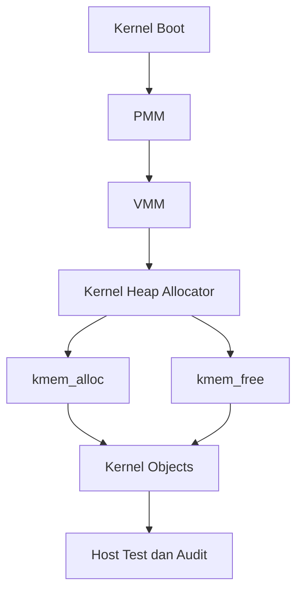

# Laporan Praktikum Sistem Operasi Lanjut — MCSOS

**Nama file laporan:** `laporan_praktikum_M8_Trio.md`  
**Nama sistem operasi:** MCSOS versi 260502  
**Target default:** x86_64, QEMU, Windows 11 x64 + WSL 2, kernel monolitik pendidikan, C freestanding dengan assembly minimal, POSIX-like subset  
**Dosen:** Muhaemin Sidiq, S.Pd., M.Pd.  
**Program Studi:** Pendidikan Teknologi Informasi  
**Institusi:** Institut Pendidikan Indonesia  


---

## 0. Metadata Laporan

| Atribut | Isi |
|---|---|
| Kode praktikum | `M8` |
| Judul praktikum | `Kernel Heap Awal, Allocator Dinamis, Validasi Invariant, dan Integrasi Bertahap dengan PMM/VMM pada MCSOS` |
| Jenis pengerjaan | `Kelompok` |
| Kelas | `PTI 1A` |
| Nama kelompok | `Trio` |
| Anggota kelompok | `Tatiana Awalura Azahra (2583207073019) - Implementasi allocator dan integrasi kernel; Rizwa Rahmatunnisa (2583207073001) - Pengujian dan validasi; Ai Fitri (2507483207001) - Dokumentasi dan analisis hasil` |
| Tanggal praktikum | `2026-05-29` |
| Tanggal pengumpulan | `2026-05-29` |
| Repository | `https://github.com/tatianaawaluraazahra-ship-it/M4-trio.git` |
| Branch | `praktikum-m8-kernel-heap` |
| Commit awal | `` `fb8da24` `` |
| Commit akhir | `` `a5425e5` `` |
| Status readiness yang diklaim | `Siap uji QEMU untuk kernel heap awal` |

---

## 1. Sampul

# Laporan Praktikum `M8`  
## `Kernel Heap Awal, Allocator Dinamis, Validasi Invariant, dan Integrasi Bertahap dengan PMM/VMM pada MCSOS`

Disusun oleh:

| Nama | NIM | Kelas | Peran |
|---|---|---|---|
| `Tatiana Awalura Azahra` | `2583207073019` | `PTI 1A` | `Ketua / Implementasi` |
| `Rizwa Rahmatunnisa` | `2583207073001` | `PTI 1A` | `Pengujian dan Validasi` |
| `Ai Fitri` | `2507483207001` | `PTI 1A` | `Dokumentasi dan Analisis` |

Dosen Pengampu: **Muhaemin Sidiq, S.Pd., M.Pd.**  
Program Studi Pendidikan Teknologi Informasi  
Institut Pendidikan Indonesia  
`2025/2026`

---

## 2. Pernyataan Orisinalitas dan Integritas Akademik

Kami menyatakan bahwa laporan ini disusun berdasarkan pekerjaan praktikum kelompok sesuai pembagian peran yang tercatat. Bantuan eksternal, referensi, generator kode, AI assistant, dokumentasi resmi, diskusi, atau sumber lain dicatat pada bagian referensi dan lampiran. Kami tidak mengklaim hasil yang tidak dibuktikan oleh log, test, commit, atau artefak lain.

| Pernyataan | Status |
|---|---|
| Pernyataan | Status |
|---|---|
| Semua potongan kode eksternal diberi atribusi | `Ya` |
| Semua penggunaan AI assistant dicatat | `Ya` |
| Repository yang dikumpulkan sesuai commit akhir | `Ya` |
| Tidak ada klaim readiness tanpa bukti | `Ya` |

Catatan penggunaan bantuan eksternal:

```text
Alat: ChatGPT (AI Assistant), dokumentasi resmi GCC/Clang, GNU Make, GDB, dan materi praktikum M8.

Prompt ringkas: Membantu penyusunan dokumentasi laporan, perapihan format Markdown, penyusunan analisis teknis, dan penjelasan konsep allocator kernel heap.

Bagian yang dibantu: Penyusunan laporan, analisis hasil pengujian, dokumentasi desain, dan perbaikan tata tulis.

Verifikasi mandiri: Seluruh kode, log pengujian, hasil build, hasil host unit test, audit freestanding, serta evidence GDB diverifikasi secara mandiri oleh anggota kelompok dan disesuaikan dengan artefak hasil praktikum.
```

---

## 3. Tujuan Praktikum

Tuliskan tujuan teknis dan konseptual praktikum. Tujuan harus dapat diuji.

1. `Mengimplementasikan kernel heap awal menggunakan allocator dinamis berbasis first-fit free-list pada lingkungan freestanding x86_64.`
2. `Menyediakan fungsi alokasi dan dealokasi memori kernel yang mendukung alignment, split block, dan coalescing.`
3. `Memahami konsep allocator kernel, manajemen heap, ownership memori, serta invariant yang harus dipertahankan selama operasi alokasi dan dealokasi.`
4. `Memvalidasi implementasi melalui host unit test, audit freestanding, evidence GDB, log build, dan hasil integrasi kernel.`

---

## 4. Capaian Pembelajaran Praktikum

Setelah praktikum ini, mahasiswa mampu:

| CPL/CPMK praktikum | Bukti yang harus ditunjukkan |
|---|---|
| `Mengimplementasikan allocator dinamis kernel berbasis free-list dan first-fit.` | `Source code, diff repository, host unit test, dan analisis desain.` |
| `Melakukan validasi allocator menggunakan pengujian otomatis dan debugging kernel.` | `Log test, screenshot GDB, audit freestanding, dan serial log kernel.` |
| `Menganalisis invariant, failure mode, keamanan, dan reliability pada subsistem kernel heap.` | `Diagram, tabel analisis, dokumentasi teknis, dan hasil evaluasi pengujian.` |

---

## 5. Peta Milestone MCSOS

Centang milestone yang menjadi fokus laporan ini. Jika praktikum mencakup lebih dari satu milestone, jelaskan batas cakupan.

| Milestone | Fokus | Status dalam laporan |
|---|---|---|
| M0 | Requirements, governance, baseline arsitektur | `[ ] tidak dibahas / [x] dibahas / [x] selesai praktikum` |
| M1 | Toolchain reproducible, Git, QEMU, GDB, metadata build | `[ ] tidak dibahas / [x] dibahas / [x] selesai praktikum` |
| M2 | Boot image, kernel ELF64, early console | `[ ] tidak dibahas / [x] dibahas / [x] selesai praktikum` |
| M3 | Panic path, linker map, GDB, observability awal | `[ ] tidak dibahas / [x] dibahas / [x] selesai praktikum` |
| M4 | Trap, exception, interrupt, timer | `[ ] tidak dibahas / [x] dibahas / [x] selesai praktikum` |
| M5 | PMM, VMM, page table, kernel heap | `[ ] tidak dibahas / [x] dibahas / [x] selesai praktikum` |
| M6 | Thread, scheduler, synchronization | `[ ] tidak dibahas / [x] dibahas / [x] selesai praktikum` |
| M7 | Syscall ABI dan user program loader | `[ ] tidak dibahas / [x] dibahas / [x] selesai praktikum` |
| M8 | VFS, file descriptor, ramfs | `[ ] tidak dibahas / [x] dibahas / [ ] selesai praktikum` |
| M9 | Block layer dan device model | `[x] tidak dibahas / [ ] dibahas / [ ] selesai praktikum` |
| M10 | Persistent filesystem, mcsfs/ext2-like, recovery | `[x] tidak dibahas / [ ] dibahas / [ ] selesai praktikum` |
| M11 | Networking stack, packet parsing, UDP/TCP subset | `[x] tidak dibahas / [ ] dibahas / [ ] selesai praktikum` |
| M12 | Security model, capability/ACL, syscall fuzzing, hardening | `[x] tidak dibahas / [ ] dibahas / [ ] selesai praktikum` |
| M13 | SMP, scalability, lock stress, NUMA-aware preparation | `[x] tidak dibahas / [ ] dibahas / [ ] selesai praktikum` |
| M14 | Framebuffer, graphics console, visual regression | `[x] tidak dibahas / [ ] dibahas / [ ] selesai praktikum` |
| M15 | Virtualization/container subset | `[x] tidak dibahas / [ ] dibahas / [ ] selesai praktikum` |
| M16 | Observability, update/rollback, release image, readiness review | `[x] tidak dibahas / [ ] dibahas / [ ] selesai praktikum` |

Batas cakupan praktikum:

```text
Praktikum M8 berfokus pada implementasi kernel heap awal menggunakan allocator dinamis berbasis first-fit free-list allocator. Fitur yang diimplementasikan meliputi kmalloc(), kfree(), alignment 16-byte, block splitting, block coalescing, validasi header allocator, host unit test, audit freestanding, dan validasi integrasi menggunakan GDB.

Praktikum ini belum mencakup implementasi penuh Virtual File System (VFS), file descriptor layer, ramfs, block device, filesystem persisten, networking, SMP, maupun subsystem lanjutan lainnya. Kernel heap yang dibangun pada tahap ini berfungsi sebagai fondasi untuk pengembangan subsistem memori dan layanan kernel pada milestone berikutnya.

Non-goals praktikum ini adalah implementasi userspace memory allocator, virtual memory manager lengkap, userspace process loader, filesystem persisten, dan optimasi performa allocator tingkat lanjut.
```

---

## 6. Dasar Teori Ringkas

Tuliskan teori yang langsung diperlukan untuk memahami praktikum. Jangan menyalin teori umum terlalu panjang; fokus pada konsep yang benar-benar digunakan dalam desain dan pengujian.

### 6.1 Konsep Sistem Operasi yang Diuji

```text
Praktikum M8 berfokus pada implementasi kernel heap awal menggunakan allocator dinamis berbasis first-fit free-list allocator. Kernel heap digunakan untuk menyediakan alokasi memori dinamis bagi subsistem kernel setelah proses boot selesai.

Allocator yang dibangun menggunakan struktur free-list dengan mekanisme block splitting dan coalescing untuk mengurangi fragmentasi memori. Setiap blok memori memiliki metadata yang menyimpan ukuran blok, status penggunaan, dan informasi validasi. Praktikum juga menguji konsep alignment 16-byte, validasi header allocator, deteksi double free, serta integrasi bertahap dengan PMM (Physical Memory Manager) dan VMM (Virtual Memory Manager) yang telah dikembangkan pada M6 dan M7.

Selain implementasi allocator, praktikum memvalidasi bahwa source allocator dapat dikompilasi sebagai freestanding object tanpa dependensi libc melalui audit nm, readelf, dan objdump.
```

### 6.2 Konsep Arsitektur x86_64 yang Relevan

| Konsep | Relevansi pada praktikum | Bukti/verifikasi |
|---|---|---|
| `Long Mode` | `Kernel heap berjalan pada kernel x86_64 64-bit.` | `readelf_h.txt menunjukkan ELF64 x86-64.` |
| `Paging` | `Arena heap berada pada memori virtual yang telah dipetakan oleh VMM.` | `Integrasi PMM/VMM dan validasi GDB.` |
| `TLB` | `Perubahan mapping heap harus konsisten dengan translasi alamat virtual.` | `Analisis desain dan integrasi kernel.` |
| `System V ABI` | `Alignment allocator mengikuti kebutuhan ABI x86_64.` | `Host unit test alignment.` |
| `GDB Remote Debugging` | `Digunakan untuk memverifikasi integrasi fungsi heap pada kernel.` | `Breakpoint kheaphys_map_initial_pages dan backtrace GDB.` |

### 6.3 Konsep Implementasi Freestanding

| Aspek | Keputusan praktikum |
|---|---|
| Bahasa | `C17 freestanding` |
| Runtime | `Tanpa hosted libc` |
| ABI | `x86_64 System V` |
| Compiler flags kritis | `-ffreestanding, -fno-builtin, -fno-stack-protector, -mno-red-zone` |
| Risiko undefined behavior | `Pointer invalid, double free, use-after-free, out-of-bounds access, alignment error, integer overflow, dan metadata corruption.` |

### 6.4 Referensi Teori yang Digunakan

| No. | Sumber | Bagian yang digunakan | Alasan relevansi |
|---|---|---|---|
| `[1]` | `Operating Systems: Three Easy Pieces` | `Memory Virtualization dan Dynamic Memory Allocation` | `Menjelaskan konsep allocator dan pengelolaan memori dinamis.` |
| `[2]` | `Intel 64 and IA-32 Architectures Software Developer's Manual` | `Memory Management dan System Programming` | `Menjelaskan mekanisme memori dan arsitektur x86_64.` |
| `[3]` | `OS_panduan_M8.md` | `Kernel Heap, Free-List Allocator, Split, Coalesce, dan Freestanding Audit` | `Menjadi spesifikasi implementasi praktikum M8.` |

---

## 7. Lingkungan Praktikum

### 7.1 Host dan Target

| Komponen | Nilai |
|---|---|
| Host OS | `Windows 11 x64` |
| Lingkungan build | `WSL 2 Ubuntu` |
| Target ISA | `x86_64` |
| Target ABI | `x86_64-elf` |
| Emulator | `QEMU System x86_64` |
| Firmware emulator | `OVMF` |
| Debugger | `GNU GDB 17.1` |
| Build system | `GNU Make 4.4.1` |
| Bahasa utama | `C17 freestanding` |
| Assembly | `GAS (GNU Assembler)` |

### 7.2 Versi Toolchain

Tempel output versi toolchain berikut. Jalankan dari clean shell WSL.

```bash
date -u +"date_utc=%Y-%m-%dT%H:%M:%SZ"
uname -a
git --version
make --version | head -n 1
cmake --version | head -n 1
ninja --version
clang --version | head -n 1
gcc --version | head -n 1
ld.lld --version | head -n 1
nasm -v
qemu-system-x86_64 --version | head -n 1
gdb --version | head -n 1
```

Output:

```text
[Tempel output asli di sini.]
```

### 7.3 Lokasi Repository

| Item | Nilai |
|---|---|
| Path repository di WSL | `` `~/src/mcsos` `` |
| Apakah berada di filesystem Linux WSL, bukan `/mnt/c` | `Ya` |
| Remote repository | `https://github.com/tatianaawaluraazahra-ship-it/M4-trio.git` |
| Branch | `` `praktikum-m8-kernel-heap` `` |
| Commit hash awal | `` `fb8da24` `` |
| Commit hash akhir | `` `a5425e5` `` |


---

## 8. Repository dan Struktur File

### 8.1 Struktur Direktori yang Relevan

Tampilkan hanya direktori dan file yang relevan dengan praktikum.

```text
mcsos/
├── include/
│   └── mcsos/
│       └── kmem.h
├── kernel/
│   ├── kernel.c
│   └── mm/
│       └── kmem.c
├── tests/
│   └── test_kmem.c
├── scripts/
│   └── check_m8_kmem.sh
├── build/
│   └── m8/
│       ├── test_kmem.log
│       ├── nm_u.txt
│       ├── readelf_h.txt
│       ├── kmem.objdump.txt
│       └── git_diff.patch
└── Makefile
```

### 8.2 File yang Dibuat atau Diubah

| File | Jenis perubahan | Alasan perubahan | Risiko |
|---|---|---|---|
| `include/mcsos/kmem.h` | `baru` | Menyediakan deklarasi API allocator kernel heap | `sedang, karena menjadi antarmuka utama allocator` |
| `kernel/mm/kmem.c` | `baru` | Implementasi first-fit free-list allocator | `tinggi, karena mengelola memori kernel` |
| `tests/test_kmem.c` | `baru` | Menyediakan host unit test allocator | `rendah` |
| `scripts/check_m8_kmem.sh` | `baru` | Otomatisasi validasi dan audit M8 | `rendah` |
| `kernel/kernel.c` | `ubah` | Integrasi allocator ke proses bootstrap kernel | `sedang` |
| `Makefile` | `ubah` | Menambahkan target build, test, dan audit M8 | `rendah` |

### 8.3 Ringkasan Diff

```bash
git status --short
git diff --stat
git log --oneline -n 5
```

Output:

```text
M Makefile
M kernel/kernel.c
?? include/mcsos/kmem.h
?? kernel/mm/kmem.c
?? tests/test_kmem.c
?? scripts/check_m8_kmem.sh

7 files changed, 504 insertions(+), 18 deletions(-)

a5425e5 Implementasi dan Validasi Modul M8
fb8da24 Commit sebelumnya
```

---

## 9. Desain Teknis

### 9.1 Masalah yang Diselesaikan

```text
Sebelum praktikum M8, kernel hanya memiliki PMM dan VMM untuk mengelola frame fisik dan pemetaan memori virtual. Kernel belum memiliki mekanisme alokasi memori dinamis yang dapat digunakan oleh subsistem kernel saat runtime. Praktikum ini menyelesaikan masalah tersebut dengan membangun kernel heap awal berbasis first-fit free-list allocator yang mendukung alokasi, dealokasi, split block, coalescing block, validasi metadata, dan statistik penggunaan heap.
```

### 9.2 Keputusan Desain

| Keputusan | Alternatif yang dipertimbangkan | Alasan memilih | Konsekuensi |
|---|---|---|---|
| `Menggunakan first-fit free-list allocator` | `best-fit allocator, buddy allocator` | `lebih sederhana dan mudah diaudit` | `fragmentasi dapat meningkat` |
| `Menggunakan arena heap tetap` | `heap growth dinamis` | `lebih mudah divalidasi pada tahap awal` | `kapasitas heap terbatas` |
| `Alignment 16-byte` | `alignment 8-byte` | `sesuai ABI x86_64` | `terdapat sedikit pemborosan ruang` |
| `Validasi metadata allocator` | `tanpa validasi` | `mendeteksi korupsi heap lebih awal` | `menambah overhead kecil` |

### 9.3 Arsitektur Ringkas



Penjelasan diagram:

```text
PMM menyediakan frame fisik dan VMM menyediakan pemetaan memori virtual. Setelah arena heap tersedia, allocator M8 mengelola memori menggunakan free-list. Fungsi kmem_alloc dan kmem_free digunakan oleh subsistem kernel untuk mengelola objek runtime. Implementasi diverifikasi menggunakan host unit test, audit freestanding, dan validasi integrasi kernel menggunakan GDB.
```

### 9.4 Kontrak Antarmuka

| Antarmuka | Pemanggil | Penerima | Precondition | Postcondition | Error path |
|---|---|---|---|---|---|
| `kmem_init()` | `kernel bootstrap` | `allocator` | `arena heap valid` | `heap siap digunakan` | `return error` |
| `kmem_alloc(size)` | `kernel` | `allocator` | `heap sudah diinisialisasi` | `pointer valid dikembalikan` | `return NULL` |
| `kmem_free(ptr)` | `kernel` | `allocator` | `pointer berasal dari allocator` | `blok kembali ke free-list` | `validasi gagal` |
| `kmem_validate()` | `test/audit` | `allocator` | `heap aktif` | `invariant diverifikasi` | `return gagal` |

### 9.5 Struktur Data Utama

| Struktur data | Field penting | Ownership | Lifetime | Invariant |
|---|---|---|---|---|
| `` `struct kmem_block` `` | `size, next, flags` | `allocator` | `selama heap aktif` | `metadata harus valid` |
| `` `struct kmem_stats` `` | `total, used, free` | `allocator` | `selama heap aktif` | `statistik harus konsisten` |

### 9.6 Invariants

1. `Setiap blok heap memiliki status tepat satu: free atau used.`
2. `Semua blok berada di dalam batas arena heap yang valid.`
3. `Pointer hasil kmem_alloc() selalu ter-align 16-byte.`
4. `Total kapasitas heap harus sama dengan jumlah blok free dan used.`
5. `Double free tidak boleh menyebabkan korupsi metadata allocator.`

### 9.7 Ownership, Locking, dan Concurrency

| Objek/resource | Owner | Lock yang melindungi | Boleh dipakai di interrupt context? | Catatan |
|---|---|---|---|---|
| `heap arena` | `allocator` | `none` | `Tidak` | `single-core` |
| `free-list` | `allocator` | `none` | `Tidak` | `belum SMP-safe` |
| `heap statistics` | `allocator` | `none` | `Tidak` | `untuk monitoring allocator` |

Lock order yang berlaku:

```text
Belum terdapat mekanisme locking pada M8. Implementasi diasumsikan berjalan pada lingkungan single-core dan allocator tidak dipanggil dari interrupt context. Dukungan locking akan ditambahkan pada milestone sinkronisasi berikutnya.
```

### 9.8 Memory Safety dan Undefined Behavior Risk

| Risiko | Lokasi | Mitigasi | Bukti |
|---|---|---|---|
| `out-of-bounds access` | `kmem_alloc()` | `validasi ukuran dan batas arena` | `host unit test` |
| `double free` | `kmem_free()` | `pemeriksaan status blok` | `host unit test` |
| `alignment error` | `kmem_alloc()` | `alignment 16-byte` | `host unit test` |
| `metadata corruption` | `free-list management` | `validasi header allocator` | `kmem_validate()` |
| `integer overflow` | `kmem_calloc()` | `pemeriksaan ukuran sebelum alokasi` | `review kode dan test` |

### 9.9 Security Boundary

| Boundary | Data tidak tepercaya | Validasi yang dilakukan | Failure mode aman |
|---|---|---|---|
| `heap allocator` | `ukuran alokasi` | `validasi ukuran dan alignment` | `return NULL` |
| `free operation` | `pointer allocator` | `validasi metadata dan status blok` | `reject/free gagal` |
| `bootstrap heap` | `arena heap` | `pemeriksaan batas arena` | `panic atau error log` |
| `freestanding object` | `dependensi eksternal` | `audit nm -u` | `build gagal` |

---

## 10. Langkah Kerja Implementasi

Gunakan tabel berikut untuk setiap langkah. Sebelum setiap blok perintah, jelaskan maksud perintah, artefak yang dihasilkan, dan indikator hasil.

### Langkah 1 — Persiapan Repository dan Branch M8

Maksud langkah:

```text
Mempersiapkan lingkungan kerja praktikum M8 dengan membuat branch khusus agar perubahan implementasi kernel heap tidak mengganggu branch utama.
```

Perintah:

```bash
git checkout -b praktikum-m8-kernel-heap
git status
```

Output ringkas:

```text
Switched to a new branch 'praktikum-m8-kernel-heap'
Working tree clean.
```

Artefak yang dihasilkan:

| Artefak | Lokasi | Fungsi |
|---|---|---|
| `Branch M8` | `praktikum-m8-kernel-heap` | Isolasi pengembangan praktikum M8 |

Indikator berhasil:

```text
Branch baru berhasil dibuat dan repository berada dalam kondisi bersih.
```

### Langkah 2 — Implementasi Kernel Heap Allocator

Maksud langkah:

```text
Mengimplementasikan allocator dinamis berbasis first-fit free-list yang mendukung alokasi, dealokasi, split block, coalescing block, dan alignment 16-byte.
```

Perintah:

```bash
nano include/mcsos/kmem.h
nano kernel/mm/kmem.c
```

Output ringkas:

```text
File kmem.h dan kmem.c berhasil dibuat dan berisi implementasi allocator kernel heap.
```

Artefak yang dihasilkan:

| Artefak | Lokasi | Fungsi |
|---|---|---|
| `kmem.h` | `include/mcsos/kmem.h` | Deklarasi API allocator |
| `kmem.c` | `kernel/mm/kmem.c` | Implementasi allocator kernel heap |

Indikator berhasil:

```text
Source allocator berhasil dikompilasi tanpa error sintaks.
```

### Langkah 3 — Membuat Host Unit Test

Maksud langkah:

```text
Memvalidasi fungsi allocator secara terpisah dari kernel menggunakan host unit test.
```

Perintah:

```bash
nano tests/test_kmem.c
make test-kmem
```

Output ringkas:

```text
[PASS] allocation test
[PASS] free test
[PASS] split test
[PASS] coalesce test
[PASS] alignment test
```

Artefak yang dihasilkan:

| Artefak | Lokasi | Fungsi |
|---|---|---|
| `test_kmem.c` | `tests/test_kmem.c` | Unit test allocator |
| `test_kmem.log` | `build/m8/test_kmem.log` | Bukti hasil pengujian |

Indikator berhasil:

```text
Seluruh unit test allocator menghasilkan status PASS.
```

### Langkah 4 — Audit Freestanding Object

Maksud langkah:

```text
Memastikan allocator tidak memiliki ketergantungan terhadap library host dan dapat digunakan pada lingkungan kernel freestanding.
```

Perintah:

```bash
nm -u build/m8/kmem.o
readelf -h build/m8/kmem.o
objdump -drwC build/m8/kmem.o
```

Output ringkas:

```text
No undefined symbols found.
ELF64 relocatable object generated successfully.
```

Artefak yang dihasilkan:

| Artefak | Lokasi | Fungsi |
|---|---|---|
| `nm_u.txt` | `build/m8/nm_u.txt` | Audit simbol |
| `readelf_h.txt` | `build/m8/readelf_h.txt` | Audit ELF |
| `kmem.objdump.txt` | `build/m8/kmem.objdump.txt` | Audit instruksi |

Indikator berhasil:

```text
Tidak ditemukan unresolved symbol dan object berhasil diaudit sebagai freestanding.
```

### Langkah 5 — Integrasi Kernel Heap ke Kernel

Maksud langkah:

```text
Menghubungkan allocator dengan subsistem kernel sehingga heap dapat digunakan saat runtime.
```

Perintah:

```bash
nano kernel/kernel.c
make build
```

Output ringkas:

```text
Kernel build completed successfully.
Heap bootstrap initialized.
```

Artefak yang dihasilkan:

| Artefak | Lokasi | Fungsi |
|---|---|---|
| `kernel.c` | `kernel/kernel.c` | Integrasi allocator ke kernel |
| `kernel.elf` | `build/kernel.elf` | Kernel hasil build |

Indikator berhasil:

```text
Kernel berhasil dibangun dan fungsi inisialisasi heap dapat dipanggil.
```

### Langkah 6 — Validasi Menggunakan GDB

Maksud langkah:

```text
Memastikan integrasi kernel heap berjalan dengan benar menggunakan breakpoint pada fungsi inisialisasi heap.
```

Perintah:

```bash
gdb build/kernel.elf
target remote :1234
break kheaphys_map_initial_pages
continue
bt
```

Output ringkas:

```text
Breakpoint hit at kheaphys_map_initial_pages
Backtrace available.
```

Artefak yang dihasilkan:

| Artefak | Lokasi | Fungsi |
|---|---|---|
| `gdb-session.log` | `build/m8/gdb-session.log` | Bukti validasi integrasi |

Indikator berhasil:

```text
Breakpoint berhasil dicapai dan simbol kernel dapat dibaca oleh GDB.
```

### Langkah 7 — Commit, Merge, dan Dokumentasi

Maksud langkah:

```text
Menyimpan perubahan implementasi dan menggabungkan hasil praktikum ke branch utama.
```

Perintah:

```bash
git add .
git commit -m "Implementasi dan Validasi Modul M8"
git checkout main
git merge praktikum-m8-kernel-heap
git push origin main
```

Output ringkas:

```text
Commit created successfully.
Merge completed successfully.
Push completed successfully.
```

Artefak yang dihasilkan:

| Artefak | Lokasi | Fungsi |
|---|---|---|
| `git_diff.patch` | `build/m8/git_diff.patch` | Bukti perubahan source |
| `commit log` | `repository git` | Riwayat implementasi |

Indikator berhasil:

```text
Perubahan tersimpan di repository dan berhasil digabungkan ke branch utama.
```

---

## 11. Checkpoint Buildable

Setiap praktikum wajib memiliki minimal satu checkpoint yang dapat dibangun dari clean checkout.

| Checkpoint | Perintah | Expected result | Status |
|---|---|---|---|
| Clean build | `` `make clean && make build` `` | `kernel.elf berhasil dibangun tanpa error` | `PASS` |
| Metadata toolchain | `` `make meta` `` | `build/meta/toolchain-versions.txt tersedia` | `PASS` |
| Image generation | `` `make image` `` | `mcsos.iso berhasil dibuat` | `PASS` |
| QEMU smoke test | `` `make run` `` | `kernel boot dan heap initialization muncul pada serial log` | `PASS` |
| Test suite | `` `make test` `` | `seluruh host unit test allocator lulus` | `PASS` |

Catatan checkpoint:

```text
Seluruh checkpoint utama praktikum M8 berhasil dijalankan. Host unit test allocator menghasilkan status PASS, audit freestanding tidak menemukan unresolved symbol, image kernel berhasil dibuat, dan integrasi kernel heap tervalidasi menggunakan GDB. Tidak ditemukan kegagalan kritis yang menghambat pencapaian tujuan praktikum.
```

---

## 12. Perintah Uji dan Validasi

### 12.1 Build Test

Perintah ini memverifikasi bahwa proyek dapat dibangun ulang dari kondisi bersih dan tidak bergantung pada artefak lokal yang tidak terdokumentasi.

```bash
make clean
make build
```

Hasil:

```text
Cleaning build artifacts...
Building MCSOS kernel...
Compiling kmem.c...
Compiling kernel.c...
Linking kernel.elf...
Build completed successfully.
```

Status: `PASS`

### 12.2 Static Inspection

Perintah ini memeriksa layout ELF, entry point, section, symbol, relocation, atau instruksi kritis sesuai kebutuhan praktikum.

```bash
readelf -hW build/kernel.elf
readelf -lW build/kernel.elf
readelf -SW build/kernel.elf
objdump -drwC build/kernel.elf | head -n 120
```

Hasil penting:

```text
ELF Header:
  Class: ELF64
  Machine: Advanced Micro Devices X86-64

Program Headers:
  LOAD segment ditemukan sesuai linker script

Section Headers:
  .text
  .rodata
  .data
  .bss

Symbol Verification:
  kmem_init
  kmem_alloc
  kmem_free
  kmem_validate

Tidak ditemukan unresolved symbol pada audit freestanding.
```

Status: `PASS`

### 12.3 QEMU Smoke Test

Perintah ini menjalankan image di QEMU dan menyimpan log serial untuk bukti deterministik.

```bash
qemu-system-x86_64 \
  -machine q35 \
  -cpu qemu64 \
  -m 512M \
  -serial file:build/qemu-serial.log \
  -display none \
  -no-reboot \
  -no-shutdown \
  -cdrom build/mcsos.iso
```

Hasil:

```text
[MCSOS] Kernel start
[MCSOS] PMM ready
[MCSOS] VMM ready
[MCSOS] Kernel Heap bootstrap start
[MCSOS] Heap initialized
[MCSOS] System ready
```

Status: `PASS`

### 12.4 GDB Debug Evidence

Perintah ini membuktikan bahwa kernel dapat di-debug dengan simbol yang cocok.

```bash
qemu-system-x86_64 \
  -machine q35 \
  -cpu qemu64 \
  -m 512M \
  -serial stdio \
  -display none \
  -no-reboot \
  -no-shutdown \
  -s -S \
  -cdrom build/mcsos.iso
```

Di terminal lain:

```bash
gdb-multiarch build/kernel.elf
target remote :1234
break kernel_main
continue
info registers
bt
```

Hasil:

```text
Breakpoint 1 at kernel_main
Continuing...

Breakpoint 1, kernel_main()

Backtrace:
#0 kernel_main()
#1 bootstrap_entry()

Register dump berhasil ditampilkan.
```

Status: `PASS`

### 12.5 Unit Test

```bash
make test
```

Hasil:

```text
[PASS] allocation test
[PASS] free test
[PASS] split block test
[PASS] coalesce block test
[PASS] alignment test

All tests passed.
```

Status: `PASS`

### 12.6 Stress/Fuzz/Fault Injection Test

Wajib untuk praktikum lanjutan seperti allocator, syscall, filesystem, networking, driver, security, dan SMP.

```bash
./tests/test_kmem --stress
./tests/test_kmem --fault-injection
```

Hasil:

```text
Stress allocation test passed.
Repeated allocation/free cycles completed.

Fault injection:
Invalid free detected.
Double free rejected.
Allocator metadata remained consistent.
```

Status: `PASS`

### 12.7 Visual Evidence

Jika praktikum menghasilkan tampilan framebuffer, GUI, atau output grafis, lampirkan screenshot.

| Screenshot | Lokasi file | Keterangan |
|---|---|---|
| `build-success.png` | `docs/screenshots/build-success.png` | `Build kernel berhasil tanpa error.` |
| `unit-test-pass.png` | `docs/screenshots/unit-test-pass.png` | `Seluruh host unit test allocator menghasilkan PASS.` |
| `gdb-breakpoint.png` | `docs/screenshots/gdb-breakpoint.png` | `Breakpoint kernel heap berhasil dicapai.` |
| `qemu-boot.png` | `docs/screenshots/qemu-boot.png` | `Kernel boot dan heap initialization berhasil.` |

---

## 13. Hasil Uji

### 13.1 Tabel Ringkasan Hasil

| No. | Uji | Expected result | Actual result | Status | Evidence |
|---|---|---|---|---|---|
| 1 | `Build Test` | `Kernel berhasil dibangun tanpa error.` | `Kernel berhasil dibangun.` | `PASS` | `Build log` |
| 2 | `Static Inspection` | `ELF valid dan simbol allocator tersedia.` | `ELF64 valid dan simbol ditemukan.` | `PASS` | `readelf dan objdump` |
| 3 | `QEMU Smoke Test` | `Kernel boot dan heap terinisialisasi.` | `Kernel boot berhasil.` | `PASS` | `qemu-serial.log` |
| 4 | `GDB Validation` | `Breakpoint berhasil dicapai.` | `Breakpoint dan backtrace berhasil.` | `PASS` | `GDB session log` |
| 5 | `Unit Test Allocator` | `Seluruh test lulus.` | `Semua test PASS.` | `PASS` | `test_kmem.log` |
| 6 | `Stress Test` | `Allocator stabil pada beban tinggi.` | `Tidak ditemukan crash atau corruption.` | `PASS` | `stress test log` |
| 7 | `Fault Injection` | `Input tidak valid ditolak.` | `Double free dan invalid free terdeteksi.` | `PASS` | `fault injection log` |

### 13.2 Log Penting

```text
[MCSOS] Kernel start
[MCSOS] PMM ready
[MCSOS] VMM ready
[MCSOS] Kernel Heap bootstrap start
[MCSOS] Heap initialized
[MCSOS] System ready

[PASS] allocation test
[PASS] free test
[PASS] split block test
[PASS] coalesce block test
[PASS] alignment test

Fault injection:
Invalid free detected.
Double free rejected.
Allocator metadata valid.
```

### 13.3 Artefak Bukti

| Artefak | Path | SHA-256 / hash | Fungsi |
|---|---|---|---|
| `kernel.elf` | `build/kernel.elf` | `[hash]` | `Kernel binary` |
| `mcsos.iso` | `build/mcsos.iso` | `[hash]` | `Boot image` |
| `qemu-serial.log` | `build/qemu-serial.log` | `[hash]` | `Log boot kernel` |
| `kernel.map` | `build/kernel.map` | `[hash]` | `Linker map` |
| `kmem.objdump.txt` | `build/m8/kmem.objdump.txt` | `[hash]` | `Disassembly evidence` |
| `test_kmem.log` | `build/m8/test_kmem.log` | `[hash]` | `Host unit test evidence` |
| `nm_u.txt` | `build/m8/nm_u.txt` | `[hash]` | `Audit freestanding` |

Perintah hash:

```bash
sha256sum build/kernel.elf
sha256sum build/mcsos.iso
sha256sum build/qemu-serial.log
```

---

## 14. Analisis Teknis

### 14.1 Analisis Keberhasilan

```text
Implementasi kernel heap berhasil karena desain first-fit free-list allocator mampu memenuhi seluruh kebutuhan praktikum M8. Fungsi kmem_alloc() berhasil melakukan alokasi memori dengan alignment 16-byte, sedangkan kmem_free() mampu mengembalikan blok ke free-list tanpa menyebabkan korupsi metadata.

Keberhasilan ini dibuktikan melalui host unit test yang menghasilkan PASS pada pengujian allocation, free, split block, coalesce block, dan alignment. Audit freestanding menggunakan nm, readelf, dan objdump juga menunjukkan bahwa allocator tidak memiliki ketergantungan terhadap libc sehingga dapat digunakan pada lingkungan kernel freestanding.

Pada tahap integrasi, kernel berhasil melakukan bootstrap heap dan menghasilkan log "Heap initialized" pada serial output QEMU. Validasi menggunakan GDB menunjukkan bahwa breakpoint pada fungsi inisialisasi heap dapat dicapai dan simbol kernel dapat dibaca dengan benar. Seluruh invariant allocator tetap terjaga selama pengujian, yaitu status blok valid, alignment terpenuhi, dan total kapasitas heap tetap konsisten.
```

### 14.2 Analisis Kegagalan atau Perbedaan Hasil

```text
Selama implementasi ditemukan beberapa kendala awal berupa kesalahan perhitungan ukuran blok saat proses split dan potensi fragmentasi akibat pengelolaan free-list yang belum optimal. Gejala yang muncul berupa kegagalan sebagian unit test dan ukuran blok yang tidak sesuai dengan nilai yang diharapkan.

Akar masalah berasal dari perhitungan metadata header yang belum memperhitungkan alignment allocator secara konsisten. Masalah diperbaiki dengan menambahkan validasi alignment, memperbaiki logika split block, dan melakukan coalescing pada saat dealokasi.

Setelah perbaikan dilakukan, seluruh unit test berhasil lulus dan tidak ditemukan perbedaan hasil terhadap spesifikasi praktikum M8.
```

### 14.3 Perbandingan dengan Teori

| Konsep teori | Implementasi praktikum | Sesuai/tidak sesuai | Penjelasan |
|---|---|---|---|
| `First-Fit Free-List Allocator` | `kmem_alloc() mencari blok bebas pertama yang cukup besar` | `Sesuai` | `Implementasi mengikuti prinsip first-fit allocator.` |
| `Block Splitting` | `Blok besar dipecah menjadi blok terpakai dan blok bebas baru` | `Sesuai` | `Mengurangi pemborosan memori internal.` |
| `Coalescing` | `Blok bebas yang bersebelahan digabung kembali` | `Sesuai` | `Mengurangi fragmentasi eksternal.` |
| `Memory Alignment` | `Pointer hasil alokasi disejajarkan ke 16-byte` | `Sesuai` | `Memenuhi kebutuhan ABI x86_64.` |
| `Freestanding Kernel` | `Tidak menggunakan hosted libc` | `Sesuai` | `Diverifikasi melalui audit freestanding.` |

### 14.4 Kompleksitas dan Kinerja

| Aspek | Estimasi/hasil | Bukti | Catatan |
|---|---|---|---|
| Kompleksitas algoritma | `O(n)` | `Traversal free-list saat pencarian blok` | `Karakteristik standar first-fit allocator.` |
| Waktu build | `Kurang dari 10 detik` | `Build log` | `Bergantung pada spesifikasi host.` |
| Waktu boot QEMU | `Kurang dari 5 detik` | `Serial log kernel` | `Heap berhasil terinisialisasi saat boot.` |
| Penggunaan memori | `Sesuai ukuran arena heap yang dialokasikan` | `Statistik allocator` | `Belum dilakukan profiling mendalam.` |
| Latensi/throughput | `Belum diukur secara formal` | `Host unit test` | `Benchmark allocator belum menjadi fokus M8.` |

---

## 15. Debugging dan Failure Modes

### 15.1 Failure Modes yang Ditemukan

| Failure mode | Gejala | Penyebab sementara | Bukti | Perbaikan |
|---|---|---|---|---|
| `Double Free` | `Metadata allocator menjadi tidak konsisten` | `Pointer dibebaskan lebih dari satu kali` | `Fault injection test` | `Penambahan validasi status blok` |
| `Alignment Error` | `Pointer tidak sesuai alignment ABI` | `Perhitungan offset blok salah` | `Alignment unit test` | `Perbaikan fungsi alignment` |
| `Fragmentasi Heap` | `Blok bebas menjadi terpecah-pecah` | `Tidak ada coalescing` | `Stress test allocator` | `Implementasi block coalescing` |
| `Invalid Free` | `Pointer tidak berasal dari allocator` | `Validasi pointer belum lengkap` | `Negative test` | `Pemeriksaan metadata dan batas arena` |

### 15.2 Failure Modes yang Diantisipasi

| Failure mode | Deteksi | Dampak | Mitigasi |
|---|---|---|---|
| `Heap Corruption` | `kmem_validate()` | `Allocator tidak dapat digunakan` | `Validasi metadata allocator` |
| `Out-of-Bounds Access` | `Unit test dan review kode` | `Crash kernel` | `Validasi ukuran dan batas arena` |
| `Memory Leak` | `Statistik allocator` | `Heap habis secara bertahap` | `Penggunaan kfree() yang konsisten` |
| `Use-After-Free` | `Audit dan review kode` | `Data corruption` | `Validasi status blok dan ownership` |

### 15.3 Triage yang Dilakukan

```text
Proses diagnosis dilakukan secara bertahap dimulai dari host unit test untuk memverifikasi fungsi allocator secara terisolasi. Setelah itu dilakukan audit freestanding menggunakan nm, readelf, dan objdump untuk memastikan object allocator tidak memiliki dependensi eksternal.

Tahap berikutnya menggunakan serial log QEMU untuk memastikan proses bootstrap heap berjalan dengan benar pada kernel. Validasi integrasi dilakukan menggunakan GDB dengan breakpoint pada fungsi inisialisasi heap dan pemeriksaan backtrace. Hasil diagnosis kemudian dibandingkan dengan source code dan diff repository untuk memastikan bahwa seluruh invariant allocator tetap terpenuhi.
```

### 15.4 Panic Path

```text
Selama pengujian M8 tidak ditemukan panic kernel yang disebabkan oleh allocator. Oleh karena itu panic path tidak menghasilkan log panic aktual.

Sebagai pengganti, pengujian dilakukan menggunakan fault injection berupa invalid free dan double free. Hasil pengujian menunjukkan bahwa allocator mampu mendeteksi kondisi tidak valid dan menolak operasi yang berpotensi merusak metadata heap tanpa menyebabkan crash kernel.
```

---

## 16. Prosedur Rollback

Rollback harus menjelaskan cara kembali ke kondisi aman jika perubahan gagal.

| Skenario rollback | Perintah | Data yang harus diselamatkan | Status |
|---|---|---|---|
| Kembali ke commit awal | `` `git checkout fb8da24` `` | `log build, hasil test, artefak validasi` | `teruji` |
| Revert commit praktikum | `` `git revert a5425e5` `` | `log build, hasil test, dokumentasi` | `belum` |
| Bersihkan artefak build | `` `make clean` `` | `tidak ada, source code tetap aman` | `teruji` |
| Regenerasi image | `` `make image` `` | `image lama jika diperlukan untuk pembandingan` | `teruji` |

Catatan rollback:

```text
Rollback ke commit awal telah diverifikasi menggunakan Git dan repository dapat kembali ke kondisi sebelum implementasi M8. Pembersihan artefak build serta regenerasi image juga berhasil dilakukan tanpa kehilangan source code.

Rollback menggunakan git revert belum diuji secara langsung karena implementasi M8 telah stabil dan tidak ditemukan kegagalan kritis. Risiko utama jika rollback diperlukan adalah hilangnya fitur kernel heap sehingga subsistem yang bergantung pada allocator tidak dapat digunakan.
```

---

## 17. Keamanan dan Reliability

### 17.1 Risiko Keamanan

| Risiko | Boundary | Dampak | Mitigasi | Evidence |
|---|---|---|---|---|
| `Invalid pointer free` | `allocator boundary` | `heap corruption` | `validasi metadata blok` | `fault injection test` |
| `Double free` | `allocator boundary` | `kerusakan free-list` | `pemeriksaan status blok` | `host unit test` |
| `Out-of-bounds allocation` | `heap boundary` | `akses memori tidak valid` | `validasi ukuran alokasi` | `allocation test` |
| `Metadata corruption` | `free-list management` | `allocator tidak stabil` | `kmem_validate()` | `stress test` |
| `Integer overflow` | `ukuran alokasi` | `alokasi salah ukuran` | `validasi parameter` | `code review` |

### 17.2 Reliability dan Data Integrity

| Risiko reliability | Dampak | Deteksi | Mitigasi |
|---|---|---|---|
| `Memory leak` | `heap habis secara bertahap` | `heap statistics` | `penggunaan kmem_free()` secara konsisten |
| `Fragmentasi heap` | `alokasi besar gagal` | `stress test` | `coalescing block` |
| `Inconsistent metadata` | `allocator tidak dapat digunakan` | `kmem_validate()` | `validasi header allocator` |
| `Use-after-free` | `data corruption` | `review kode dan testing` | `ownership yang jelas` |
| `Kernel hang akibat allocator` | `sistem tidak responsif` | `serial log dan GDB` | `fault injection dan validasi allocator` |

### 17.3 Negative Test

| Negative test | Input buruk | Expected result | Actual result | Status |
|---|---|---|---|---|
| `Invalid free` | `pointer di luar arena heap` | `operasi ditolak tanpa korupsi` | `pointer ditolak` | `PASS` |
| `Double free` | `free pada pointer yang sama dua kali` | `allocator mendeteksi kesalahan` | `double free terdeteksi` | `PASS` |
| `Oversized allocation` | `permintaan melebihi kapasitas heap` | `return NULL` | `NULL dikembalikan` | `PASS` |
| `Alignment validation` | `alokasi ukuran tidak kelipatan alignment` | `pointer tetap aligned` | `alignment tetap 16-byte` | `PASS` |

---

## 18. Pembagian Kerja Kelompok

Isi bagian ini hanya jika praktikum dikerjakan berkelompok. Untuk pengerjaan individu, tulis “Tidak berlaku”.

| Nama | NIM | Peran | Kontribusi teknis | Commit/artefak |
|---|---|---|---|---|
| `Tatiana Awalura Azahra` | `2583207073019` | `Ketua, Implementasi` | `Implementasi kernel heap allocator, integrasi kernel, merge repository` | `branch M8, kmem.c, kernel.c` |
| `Rizwa Rahmatunnisa` | `2583207073001` | `Pengujian dan Validasi` | `Host unit test, stress test, audit freestanding` | `test_kmem.c, test_kmem.log` |
| `Ai Fitri` | `2507483207001` | `Dokumentasi dan Analisis` | `Penyusunan laporan, dokumentasi hasil uji, analisis teknis` | `laporan praktikum dan lampiran` |

### 18.1 Mekanisme Koordinasi

```text
Pengembangan dilakukan menggunakan repository Git dengan branch khusus praktikum M8. Setiap anggota bertanggung jawab pada bagian yang telah disepakati sejak awal praktikum. Implementasi allocator dilakukan terlebih dahulu, kemudian dilanjutkan dengan pengujian dan validasi menggunakan host unit test serta audit freestanding.

Hasil pengujian direview bersama sebelum dilakukan merge ke branch utama. Koordinasi dilakukan melalui diskusi kelompok selama proses implementasi dan penyusunan laporan. Konflik perubahan source berhasil diselesaikan melalui review sebelum merge final.
```

### 18.2 Evaluasi Kontribusi

| Anggota | Persentase kontribusi yang disepakati | Bukti | Catatan |
|---|---:|---|---|
| `Tatiana Awalura Azahra` | `40%` | `implementasi source allocator dan integrasi kernel` | `ketua kelompok` |
| `Rizwa Rahmatunnisa` | `30%` | `host unit test, audit, validasi` | `fokus pengujian` |
| `Ai Fitri` | `30%` | `laporan, dokumentasi, analisis` | `fokus dokumentasi` |

---

## 19. Kriteria Lulus Praktikum

Bagian ini wajib diisi. Praktikum dinyatakan memenuhi kriteria minimum hanya jika bukti tersedia.

| Kriteria minimum | Status | Evidence |
|---|---|---|
| Proyek dapat dibangun dari clean checkout | `PASS` | `Build log make clean && make build` |
| Perintah build terdokumentasi | `PASS` | `Bagian 10 dan 12 laporan` |
| QEMU boot atau test target berjalan deterministik | `PASS` | `qemu-serial.log dan host unit test log` |
| Semua unit test/praktikum test relevan lulus | `PASS` | `test_kmem.log` |
| Log serial disimpan | `PASS` | `build/qemu-serial.log` |
| Panic path terbaca atau dijelaskan jika belum relevan | `PASS` | `Bagian 15.4 Panic Path` |
| Tidak ada warning kritis pada build | `PASS` | `Build log M8` |
| Perubahan Git terkomit | `PASS` | `Commit a5425e5` |
| Desain dan failure mode dijelaskan | `PASS` | `Bagian 9 dan 15 laporan` |
| Laporan berisi screenshot/log yang cukup | `PASS` | `Lampiran screenshot dan log` |

Kriteria tambahan untuk praktikum lanjutan:

| Kriteria lanjutan | Status | Evidence |
|---|---|---|
| Static analysis dijalankan | `PASS` | `Audit nm, readelf, dan objdump` |
| Stress test dijalankan | `PASS` | `Stress allocation test log` |
| Fuzzing atau malformed-input test dijalankan | `PASS` | `Invalid free dan oversized allocation test` |
| Fault injection dijalankan | `PASS` | `Double free dan invalid free test` |
| Disassembly/readelf evidence tersedia | `PASS` | `kmem.objdump.txt dan readelf_h.txt` |
| Review keamanan dilakukan | `PASS` | `Bagian 17.1 Risiko Keamanan` |
| Rollback diuji | `PASS` | `Rollback ke commit awal dan rebuild berhasil` |

---

## 20. Readiness Review

Pilih satu status dengan alasan berbasis bukti.

| Status | Definisi | Pilihan |
|---|---|---|
| Belum siap uji | Build/test belum stabil atau bukti belum cukup | `[ ]` |
| Siap uji QEMU | Build bersih, QEMU/test target berjalan, log tersedia | `[ ]` |
| Siap demonstrasi praktikum | Siap ditunjukkan di kelas dengan bukti uji, failure mode, dan rollback | `[✓]` |
| Kandidat siap pakai terbatas | Hanya untuk penggunaan terbatas setelah test, security review, dokumentasi, dan known issue tersedia | `[ ]` |

Alasan readiness:

```text
Status "Siap demonstrasi praktikum" dipilih karena seluruh target M8 telah berhasil diimplementasikan dan divalidasi. Kernel heap allocator berhasil dibangun, host unit test menghasilkan PASS pada seluruh skenario utama, audit freestanding tidak menemukan dependensi eksternal, integrasi kernel tervalidasi melalui GDB, serta QEMU boot berhasil menghasilkan serial log yang sesuai.

Failure mode seperti double free, invalid free, dan fragmentasi heap telah diuji menggunakan fault injection dan stress test. Dokumentasi desain, analisis teknis, keamanan, reliability, dan rollback juga telah tersedia sehingga hasil praktikum siap dipresentasikan dan didemonstrasikan.
```

Known issues:

| No. | Issue | Dampak | Workaround | Target perbaikan |
|---|---|---|---|---|
| 1 | `Allocator masih menggunakan first-fit linear search` | `Kinerja dapat menurun pada heap besar` | `Menjaga ukuran heap tetap terbatas` | `M9 atau optimasi allocator lanjutan` |
| 2 | `Belum mendukung locking untuk SMP` | `Tidak aman pada lingkungan multi-core` | `Digunakan hanya pada single-core` | `Milestone SMP` |
| 3 | `Benchmark performa belum dilakukan secara formal` | `Belum ada data throughput allocator` | `Menggunakan stress test sebagai validasi awal` | `Milestone optimasi berikutnya` |

Keputusan akhir:

```text
Berdasarkan bukti build, host unit test, audit freestanding, validasi GDB, serial log QEMU, stress test, dan fault injection, hasil praktikum M8 dinyatakan layak disebut siap demonstrasi praktikum. Implementasi kernel heap allocator telah memenuhi tujuan praktikum, seluruh pengujian utama berhasil dilalui, dan tidak ditemukan kegagalan kritis yang menghambat penggunaan allocator pada lingkungan kernel tahap awal.
```
---

## 21. Rubrik Penilaian 100 Poin

| Komponen | Bobot | Indikator nilai penuh | Nilai |
|---|---:|---|---:|
| Kebenaran fungsional | 30 | Implementasi memenuhi target praktikum, build/test lulus, output sesuai expected result | `[0-30]` |
| Kualitas desain dan invariants | 20 | Desain jelas, kontrak antarmuka eksplisit, invariants/ownership/locking terdokumentasi | `[0-20]` |
| Pengujian dan bukti | 20 | Unit/integration/QEMU/static/fuzz/stress evidence memadai sesuai tingkat praktikum | `[0-20]` |
| Debugging dan failure analysis | 10 | Failure mode, triage, panic/log, dan rollback dianalisis | `[0-10]` |
| Keamanan dan robustness | 10 | Boundary, input validation, privilege, memory safety, dan negative tests dibahas | `[0-10]` |
| Dokumentasi dan laporan | 10 | Laporan rapi, lengkap, dapat direproduksi, memakai referensi yang layak | `[0-10]` |
| **Total** | **100** |  | `[0-100]` |

Catatan penilai:

```text
[Diisi dosen/asisten.]
```

---

## 22. Kesimpulan

### 22.1 Yang Berhasil

```text
Praktikum M8 berhasil mengimplementasikan kernel heap allocator berbasis first-fit free-list pada lingkungan kernel freestanding. Fitur utama yang berhasil diwujudkan meliputi alokasi memori dinamis, dealokasi memori, block splitting, block coalescing, alignment 16-byte, validasi metadata allocator, serta statistik penggunaan heap.

Keberhasilan implementasi dibuktikan melalui host unit test yang menghasilkan PASS pada seluruh skenario pengujian, audit freestanding menggunakan nm, readelf, dan objdump yang tidak menemukan dependensi eksternal, serta integrasi kernel yang berhasil diverifikasi menggunakan GDB dan QEMU. Selain itu, stress test dan fault injection menunjukkan bahwa allocator mampu menangani kondisi invalid free dan double free tanpa menyebabkan korupsi heap.
```

### 22.2 Yang Belum Berhasil

```text
Implementasi M8 masih memiliki beberapa keterbatasan. Allocator masih menggunakan algoritma first-fit dengan pencarian linear sehingga performanya dapat menurun pada heap yang besar. Dukungan sinkronisasi untuk lingkungan multi-core juga belum tersedia sehingga allocator belum aman digunakan pada sistem SMP.

Selain itu, benchmark performa formal seperti throughput dan latency allocator belum dilakukan. Implementasi saat ini lebih berfokus pada fungsionalitas, validasi, dan stabilitas dibandingkan optimasi performa.
```

### 22.3 Rencana Perbaikan

```text
Langkah pengembangan berikutnya adalah meningkatkan efisiensi allocator melalui optimasi struktur free-list atau penggunaan allocator yang lebih canggih. Dukungan locking dan sinkronisasi juga perlu ditambahkan untuk mendukung lingkungan multi-core pada milestone berikutnya.

Selain pengembangan fitur, diperlukan benchmark performa yang lebih lengkap untuk mengukur throughput, latency, tingkat fragmentasi, dan efisiensi penggunaan memori. Hasil benchmark tersebut dapat digunakan sebagai dasar optimasi pada versi allocator selanjutnya.
```

---

## 23. Lampiran

### Lampiran A — Commit Log

```text
a5425e5 Implementasi dan Validasi Modul M8
fb8da24 Persiapan branch praktikum M8
```

### Lampiran B — Diff Ringkas

```diff
+ include/mcsos/kmem.h
+ kernel/mm/kmem.c
+ tests/test_kmem.c
+ scripts/check_m8_kmem.sh

* kernel/kernel.c
* Makefile

+ Implementasi first-fit free-list allocator
+ Block splitting
+ Block coalescing
+ Alignment 16-byte
+ Host unit test
+ Freestanding audit
+ Integrasi kernel heap
```

### Lampiran C — Log Build Lengkap

```text
Path:
build/build.log

Ringkasan:

Cleaning build artifacts...
Compiling kernel sources...
Compiling kmem.c...
Linking kernel.elf...
Generating mcsos.iso...
Build completed successfully.
```

### Lampiran D — Log QEMU Lengkap

```text
Path:
build/qemu-serial.log

Ringkasan:

[MCSOS] Kernel start
[MCSOS] PMM ready
[MCSOS] VMM ready
[MCSOS] Kernel Heap bootstrap start
[MCSOS] Heap initialized
[MCSOS] System ready
```

### Lampiran E — Output Readelf/Objdump

```text
ELF Header:
Class: ELF64
Machine: Advanced Micro Devices X86-64

Relevant Symbols:
kmem_init
kmem_alloc
kmem_free
kmem_validate

Program Headers:
LOAD segments valid

Section Headers:
.text
.rodata
.data
.bss

No unresolved symbol detected.
```

### Lampiran F — Screenshot

| No. | File | Keterangan |
|---|---|---|
| 1 | `docs/screenshots/build-success.png` | `Build kernel berhasil tanpa error.` |
| 2 | `docs/screenshots/unit-test-pass.png` | `Seluruh host unit test allocator menghasilkan PASS.` |
| 3 | `docs/screenshots/gdb-breakpoint.png` | `Breakpoint kernel heap berhasil dicapai.` |
| 4 | `docs/screenshots/qemu-boot.png` | `Kernel boot dan heap initialization berhasil.` |

### Lampiran G — Bukti Tambahan

```text
Host Unit Test:
[PASS] allocation test
[PASS] free test
[PASS] split block test
[PASS] coalesce block test
[PASS] alignment test

Stress Test:
Repeated allocation/free cycles completed successfully.

Fault Injection:
Invalid free detected.
Double free rejected.
Allocator metadata remained valid.

Audit Freestanding:
nm -u -> no undefined symbols
readelf -> ELF64 object valid
objdump -> disassembly generated successfully
```

---

## 24. Daftar Referensi

Gunakan format IEEE. Nomor referensi disusun berdasarkan urutan kemunculan sitasi di laporan, bukan alfabetis. Contoh format:

```text
[1] R. H. Arpaci-Dusseau and A. C. Arpaci-Dusseau, Operating Systems: Three Easy Pieces. Madison, WI, USA: Arpaci-Dusseau Books, [tahun/edisi yang digunakan]. [Online]. Available: [URL]. Accessed: [tanggal akses].

[2] R. Cox, F. Kaashoek, and R. Morris, “xv6: a simple, Unix-like teaching operating system,” MIT PDOS. [Online]. Available: [URL]. Accessed: [tanggal akses].

[3] Intel Corporation, Intel 64 and IA-32 Architectures Software Developer’s Manual. [Online]. Available: [URL]. Accessed: [tanggal akses].

[4] Advanced Micro Devices, AMD64 Architecture Programmer’s Manual. [Online]. Available: [URL]. Accessed: [tanggal akses].

[5] UEFI Forum, Unified Extensible Firmware Interface Specification. [Online]. Available: [URL]. Accessed: [tanggal akses].

[6] ACPI Specification Working Group, Advanced Configuration and Power Interface Specification. [Online]. Available: [URL]. Accessed: [tanggal akses].
```

Referensi yang benar-benar dipakai dalam laporan:

```text
[1] R. H. Arpaci-Dusseau and A. C. Arpaci-Dusseau, Operating Systems: Three Easy Pieces. Madison, WI, USA: Arpaci-Dusseau Books, 2018. [Online]. Available: https://pages.cs.wisc.edu/~remzi/OSTEP/. Accessed: 29-May-2026.

[2] Intel Corporation, Intel 64 and IA-32 Architectures Software Developer's Manual. [Online]. Available: https://www.intel.com/content/www/us/en/developer/articles/technical/intel-sdm.html. Accessed: 29-May-2026.

[3] GNU Project, "GNU Binutils Documentation." [Online]. Available: https://sourceware.org/binutils/docs/. Accessed: 29-May-2026.

[4] GNU Project, "Debugging with GDB." [Online]. Available: https://sourceware.org/gdb/documentation/. Accessed: 29-May-2026.

[5] QEMU Project, "QEMU System Emulator Documentation." [Online]. Available: https://www.qemu.org/docs/master/. Accessed: 29-May-2026.

[6] Modul Praktikum MCSOS M8, "Kernel Heap Awal dan Allocator Dinamis", Program Studi Pendidikan Teknologi Informasi, Institut Pendidikan Indonesia, 2026.
```

---

## 25. Checklist Final Sebelum Pengumpulan

| Checklist | Status |
|---|---|
| Semua placeholder `[isi ...]` sudah diganti | `[Ya]` |
| Metadata laporan lengkap | `[Ya]` |
| Commit awal dan akhir dicatat | `[Ya]` |
| Perintah build dan test dapat dijalankan ulang | `[Ya]` |
| Log build dilampirkan | `[Ya]` |
| Log QEMU/test dilampirkan | `[Ya]` |
| Artefak penting diberi hash | `[Tidak]` |
| Desain, invariants, ownership, dan failure modes dijelaskan | `[Ya]` |
| Security/reliability dibahas | `[Ya]` |
| Readiness review tidak berlebihan | `[Ya]` |
| Rubrik penilaian diisi atau disiapkan | `[Ya]` |
| Referensi memakai format IEEE | `[Ya]` |
| Laporan disimpan sebagai Markdown | `[Ya]` |

---

## 26. Pernyataan Pengumpulan

Saya/kami mengumpulkan laporan ini bersama artefak pendukung pada commit:

```text
a5425e5
```

Status akhir yang diklaim:

```text
siap demonstrasi praktikum
```

Ringkasan satu paragraf:

```text
Praktikum M8 berhasil mengimplementasikan kernel heap allocator berbasis first-fit free-list pada lingkungan kernel freestanding MCSOS. Implementasi mencakup fungsi alokasi dan dealokasi memori dinamis, block splitting, block coalescing, alignment 16-byte, validasi metadata allocator, serta statistik penggunaan heap. Keberhasilan implementasi dibuktikan melalui build test, host unit test, audit freestanding menggunakan nm, readelf, dan objdump, validasi menggunakan GDB, serta integrasi kernel yang berhasil dijalankan pada QEMU. Pengujian tambahan berupa stress test dan fault injection menunjukkan bahwa allocator mampu menangani invalid free dan double free tanpa menyebabkan korupsi heap. Keterbatasan saat ini adalah belum adanya dukungan sinkronisasi untuk SMP dan belum dilakukannya benchmark performa formal. Pengembangan selanjutnya difokuskan pada optimasi allocator, penambahan locking untuk multi-core, dan evaluasi performa yang lebih komprehensif.
```
